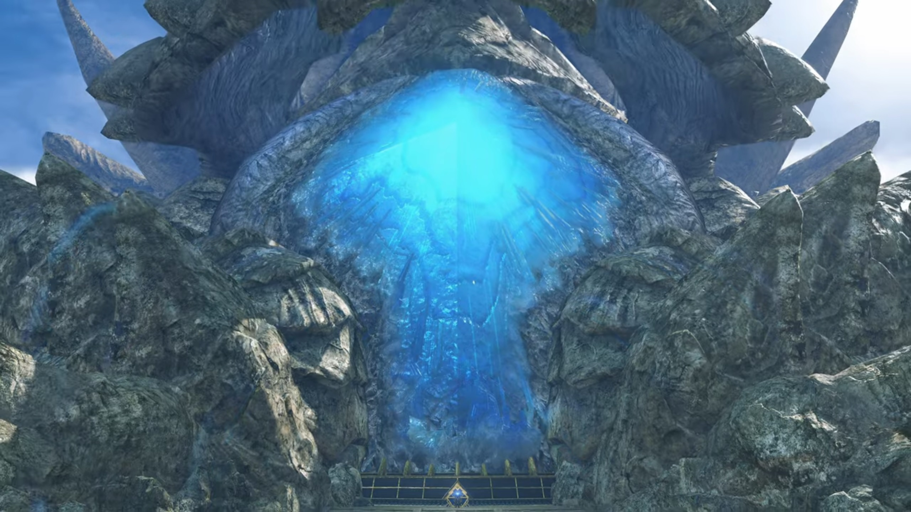
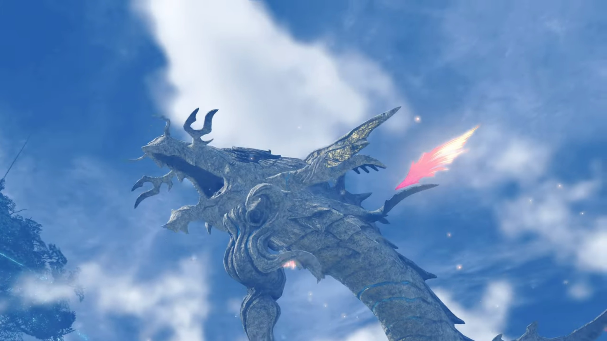
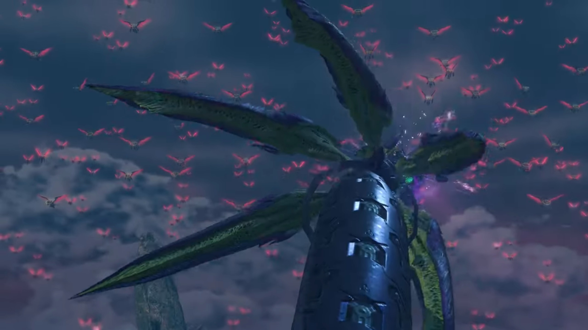
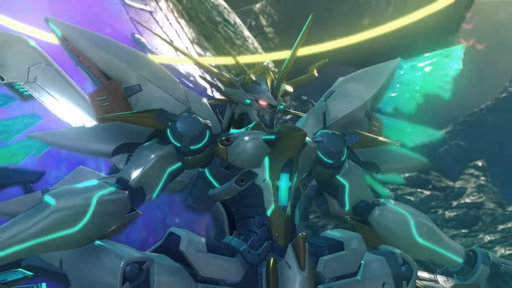
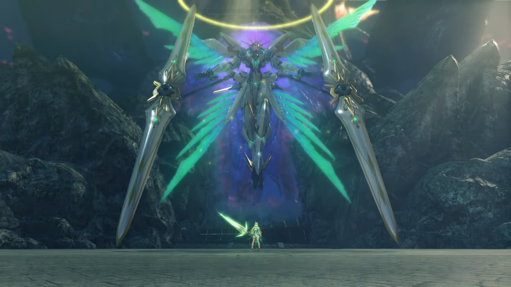
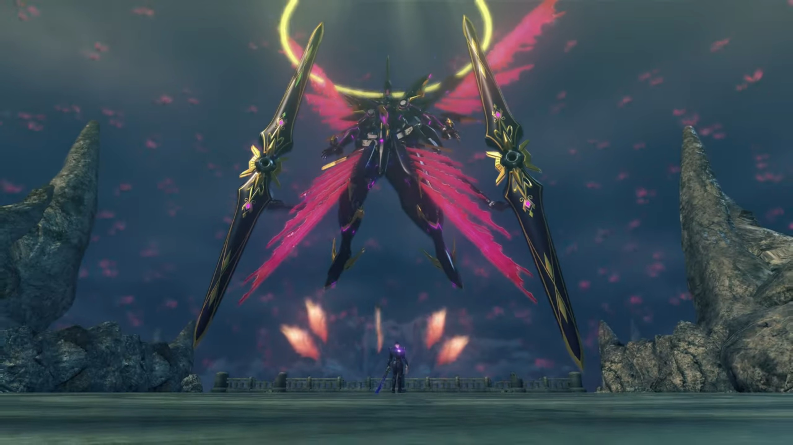
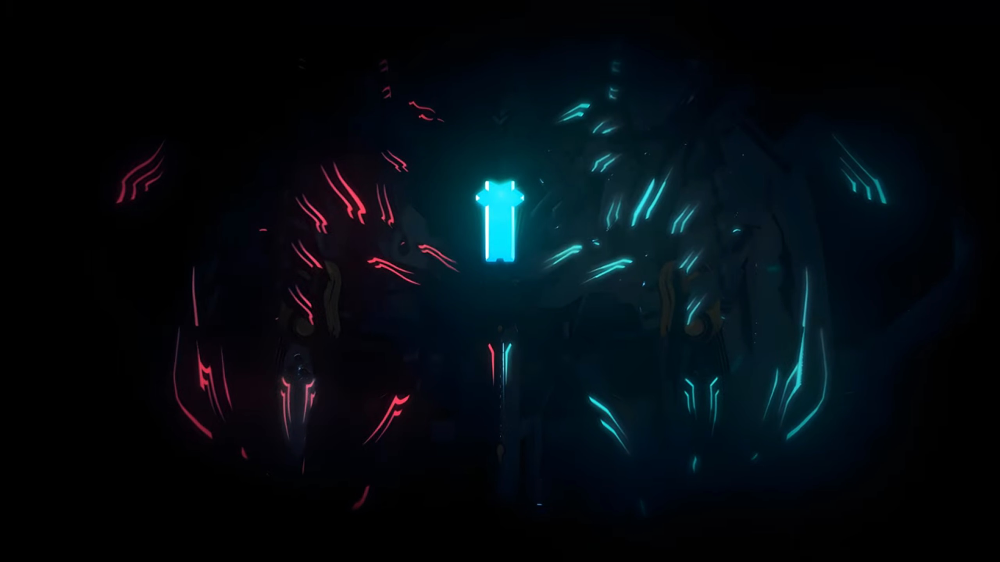
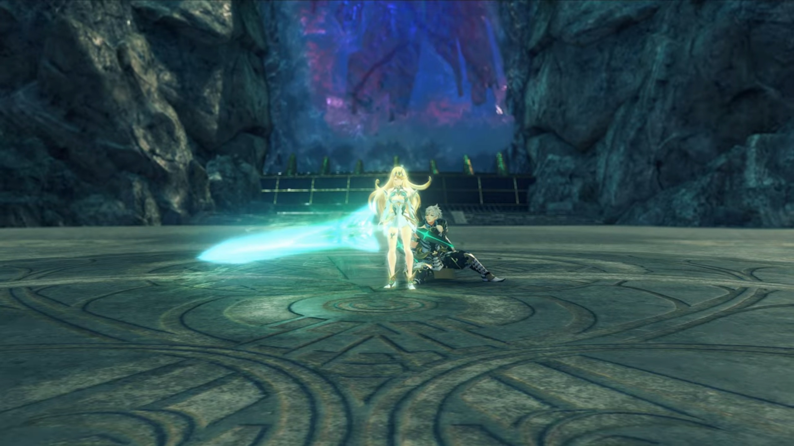
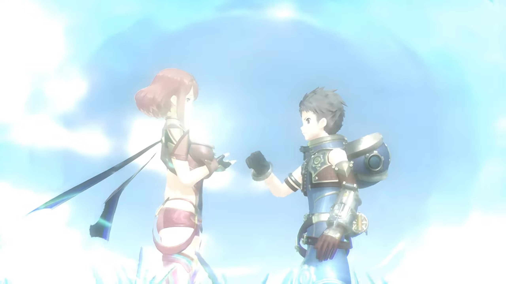
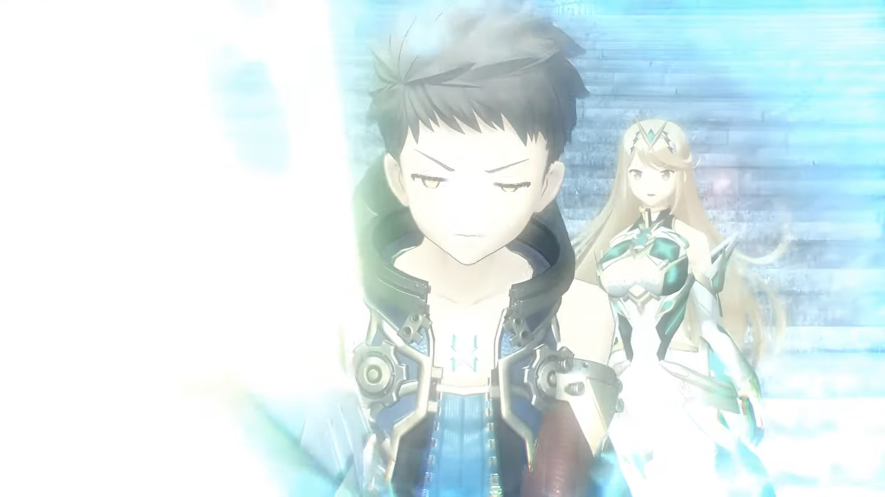

# The Battle with Malos, The Fall of Torna

After Torna's ancestors sealed the Titan eons ago, they laboriously flattened the land in front of the seal, pouring lots of cements and built a huge square. To both sides were the Titan's meat, unclimbable by most but the most persistent. Then they raised a wall in between, guarding the entrance to the seal. But now, the soldiers were gone. There was not a sound of civilization in its immediate surrounding. Malos stood in front of the seal, a metallic wall that joined in the middle by a lock, with a hole in the very middle that the crystal he took from the top of the castle can fit. 

Then he grinned. 

Without hesitation, he retrieved the crystal inside his pocket and put it in. Electric sparkled as the key reacted with the seal. Bright light started to glow from within, and electric leaked through the whole seal. Then the meat above the seal started to rise, split into half, revealing the bright blue-glowing cavity underneath it. Other body parts began to move, and red-flaming wings extended themselves from between the different layers of its skin. Such wings, or rather, feathers, grew in abundance, not only on its neck, but also on the tip of its tail. Then it swung its tail, immersed deep below the ocean for eons, for the first time, slapping the waves as it felt the cool water brushed against its numb skin. Ahhh, how long had it slept? It don't remember. 

Then it raised its head and bellowed, its roar shook the capital, listenable in the entire Alrest. 

Then it turned around to look behind it. 

---

The group were at the bridge connecting the plains to the capital when the event happened. They watched from afar how it transformed, felt the ground shaking, and went into defensive posture. The worst had happened; and they weren't there early enough to stop it. 

"_That's..._"

"The Tornan Titan's- **true** form." Jin finished his Driver's sentence. 

"Is Malos there?" Hugo wondered, focusing at the blue cavity. 

Addam watched calmly for a while before announcing, "There's no time! **Keep moving!**" They had deserts and plains to cross before they can arrive. 

---

The entrance looked ancient. It's a single narrow alleyway illuminated by ether lamp mounted on the pillars on both sides. They currently stand at where Malos stood before, but he was nowhere to be seen. Without foliage blocking, the wind, continuously blowing from the sea, gushed strongly. 

"_Malos... will be waiting inside..._" Addam had no doubt about it. 

"I believe so. But it's got me thinking." Hugo voiced his concerns. "What is his aim in doing this? Can it just be **carnage** for its own sake...?"

"Mythra... Maybe **you** understand this better, as an Aegis."

"No. I might have the same power, but... that's all we have in common."

"Could it be a _reflection of something in the depths of Amalthus's mind, perhaps?_"

She looked on the ground, trying to link any reasonable explanations, then shook her head, "I really don't know."

"Hmm..." Addam folded his arms, deep in thought. 

"Addam?" Lora called out. He didn't react. After a while, he said, 

"Let's go. We can't afford to give him any more **time**..." He turned to look at the depth they're to traverse, then said, "_I've got a bad feeling._"

---

They approached the blue-glowing cavity. Another wall was raised just in front of it, perhaps to prevent people from approaching it. Along the walls of the cylindrical cavity grew highly-translucent icicles, sticking out of the walls like stalagmites and stalactites. Thunderous sound roared in such depth, where the wind blew at the mouth and the vibration echoed through the chamber. 

But the group held no attention to such interesting phenomenon. They quickly covered grounds, knowing full well that they had to get to where they had to before Malos laid hand on the core. They finally arrived behind the wall, and they stopped. There was another platform built here, where the narrow path diverge into a relatively huge room. Their attention were on the cavity when Malos walked out from his hiding place, appeared behind them. Sensing the disturbance in the flow of ether, they turned around and faced him. 

"You got here fast. I thought you'd jump ship with the rest of the rats." He called out, his Monado slung over his shoulder. 

"Tornans are _braver than you think, Malos. Nobody here is **scared** of you!_" replied the other Aegis. 

"_Heh._"

Then he looked up. The group followed glance. Behind the thick dark cumulonimbus clouds summoned by the angry Titan, they could see it waving its tails; but Lora noticed something smaller, in large groups, no, swarms; she called out, 

"_Look._"

"Yes, I can see it!" 

Hundreds of thousands of Gargoyles swarmed the sky, their wings glowed blood red as they stretched, gliding across the air, with angel rings hovering atop their heads. They were coming for them. 

"**Ten minutes to go.**" (Malos announced) "Ten minutes before my Gargoyles **overrun** the core- _entirely._" (He signaled to the blue cavity behind them.) "If you can take me down, that means you **win**. If you **can't**... (He glanced over at them) Well. _End of story._"

"Aren't you smug?" Mythra asked. 

"We were born into this stinking world. Might as well have some fun." Two larger meaty Gargoyles descended from the air and landed beside him. Its body was the shape of a UFO. The other Gargoyles stopped, hovering above the air, awaiting his command, or just waiting for a countdown. "**Life...** _or death... Not much of a choice._"

He pulled his sword; the others withdrew their weapons. 

"But **you gotta choose, partner!**" And the battle begun. 

---

The time is up. The Gargoyles started their collision course, aiming for the layer of membrane protecting the cavity. When they attached themselves to it, and lowered their body like mosquitoes plucking their mouth through your skin, the membrane at the location where they stuck on dissolved. The point of contact turned red. That was when Lora noticed their actions when the dim light from the sun that penetrated through the clouds and falling on them were totally covered, with moving shadows; she panickingly glanced left and right, shouting, 

"Addam! The Gargoyles!"

He resisted an attack, replied, "I see them! But..."

Mythra threw balls of light at Malos, which he adeptly slashed through, closing in their distance. He asked, "**What's wrong? That all you got?**" (A few slashes and Mythra kicked him on his chest.) "**YARGHHH!!!**" She landed a few feet away from him. 

"Hahahah! Ohhh, _I got plenty. I think it's time_ to **smash** _your toys!_" She kept her calm. 

"**HUH?!!!**" 

Her chest glowed bright as she shouted, "**Ophion!**"

A giant snake-like artifice emerged from below the Cloud Sea. Malos was shocked, "**HUH!!!**"

Mythra flicked her hair; just as she had expected, "You know, preparation- is everything, _Malos!_"

Ophion gathered a ball of purple energy on its mouth, then shot a beam from it at the swarms of Gargoyles, lighting them into flames, their burning remains fell under the pull of gravity. Then it shots bullets like sperms that swam towards each and every one of the Gargoyles; though there were more Gargoyles than bullets, it intended to fall as much of them as possible. Ophion stretched its body to knock down more of them physically, those that weren't being targeted. 

Malos had got used to the shocking scene; indeed, he slung his Monado over his shoulder and put up a smile, casually commented, "Nice! That's my partner. (He looked back at Mythra) **Shame** you only have one. It won't- be enough!" His core crystal glowed bright as more Gargoyles flew towards Ophion.

Mythra was surprised, her eyebrows tensed, "You hid them in the clouds?"

"Preparation is **everything! Like you said, partner.**" 

The kamikaze Gargoyles self-explode when they came into contact with Ophion's body. Inch by inch, a single explosion don't cost much; but together, the pain was beyond Ophion's threshold. It could no longer support itself, bellowed loud while it collapsed back beneath the clouds. "**Huh?!!! OPHION!!!**"

"**Hold firm! He's coming!**" Jin's eyes, fixated on Malos all the time, wasn't attracted to the distractions. All those could be fell if they fall Malos; his attention hence never wavered. He quickly dashed past everyone, "**HRRRRRRAAAAGGGHHH!!**" and started a duel. 

Malos had a chance to look into his eyes, "**You...** Got somethin' to say?"

Jin rolled his sword and knocked him back, turned around and aimed his palm at him, a white globule of energy gathering in front of it. More and more icy spears materialized beside him. He asked while he launched it at him,

"Why the damned bloodlust?"

Malos raised a shield, replying, "I've told you beforeeee! The humans built the bonfire. All I did was help them **light it.**" Physical attacks exchanged. 

"Enough sophistry." 

A giant shadow covered the remaining light from atop shining on both of them. They started walking along the circumference of an imaginary circle, preparing themselves for the chance to strike. Malos, pointing his finger at Jin, said, "Oh yeah? Are you a Blade or not? You know it as well as I do. _What humans are really like._"

"_Harrrgh..._"

He looked over at the group, "You think they're all like your precious- **Driver?**" Lora was standing there, confused. Jin could not help but look at her, which Malos too advantage and strike. By the time his attention turned back to him, the Monado was so near him he couldn't block, felt a strong smash on his body, and the next moment, his back burnt as it dragged along the rough cement. 

"**YARRGHHH!!!**" While he was standing up, Mythra heard his shout, and her attention once more returned,

"**Malos!**" The crystal on her headband and her core crystal glowed together. Siren, receiving the signal, descended from deep space onto Alrest. Its wings stretched wide like butterfly, floating behind Mythra, holding onto its dual cannons. 

"Ohhh! You summoned _Siren._ **Then let me add to the mix too...**" His core crystal glowed bright as a dark siren, stretching dark wings and holding onto dual cannon barrels too, floated behind him. 

Mythra held out left left arm, signaling Siren to start attacking. Malos held out his Monado, signaling his dark siren to retaliate. The clashes sent shocking waves that reverberate through the battlefield.

---

Such elation he felt, fighting with full strength.  "**GOOD show! But I know you've got MORE!!!**" (His core crystal shone bright, he yelled,) "**LET IT ALLLL OUT, MYTHRA!!! STOP HOLDING OUT ON ME!!!**"

Dark siren hoped for a reciprocation, but all he got was siren getting knocked back again and again. Mythra took her chance when once dark siren was 'out of breath', hailing it hard towards the ground. Malos, seeing Mythra coming after him, aimed its barrels and shooting particles at it, which Siren adeptly dodged, firing in retaliation. 

The people in the city saw the red and green globules of light moving at fast speed, like 'comets'. Then, a dark beam emitted straight at siren; which it raised a shield to block, and broke a moment later. While Malos and Mythra stood on the platform looking at one another, their artifices disappeared behind the flesh wall to Mythra's left. 

"Ngh..."

"_Can't do it?_ **I** can **bring it out** of you." He waved his Monado while his core crystal shone bright. Dark siren knocked siren away and turned around, aiming its particle cannon at the city, immediately firing a beam, swiping it horizontally from one end to the other of the city. The beam drew a line within the perimeter of the palace, and the remaining energy released a shockwave that slowly engulf the city. The inhabitants ran for their dear life; those looking back and running too slow saw a bright light, and they could feel no longer thereafter. Everyone was shouting while they ran. 

Alas, Mikhail and Milton did not run. They watched in awe the incoming shockwave; Milton thought, if he were to die, he'll die with him. He turned around and hugged Mikhail, facing his back onto the wave, hoping it would act as a cushion; perhaps he'll live in his stead. They closed their eyes. 

Lora was frozen, watching the city engulfed in flames. In one shot, more than three-quarters of the city were destroyed. Like a thousand needles piercing through her heart, she shouted subconsciously, "**Huh! The town...**" The rest of them gaped. Addam's iris dimmed in disbelieve. He then gritted his teeth, feeling the surge of anger running through his chest. 

Mythra froze. Her iris dimmed. She tried to convince herself, "This can't be real..." Her mind ran through the good times she had with Milton. Felt annoying in the moment, but they were now memories. And they'd wanted to come earlier; _she_ was the one that persuaded them to stay back. _She_ was the one that ultimately did the dirty job. _She_ was the one that smiles, thinking they were in safe hands while they were here fighting Malos. And now, all is gone. And _she_ was the culprit. _She_ was the cause. 

"**MILTON!!!**" She crunched both sides of her head hard with her hands, "**ARRRRRRRRGGGGGGHHHHHH!!!**" Large amount of ether particles leaked from both her core crystal and her headband crystal. 

Deep in space, a being with its right side glowing red like Malos's, and its left glowing light green like Mythra's, with a light-green plus-shaped core crystal in the middle, sleeping in the darkness, it's eyes suddenly glowed, awaking from eons-long hibernation, answering her call. As she unleashed the seal she'd casted on herself since her awakening, tremendous energy blasted the platform. She glowed brighter and brighter until a pillar of ether shot high into the air. 

"Hurgghhh!!" Addam felt his heart suddenly stopped beating for a second, bringing his onto the ground as he tried to recover, "**M-Mythra...! What is that?!!**" 

Then, he felt something. The sword he held on started transforming. The yellow turned turquoise; the new sword was too heavy for him to handle. He had not the power to pick it up, its handle pressing his hand onto the ground. 

Step by step, Mythra slowly walked towards him, emotionless, numbed, unable to be conversed with. He looked up, trying to attain eye contact with her, but she didn't look at him, didn't speak a word, just bent down and took the sword from him, then turned her attention to the source of despair. He'd been observing the scene, and such transformation makes his heart pump faster. He'd never had such excitement before, he was too eager for this moment; oh, the elation, how wonderful. 

"**Show me** what you got, Mythra! **DO IT!!! MAKE ME PROUD!!!**" Then he released his seal, himself glowing light purple as ether emitted from his body like radiation. 

At full speed, they dashed towards each other. Sword clashed. The shockwave they released shook the whole platform; the wind accompanied with the shockwave shook everyone, so strong that no one can get near them. Then the battlefield moved upwards. 

They split apart. Mythra's iris was dark grey, as if she was a puppet being controlled by another being; as if every hope and dreams in her had gone forever; as if her reason to live had leave her. Siren slowly floated behind her. Her sword evaporated, she opened her arms wide, and surrendered herself as she floated into the control room within Siren's core crystal, dissolving through the thick membrane. Malos reciprocated. 

Zooming their boosters to maximum power, they launched once more at each other, swirling in imaginary circles as they floated higher and higher before clashing in the center, sending stronger shockwaves that disintegrated rocks into pebbles, soil into sand. 

The group raised a shield together against such shockwave. Addam was dumbfounded, seeing the situation escalated after a point of lost control. Fear gushed through his chest as he could already imagined what would happen next; he shouted out, wishing that she would listen, "**W-WAIT!!! MYTHRA!!! YOU CAN'T!!!**" 

But she, losing the one that she held most dear, could no longer listen. Her numbness deafened her from reacting to any sound in her surrounding. All she wanted was to kill the person in front of her that caused such havoc to her friend; and for that, she felt nothing. Nothing else could enter her heart, her mind. He'd perished -- but he'll come after him, she promised. 

"Urgh! **What is happening?**" Lora fearfully asked. 

"This is..." Hugo exclaimed, "...a battle between the Aegises..."

Malos shot beams at Siren, but she dodged, unaware and cannot care much about the beams that missed slicing along the Titan's flesh, destroying everything in its path. She herself retaliated, their attention fully on trying to hit one another. All consequences were ignored. When they get nearer to each other, they started exchanging hits physically, firing their boosters to the full, spinning around one another, trying to slam one another onto the ground below. 

"**ARGGGGHHH!!!**" Malos screamed as Mythra hit him hard; he, floating previously, smashed onto the crystalline walls within the control room. 

"**ARRRRRGGGGGHHHHHH!!!**" All her rage and energy covered in such scream, she aimed her cannon at the artifice that'd gotten stuck within the Titan's flesh, and fired. 

"**MYTHRA!!!**" Addam once more shouted, but his effort was pointless. She fired anyways, which Malos, watching with dimmed iris that it got closer and closer, his heart palpitating fast, and he forced his artifice to roll aside even while it tried to recovered, hence dodged, but the Titan didn't. The beam dragged along the Titan's flesh as it tried to catch up with him. He juggled around, doing as best he could on evasion track, while waiting for her beam to cede. Her beam sliced on the skin of the Titan like it's a tofu that could be easily cut apart. 

The time had come. Malos floated up, prepared for retaliation with his cannons. It hit one side of Siren, but wasn't strong enough to suspend it. When she felt like it, she joined both barrels together, turning the cannon into a spear, and flew straight towards Dark Siren. 

Malos grinned. This is what he wanted. All out! "**BURN IT ALL!!!**" With excitement at its peak, he ordered the Gargoyles that'd been stagnant for long to join in the fight, acting as Kamikaze aiming at Siren. 

She stopped flying. Her core crystal shone the brighter, and it reciprocated with Siren's core crystal. Then, a nebula of light-green energy grew and made a sphere around Siren, engulfing all Gargoyles that were within its radius, dissolving them almost immediately when they came into contact. 

"**WHAT THE-?!!!**" Malos was confused. 

Addam was on all fours; he tried pushing himself up, called for the one last time, "M-Mythra!"

Malos was surprised, but whatever, what surprises would she give him? If there were no surprise, how would it be considered fun? "Huhuh..." He grinned again, then laughed hard. "**Hahahahahaha!! HAHAHAHAHAHAHHAHAH!!! THAT'S IT!!! PERFECT!!! THAT'S the power that our father gave US!!! It's what the world has cried for since its birth... Me... YOU... WE'RE HERE TO GIVE THEM WHAT they want...**"

His words seemed to had recall the logical part of her brain. She attained consciousness, realized how she'd came under influence of her emotions and let it took over, realized what she'd done, tried her hardest to resist her power, "_N-no... You're wrong... I... don't..._"

But she had gone too far. 

"**Reaaaaaally?**" His core crystal shone brighter, and he announced, "**Then I'll just HAVE TO CLAIM... ALLLLLL THE DESTRUCTION FOR MYSELF!!!**" He pushed Dark Siren towards Siren, jetting its thrusters to the maximum, pushing against Siren's shield that bought Mythra some time to think until it breaks; Mythra's mind suddenly launched back to the past... 

> They gathered around after arriving at Torna, setting up tents, eating with each other; she was chatting with Brighid. 
> 
> How she and Milton were bickering, observed by Addam. 
> 
> How Addam sat beside her, eating, talking to her while she listened quietly. 

Then she foresaw a point in the future: 

> A boy, wearing a salvager suit, a helmet hung behind his back, and a girl dressed in red, her scarf dragged along her back, with neck-long red hair; his hand seemed to reach out for her chest. The background showed clear blue sky. 
> 
> 
> 
> The boy stood in front of Mythra, holding out her sword. The background looked like staircase where one could sit and watch the show at the very bottom, but there were no audience. 
> 
> 
> 
> And the boy shouting loud into the air some words that she couldn't listen to, at least not until it happens in the future. 
> 
> And the boy holding out both his hands, nodding to his left, then right, while they were inside a dark room. 

Tears flowed down her cheek; she don't understand why, but perhaps that's her destiny. Perhaps that's her future. She don't know. 

"I just..."

> The boy, looking at a metallic ship, turned around and look at her, smiled. 

"want... to save..."

Brighter and brighter the core of Siren glowed, the light it released penetrated into Dark Siren's control room and pricked Malos's eyes. He raised his hand to shield from the blinding light, "**YARRRGGGHHHH!!!**" When it dimmed and he look again, he was shocked, "**HUH!!!**" 

Sire was releasing streaks of meteors in all direction, created from within the large cloud of nebula. Some of the streaks struck Dark Siren, damaging it, destroying it, and Malos body burnt within. "**YARRRRRGGGGGHHHHH!!!**" Such flames were abnormal, as his ability to repair his body were snuffed out; the damage done was much stronger than his ability to repair. He held out his hand, trying to reach out for Siren. He thought he was just having fun; he thought all was done for the sake of entertainment; he thought he was having a good time, and will be having a good time ever since he awaken. He thought of losing, but he'd never thought of losing a second chance, as he plunged into the deep sea of flares, disappeared from everyone's sight, and slowly losing consciousness. "**MYYYYYTHRAAAAAAAA!!!**" 

Plomp! Together with Dark Siren, he disappeared beneath the Cloud Sea. But Mythra had lost her rationality once again, mindlessly released the particle barrage in all direction even though what she wanted to wipe out had already gone. Each particle, hitting the Titan, released energy similar to a standard-size nuclear bomb{{footnote: OK, there's no such thing as 'standard size' nuclear bomb. One just made it up.}}, searing every inch of the Titan's skin. 

Hugo observed the surrounding and his gut reacted badly; he gritted his teeth and dashed towards Addam, whom still knelt on one knee, looking up at Mythra doing her damage. For one, he felt bad that he'd lost control of her, like Amalthus lost control of Malos. No words could reach her, and he felt himself a failure, failing to keep her sane. 

Then, the Titan's core, previously glowing ocean blue, started to change to blood red, then it bloated, then it exploded. Hugo arrived between Addam and the core just in time to turn around and face the growing sphere of shockwave boundaries, putting his shield in front of him and held still. 

"**Puhhhh!!!**" Addam vomited some blood out of unprepared shock. 

"**WHAOOOOOO!!!**" The rest shouted. 

In great pain the Tornan Titan bellowed, then it went unconscious, its head slamming against the surface of the cloud sea, and started to sink. Its body slowly disintegrating as its life force could hold it no longer, the land started to rock tremendously, ripped apart, sinking into the hollowness deep within its flesh; 

---

Standing at the balcony, the king gripped strongly on the metallic railings. He watched the building below tumbled, he heard the screams of his citizens, he could feel their helplessness in a destruction comparable to those caused by natural disaster. And he himself was helpless. He, as their king, could not save them. 

"Our nation... Our people!"

Zettar stood at the entrance of the balcony, urged strongly, quickly losing his patience, "**My brother... We must flee before we lose the ground beneath our feet! Did you heed me, brother?**"

But his attention was on his people and his nation; his heart burnt with them. How could he leave them alone and went somewhere just because he had the power to do so? To abandon the weak was out of the question. He closed his eyes, tried hard not to shed a drop of tear. 

"**BROTHER!!!**" The time is nigh. 

He opened his eyes, took his hands away from the railings, and turned towards Zettar.

"My brother..." Finally, he looked at me. 

He closed his eyes and shook his head slowly but firmly. Zettar understood what he meant, froze for a moment before he turned around and ran. He knew his brother well -- what he'd decided, he won't change his mind. There's no time to persuade him, and he had yet a lot of future ahead of him. He don't want to die here. No, he can't yet die. He's the future king of the Tornan nation; he cannot die! Not before he sat on the throne and fulfill his role. 

The king, after seeing him disappearing behind the door, turned his attention far far away where they were previously fighting. 

"_Addam..._ I commend my people... _to you..._" 

Boulders tumbled down, crashing past and on the balcony; and to the last, he stood firm. 

---

On the outskirts of the city, after people set camp for the night, they sat still. They could still see the flames that raged the places that they were living in just a while ago, now burnt down to pieces. Some felt lost for their possession that they took a lifetime to gather; others lost their loved ones, they never stood a chance. 

Mikhail had dragged Milton out of the city. He could still feel his faint heartbeat, weakly pumping, holding on to life. He wished he could save him, but there were no doctors in the camp right now. Perhaps they never made it out. His breathing got more and more shallow, the interval between heartbeat got longer and longer, and his body starts to turn cold, lacking heat. He hugged onto him tightly, hoping his own heat would rejuvenate his life source, hence his body could heal by themselves. But he was too heavily injured, and at last, he could no longer feel it pumping. He no longer breathe. His head dropped on his arm heavily. Still, he hugged tight, as if that would hold him from leaving into the otherworld. 

---

"**Urgghhhh nghhhh...**" Lora stretched as she pushed herself up from the ground. Every inch of her muscle sore; they cried for her to rest, but this is not the time. "Krh krh..." Lora choked as she tried to fan away the thick dust. Her eyes hurt, but she forced it open, jolting her head left and right, trying to find the figures she held so dear. 

"Jin? Haze? **Where?** Addam! Everyone!"

"Hngh... ngh..." Then she heard whimpers. Someone must be there! She trailed the sound, getting closer and closer to the whimpering, until the dust between them thinned enough for her to see. Hugo was sleeping within Addam's hug. "Huh!" What happened to him? Her eyes glanced elsewhere, then she saw them. Two darkened core crystals lying to the side of Addam. 

In shock, Lora took a few steps closer; yes, she could now see them clearly. They were indeed core crystals. Aegaeon's and Brighid's, she thought. She covered her mouth; she can't believe it. They were just talking this morning, and now, it's heaven and earth! 

"**Wargh...** Hugo..." She wanted to try to feel his vein, to tell herself that she got it wrong. Her urge pushed her forward, till a big, strong hand caught her shoulder and prevented her from pushing further. She turned and saw Jin shaking his head. Minoth and Haze stood quietly behind him. 

The sound of an engine revved above the clouds. They looked up and saw it descending. Addam snuffed his cry and glanced at it. Then he softly put down Hugo, make sure that his body doesn't get damage despite, gently put both his palm on his stomach, as if that would warm him up. 

With a thud, the engine landed on the platform. The girl, unconscious, was ejected from the control room. Addam slowly walked towards her, and caught her in his hug as she dropped. 

BANG!!!

Boulders rolled down the top of the cavity and smashed on the platform. More and more incoming, they could not maintain stability. Lora heard another engine revving on the sky; she turned around and saw a ship floating high above them. 

### Footnotes: