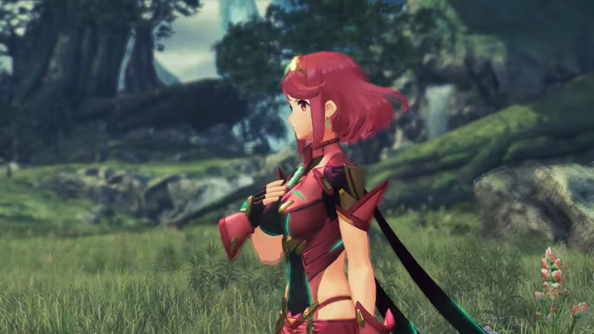
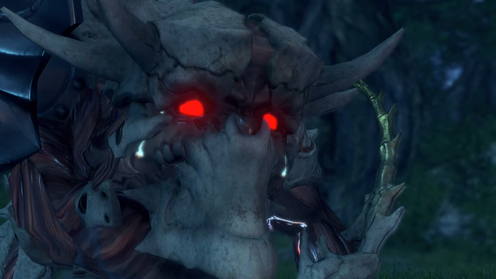
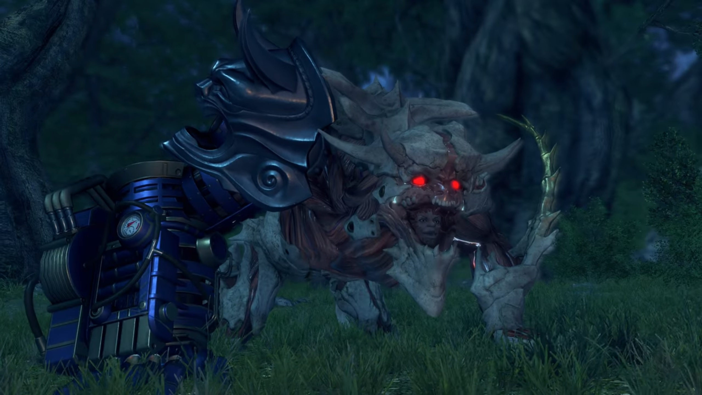

# Aftermath, The End

The flagship was parked amidst the storm. On the deck, Lora walked towards the Special Inquisitor, slowly by slowly, feeling the coldness of the two core crystals on both her palm. The Special Inquisitor held out both of his arms, and she dropped them on it softly. He gripped tight, stood there and swallowed some bitter saliva, shook his head and sighed, before turning around and walk into the inner deck. Once Lora returned the stone, she turned her attention to Hugo, left outside on the deck, sleeping serenely forever. They didn't even bother bringing him in, nor put him on a casket. 

She recalled how they'd talked earlier; her new friend she had made not long ago, sharing her joy just a few days ago, now lying there, lifeless. A bitter strung surged up her nose, and she could no longer resist her tears. She turned around and put herself onto Jin's chest, whom wrapped one hand around her, the other on her head, and felt his chest getting wet. Haze used both her palms to cover her teary eyes. Minoth closed his eyes, resisting his tears; he don't know what to do, he felt the acid rushing throughout his body, the urge to do something amidst this situation. He couldn't see a girl crying in front of him. 

Then he turned to his left and hugged Haze. 

Outside the perimeter of the flagship, the rest watched as the Titan's tail still wiggle atop the Cloud Sea. Then, as if that were the last wave of goodbye, it dropped his tail, going down with the rest of its body; the flames still searing behind its back and can be seen even through the thick clouds; even the waters couldn't extinguish the flames. 

Mythra felt her hands cold, her feet cold, her body shivering. She had done this? She just... wanted to save the world, and in the process of saving the world, she ended up... destroying it. She sunk the Tornan Titan! 

Lora's eyes turned to the Titan's tails; she remembered the smiles of the people, their hospitality, their welcoming. She'd completely forgotten about Zettar. She was born here, even though she travelled later with Jin. She was knighted here just a day ago, and how she showed to her friends and uplifted the spirit of the people. And now her homeland sunk beneath the sea. 

Then she saw it. 

At the tip of her eyes, she thought she saw the figure that had been left in the city earlier. She put two steps forward; the figure came into focus, and she shouted out, "**Mikhail!**" 

Her words reminded Mythra. She stiffly turned her head, one step by another, to her, and then to where she was looking. There, Milton slept in Mikhail's lap. Yesterday, she had told him to be in the city to protect him, because she couldn't take care of him if they'd followed her. She thought if she left him far far away from the battlefield, he would be safe. And today, he would never wake up again. 

Mikhail looked up at her. She saw in his eyes -- he was asking her, why? Why did she do it? But she don't know how to answer him. She don't have an answer. She wished she knew why. 

Her eyes turned to the figure that her mind raced through before she went berserk; she slowly brought her feet towards him, thinking that he's just lying there asleep, that she still had the power to bring him back. Addam took two steps forward; he don't know how to attend to her. He'd forgiven her for her deeds; she'd done it without realizing it, not until the last moment. She cannot control herself. He let her walked forward. 

She stood before the boy. She slowly go down, with trembled hands, gently touched his face. The frigid tinged her palm. He no longer had the warmth. He no longer smiles back at her. He no longer joked back at her. He no longer teased her. He's just lying there, serenely, not reacting to anything else. 

Then the frigidness fade as Mikhail snatched him away from her. He hugged onto him tightly without speaking a word, snuffing tears; but he meant it clear. He don't want the girl whom convinced him to stay back at the city for the sake of his safety, and the girl that lose her mind and destroyed his homeland, bringing him away along with it, to touch him. She don't deserve. 

Her muscle froze as her hand hovered atop, the cold lingered on her palm. She don't know what to say, she don't know what to feel, she don't know what to do. 

Lora cannot bear watching such depressing reunion; she returned to tears. Jin put his palm on both the side of her shoulders behind her and tugged her in, supporting her with his body. 

Mythra don't know how she'd stood up, how she'd dropped her hand; she could not feel it. She don't even know she's doing it. She slumped backwards a few steps, feeling her body so heavy her legs couldn't support her. Her chest and lungs and stomach were so bitter she clumped tight onto them, as if they would melt away if she didn't. A pair of warm hands placed on the side of her shoulder and tugged her in, but she could not feel it. Her body continued to shiver amidst the warmth he provided. Her mind was locked onto the loss of her first friend; and she had killed him herself. If she had not...

Her feet could no longer held her. She dropped to the ground; but Addam held on to her, prevented her from falling, but it couldn't prevent her from crumbling.{{footnote: Haze started to cry.}} 

"_No..._" she murmured. She could no longer live in the reality she'd created. The truth were beyond bearable. Not when she'd sent her most dear into the arms of death. Then she screamed, 

"**NOOOOOOOOOOO!!!**" 

Her body glowed, brighter and brighter yellow, until she combust into flames. The deck and the thick mist could not shroud the light she emitted. Anyone in the region must have seen it, if not felt it. 

Then she slumped into darkness. 

---

It was serene. The wind blew across the plains. The trees in the distant swaying in rhythm. The ankle-high grass brushed against their legs. Lora, Haze, Jin, and Mikhail faced Addam. 

"You're leaving?" she asked. 

"Yes. The royal Spirit _Crucible is in Leftheria._ I believe it'll keep this sealed." He looked at the mummy-wrapped sword behind his back, signaled. 

"I see."

A long silence endued without any of them conversing. A lot have happened since then. Their hearts had changed. Some people are no longer here. Their spirits were wounded. Where was she? 

It was Addam whom broke the silence. "I- have- a request for you. **I hear that** a militia squad has evacuated to Spessia. Give them a message from me. Once things are calm, they should come to Leftheria. OK?"

"Understood. I'll do it."

He smiled and nodded. Without lingering longer, he turned around, headed for the plains. A girl dressed in red with short, red hair he passed without looking. Perhaps she was not her, and he don't know how to face her. The girl put a fist in front of her heart and bowed to the group before catching up with him. 

Lora turned around and walked the other direction; the rest followed up. 

---

Insects chirping, finding mate. The darkness shrouded their vision under the cloudy night sky. The campfire they raised weren't providing a sufficiently clear view of anything beyond its vicinity. Most laid down on the sleeping bags they'd brought with them, their legs facing the fire. The night was quiet. 

A mechanical foot stomped the ground on the outer perimeter. In their deep sleep, at first, they didn't hear. But Jin whom always kept an ear raised heard it. He peered towards the direction he felt the vibrations coming from. He could see 6 rainbow-colored crystals, presumably 3 on each side of the creature's ribcage. The stomping gets louder; the vibration gets stronger; and Lora and Haze jumped up from their bed, Mikhail rubbing his eyes. Haze turned to Jin; he had no idea what was it. 

The creature stopped walking. 

"**HUH!!**" 

They had already stood up, side by side, with the child behind. The most appealing feature was its face -- oh, blood red eyes staring at them. Their sleepy eyes slowly get used to the surrounding dimness, and its feature slowly materialized within their mind. 

Jin wondered, "What... is that?"

"Caught up with you at last... _Lora._"

Lora's eyes widened, asked, "How- do you know my name...?"

"It knows human speech..." Jin observed. 

Haze could feel it, "**But... it's not a Blade...**"

The creature opened its mouth wide, and inside revealed its face -- its human face! Someone that Lora could never forget. 

"**Gort...?**" 

But what's with the monster-sized left arm and mechanical right arm that never stopped trembling tremendously, fitted with a pressure meter that flickered as if it was to explode at any moment. 

"**What happened to you?**"

"**It hurt...** _Oh, the pain!_ It- hurt- when you cut my **bloody arm off!**" (Then he got confused,) "Hmm? Is this my arm? **Hey, I have an arm!**... _It still hurts though._ **It throbs and it throbs, and it just DOESN'T STOP...**"

"I can't make sense of this." Haze commented. 

"He's lost his mind..." Jin concluded. 

"I don't think so." said Lora. They wondered what conclusion had she got to. "He seems ecstatic."

"**I'll** use your blood as a balm for my wounds. _How about it?_ Sound fair? **Yeah?!**" It raised its mechanical arm at them, ejecting its sharp claws that were previously hidden and wavered at them, pointing at Jin. "I'll start with **you, you Tornan Blade!** I'm paying you back- for cutting my arms off, youuuuu **dooooogggg!** I'll... have me arms back..." (Jin clenched his fist, trying hard to not react to a mental person, if it can still be considered as a person.) "_And I think I deserve... some interest, too..._ I'll take your **ears and nose as well!**"

"Tch..."

It lowered its arm to support itself, continued, "But first, _I'll get your blood for my medicine... Then it'll be your turn, Lora._ It's **your** meddling that **did this to me, after all...** It was you, **and your bitch mother!** I **knew I should've gotten** meself a **decent woman! It's your bastard fault!** _Think you're gonna die_ **quick?** _Nah, I'm gonna enjoy_- watching you- **suffer!**"

"Arggghhh... I will not let you insult my mother like that!"

"Huh? _Hurts to hear the_ **truth,** _don't it?_"

"_You think you can pass_ **judgment** on my **mother? You don't know us!**"

Jin drew his sword, said, "Leave it, Lora." (She looked over at him.) "Trying to talk to him is a waste of time."

"**He's right!**" Haze agreed, summoning her staff. "**No more mercy. This creature is beyond help.**"

She closed her eyes and put her right palm on her chest above her heart, bowed her head down, softly said, "_Jin... Haze..._" (Then she removed it, looked up, confidently answered,) "You're right. I **won't** waste my mercy on him. **But I will end his pain...**"

Gort was elated to see their actions, "**Exxxxxxcelllent!** I'll have me some **prime-time entertainment with you, girl!** Hope- you're a **screamer, Loooooooraaaaaaaa...**" It stood up on both its small hindlegs and bellowed. 

---

"**ARRRGGHHHH!!!**" Lora jumped into the air and sliced at the monster. 

"**YARRRRGGGHHHHAAAHHHHAHHHAHHHH!!!**" Gort screamed in pain, dropped and collapsed. They pulled some distance from him, Haze shielding Mikhail behind. It painfully raised its head, looking at the group via the eyes within the monster's mouth, cried, "**But I...!**"

Then it punched its fist onto the ground, forced itself to stand up. "**I still wanted...**" (It raised its left arm high onto the air, supporting himself with its mechanical arm) "**I still wanted to play...!**"

The group jumped one step back when it sliced at the group. As if that'd drawn the last of his vitality, black motes evaporated from his body as he collapsed, turning into soot thereafter, evaporated into nothingness. 

"Shameless, till the very end..." she commented. She looked up at the sky, softly spoken, "_You can rest easy now, Mother..._" Jin took a step and placed one arm on her shoulder, looking the same direction as her in reminiscence. 

Then he mentioned, "Somebody turned Gort into that horrible thing."

"Did they mean to kill us?"

"I-I-I don't know... But... Malos dying- _won't necessarily be enough_ to bring **peace** to the world. That, I am certain of."

That kept Lora in deep thought, "As long as there are people..."

Haze looked on the ground, sadly finished, "_...there'll always be strife... I suppose..._" Mikhail looked on the ground too, feeling similar. 

Lora turned around and smiled, walked up to Mikhail and patted on his head, "Don't say that." His sadness dissipated when he saw her smile. It never ceased to enlighten him. "**_Things can change. There's always hope._**" (Then she turned around and asked) "Don't you think, Jin?"

Seeing all 3 pairs of eyes eyeing on him, he couldn't let them down, "Y-Yes. You're right. As long as... Blades- and humans... are bonded to each other..."

"Surely... someday..."

Jin's smile dimmed. Lora's smile dimmed.

Then she walked over to the side, looked out over the cliff. 

---

They trekked through relatively dense vegetation, mostly thick layers of shrubs and sparsely distributed trees, their leaves swaying with the winds. Flowers among the shrubs blossomed. Such beauty, they thought they would never see it again; all except Jin were awed; his eyes fixated on Mikhail. 

---

Magister Baltrich thought it would be another uneventful day at the Praetorium when he felt a sharp painful stab on his spine from the back. He tried to turn around to see who'd assassinated him, but until his eyes closed he didn't have a chance. The common Blade sheathed his weapon and walked away, unbothered to stay for another second. His job is complete. 

---

Praetor Rhadallis sat at his office behind the wide table, thinking what he would be concerned with today. He always loved the tranquility, the private time for himself. At this time, he usually prepared a bottle of red wine, and despite his failing health, he thought they would revitalize his vitality. As usual, he poured some into his glass and took a sip. Ahh, what a pleasure. 

Then his eyebrow tightened; then both his hands reached for his neck as he felt a stinging pain cutting off his breathe. His glass dropped to the floor, shattered; but he did not care. He only wanted to open the passageway to oxygen again; but all that he tried, nothing helped. He felt the burning sensation of blood spilling off the tip of his mouth before he finally collapsed on the table, never to wake up again. 

---

Amalthus's eyes fixated on the great painting on the wall. Over the years, when his mind was thinking about the divine will and his pleasure to serve Him, he would look at what the wall painting. It was the painting of what the Architect had wanted all along, and so he thought. But don't you worry, O Architect, my plan had been executed, and the Praetorium will soon be mine, and your will will be served, I assure you. A thin smirk came on the tip of his lips before it dimmed. 

Then he walked away. The old man that helped him once before, accompanying Zettar, walked past him as if they never knew each other. 

---

Addam stood at the edge of a cliff just a few meters above the clouds overlooking a metallic ship sinking beneath the clouds. Ever since that day, his smile had dimmed. He wished he had not done this, but knowing that he's losing control of her, he had to do it. His smile had faded ever since. He'd lost too many comrades, and he don't know how to face her. 

When he made sure it had been sunk completely, he turned around and leave, hesitating not a single step, giving not a single look. 

---

Praetorium. The warrior monks and their respective Blades, the various monsters that looked like Gort but seemed to be produced in a factory, all of the same shape and size, and some giant Titans with warrior monks standing above their heads, gathered at the plaza in messy rows and columns. 

Amalthus appeared from within the Praetorium wearing the Praetor's dress. Then he raised his hand and ordered, "Attack!" Those warrior monks mounted on birds swooshed across the sky, became the first wave for their enemy to come. 

---

They glanced over the edge of the elevated platform. Oval-shaped tent filled the plains. An old settlement fell, a new settlement arise. The land had been cleared, the situation had been dire, the living conditions had been bad, but the hopes had been high. They had, after all, survived the aftermath. Everyone put on a smile, all except Jin, always concealed, always emotionless. 

As if he could sense something wrong even from afar, he glanced behind. Hundreds of thousands of kilometers away, at the other end of the Titan, little did they know the Praetorium warrior monks, along with their war machines, were marching towards their direction, slowly but surely, without notifying anyone. 

Who knows if the one sitting atop the World Tree was watching or not? 

---

Jin's narration continued, 

> _In the course of a lifetime, a man will see- **uncountable** meetings- and partings. Yet, as your life's candle- sputters and dies, **whose face** is it- that rises to greet you?_

Inside a wooden hut on a small island, Jin held the photograph in his hand, looking at the photo of Ornelia and him and the others. Observe him carefully and you noticed the crystal on his head and his sword had turned blood red, from the usual light blue. 

> _Happy is the man who can sleep... in the comfort of the smile- he sees then._

He then put it down, taking up the unframed photograph he took with Lora and the others, giving it a final look, wishing to remember that moment forever; the moment when they were the happiest, even amidst all the known dangers they are to face in the near future. 

> _No... I don't wish for 'forever'. Even **just** for one moment..._

Then he put the picture down on the table. 

> _It's enough... if it's with her. **And yet**..._

Standing outside the house, Jin looked at it in flames. 

> _What is the man to do... who has not been afforded that chance...?_

It burn and burn and burn, until it reached the photograph of him and Lora and the others, consumed it, together with his happy memories. They would forever carved inside his mind, but the emotions that he associated with it would forever had changed. 

> _The road stretches on without end. I **cannot**... but walk down it. As long as I keep walking, I can hold out hope that one day, the time may come..._

And when the last of the house caught fire, he turned around, not looking back. 

> _...when I see her smile again. That hope keeps me afloat..._

"You won't come back?" Azurda, whom had gave him a ride here, asked. 

He stopped and said, "This is the road- I must walk." He took out the mask that she had made it for him and put it on. "Our paths won't cross..." (Azurda's eyes tracked his motion, until he stopped and continued,) "**But...** Should we... in fact ever meet again... On that day..."

Then he walked away, but Azurda understood his answer. The metallic ship not powered by Titan was parked 3 o'clock to Azurda, on the other side of the island. And stretching beyond was whites and more whites. 

---

In your life, you may encounter joyful moments, moment of happiness, sadness, desolation, depression, anger, hatred, bored, anxiety, anxious, stressful, busy, occupied; but the days and nights don't wait for you. It comes and it goes, whatever you feel, however you feel about it, whether you realize it or not. And one day, history will repeat itself, as foolish men and women remembered only the history of their day, learning the wrong history before their day, and coming to the wrong conclusion what history had to teach. 

And so, one day, somewhere on Alrest, deep beneath the cloud sea, amidst the darkness, there was an sunken ancient ship. Inside the ship, there was a door. Inside the room was a central platform surrounded by outer platform, separated by a moat filled with brightly-lit liquid. On the middle of the platform was a red sword stuck into the ground. Behind the sword was the red-haired red-shirt girl sleeping in the vertically erected casket. She seemed to sleep very peacefully, but there was a sadness that she continually emanate, even while she was sleeping, that we can feel. 

Then the door opened. 

A young boy, dressed in blue salvager suit, immediately laid his eyes on her. For once, he could not divert his glance from her. He felt his heart beating fast; what a beautiful girl. Then it tightened -- his conviction was strong as ever. He thought he know why he came, but now he don't know why he came; but he'll soon know where his road leads, as he walked it, with her. 

### Footnotes: