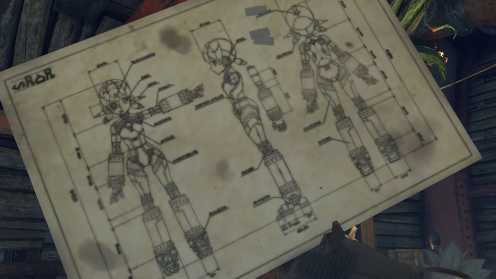
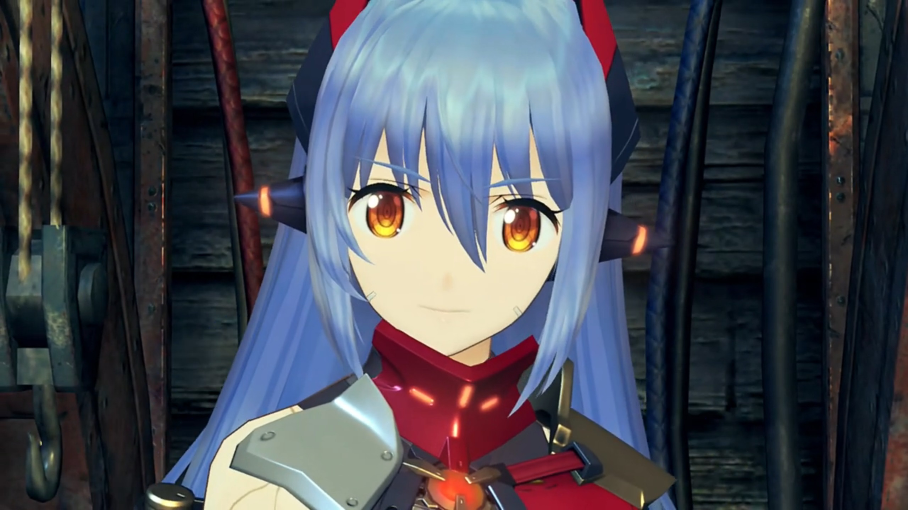

# Poppi QT \\(\pi\\)

"Hey Dadapon! You feeling OK? Your fluff look ruffly!"

Dadapon's attention was focused on something, accompanied by Lila, inside Tora's house, when Tora's sound distracted him, "**Huh?** Oh, it Tora. Me not to bad. Tum-tum is quiet."

Lila reported based on checklist, "Masterpon is careful with health. Good food, much sleep, regular poo-poo."

"**Indeed!** Body of Dadapon is temple!"

"Oh, Too much info for Tora! _So then, why make grumble-noise?_"

"**Ahhhhh, wellll... Thing is...**" His attention turned to Poppi and blurted out that he "Was thinking of making **new modeeeee- for Poppi!**"

Now that gets Tora excited, "**OHHHHH!!! Tora and Dadapon have same idea!** Tora was thinking it about time **Poppi got even more Poppi-power!**"

"What? **Tora think that too? Truly Tora is sonnypon of Tatazo! Has Dadapon's ideas too!**"

Tora wasn't someone chasing for credits, but was concerned about the details, "_So, what was Dadapon's idea?_ **Tell Tora!**"

"**Tora excited?** OK, Dadapon will let cat out from bag." He brought out the master blueprint that he'd worked day and night for don't know how long. He seemed to not care about changing Poppi's appearances. Indeed, only the  specifics on how to pump up the powers of each parts were described in illegible handwritings. "**Behold! Poppi's** most **super-duper mode!**"

"W-what's **this?!**" He was so shocked his fur tinged on all ends, mouth gaped open. What did he saw? 

Dadapon interpreted that as his son worshipping him. "You like? Tora like so much, run out of words, maybe? This mode called **'Super Fighter Mode'!** This Poppi size of **ten Rosas**. More battle power than **Titan warship.**"

Tora could no longer take it, his wings fluttered incessantly, "**What Dadapon thinking?!** Dadapon just take old Poppi blueprint and _enlargeeee!_" Nothing even changed! "Dadapon thinking **just like Bana!**" Have life taken a toll on you that you'd lost your creativity? 

"What? Tora not like great big Poppi?" He wasn't about to give up. Luckily, he prepared secondary blueprints. "Well, how about this?"

He tucked the blueprint that had the size that could wrapped around him like a blanket and brought out the same blueprint but at a size that barely covered his wing palm. 

"Uh? Hmmm... Too small for Tora's eyesight..." He can't even see what's printed on it, say what's written? 

He therefore explained, "This is **titchy** little Poppi. **Extreme compact!!!**"

Tora lost his patience, "**But what for?! AND you just changed SIZE again?!!! What good is itty-bitty little Poppi? Catch mice and rats maybe...**"

He scratched his nose, cannot understand how he couldn't fathom his wonderful discovery, "Tora not see? This Poppi piddly, but can sneak in **anywhere**, and no one know! And battle capabilities same as normal Poppi! **Strong like ant!**"

Tora gave up arguing, "Dadapon. All this a bit... fur-brained..."

"Not like little- piddly- Poppi either?" That's not a problem. But too bad, he hadn't yet prepared a tertiary blueprint. "Well, let's hear Tora's **silly** idea then."

"_Really want to hear?_ Really?!" The grin on his face cannot be concealed. "**All right**, Tora supposssssse can share secret. Tora's **big idea called... Poppi QT \\(\pi\\)!**"

The group whom were listening for so long were waiting, waiting, waiting. His Dadapon was waiting, waiting, waiting. But he took no further action. Dadapon was curious about the name, "Cootie-Pie?"

"Right! _Nearly..._ **This** Poppi become **great big** grown-up. Poppi should move to **next phase of life!** Tora and Poppi **grow up together!**"

"Uhm... I know not meaning of 'QT\\(\pi\\)', but... **Tora's unruly, lovable enthusiasm shine through, very bright!**" And how could his Dad not support him in independent invention? 

As if a child that got the required praise from his parents, he chimed, "Dadapon! **Dadapon like it!**"

"Yes, Tora. This **make sense**, for a change. **Very well!** Dadapon will get **right to it! Lila! Ready my things!**"

"Yes, Masterpon! At once!" And they walked off together to the storage room. 

Tora turned to Poppi, "Hear that, Poppi? Masterpon- and Dadapon will **work in chamber** for a little bit. Don't let **anyone** disturb _very very very_ important work! Got it?"

"Yes, Masterpon." Her voice doesn't sound very excited or whatnots. The group watched Tora exited the scene after his Dadapon. Pulling the curtains into the chamber, Poppi loyally stood in front of it, ready to eradicate any moving objects coming near it. The situation was more awkward than usual, as the group looked at her, and she looked at them, the only noise coming from the machineries working behind her. 

Rex wondered, "Tora... What's the little ball of fur getting into this time?"

"Unclear. It sounded like they were going to try to **power up** Poppi somehow." Pyra shared her thoughts. 

Zeke scratched his chin, "I also caught some **bollocks** about- 'growing up' and 'phase of life'."

Nia teased, "You'd know. You're the master of talking bollocks..."

"**Huh? How dare you!**"

"_Ugh!_ You know **e-xactly** what I mean."

Pandoria suggested a simple explanation, "Well, I guesssss this means they're going to remodel Poppi."

"Guess so." Rex agreed. "Whatever it is, looks like they won't be coming out of there for a while. **Nothing for it!** Why don't we go and take a rest- at the inn?" And everyone left, leaving Poppi herself guard the door. 

---

When they returned, the door was now guarded by Poppi and Lila. The continuous clanking of machinery inside the chamber had yet to die down. Nia jumped on her feet, couldn't believe it, "**Huh? They're still at it?**"

"Yes, Catlady." Poppi answered in extreme details, "Masterpon working feverishly. Not stop for food, sleep, or poo-poo."

She crossed her arms, "Tora... **He doesn't know** what's good for him sometimes. He's going to work himself **bald** one of these days." Furball without furs, huh? Just then, the curtain pulled apart quick and a furball dashed out real quick it didn't had time to brake, knocked hard into Nia, "**URKKK!!!**"

Horizontally on the floor was Nia, and standing atop it was Tora, brimming with smiles. He hadn't yet noticed the softness of what he's stepping on. Dromarch worryingly called out, "**My lady!**"

Without getting down from her, he exclaimed, "**Tadaa!!! Master plan of Tora complete!**"

Rex's attention drift to what he just said, totally forgot about _it_, "'Master plan'? Sounds great. But what on earth is it, Tora?"

"**MEH-HE-HE-HE-HEH-HEH!!! BEHOLD!!!** Really something, huh?"

The group watched him taking out something from his pocket and make a step back, "**OOOHHHH!!!**"

"Behold! Final and **bestest form of Poppi!**"

Meanwhile, Dromarch was still trying to get her consciousness back, "**My lady... Are you quite all right?!**" Then, another furball rushed out of the chamber and "**YARGH!!!**" He was knocked against the walls, breathing but seemingly losing his breath. Tatazo totally had not felt anything nor seen anything, his eyesight focused absolutely on "**Tora! Is this not**... too much?! Only yesterday, Poppi was **littlepon**... Maybe she grow too fast!"

Tora jumped 180° around to face his Dadapon on the same spot. "Tora not care! Tora _feel_ that Poppi is **ready to be real grown-up!**"

"Tora... Can- you- really- build- such advanced robo-woman?"

"_Dadapon. Tora mean what he say._ **Destiny calling for Tora.** Rude not to say 'hello' back."

His Dadapon thought for a second, thought his words very brilliant, but also the choice he'd made, "Well said, my littlepon."

"_Huurrrrggghhh..._" The group was wondering. That lasted for a full half-minute when, 

"**Oof...**" Tora stepped on the same spot and looked down at Nia. Why is she on the ground? Her chest brimming with flames, the volcano exploded, "**Will- you- get- OFF ME ALREADY!!!**" She bounced up as quick and as powerful as possible, tossing Tora into the air and rolled like football bouncing towards the wall. 

"**MEHMEH!!!!**" The rest bent to her wrath. 

---

On a calm, windy night. Poppi had been shut down for the remodeling. Tora, Tatazo, and Lila each monitored a screen and reported their readings. Lila started, "Internal pressure remain stable."

"Dadapon, crank up voltage a bit further!"

"Tora! Increasing load even more maybe dangerous!"

"**Levels not there yet**, Dadapon! We not cross the line, **but** we step on it."

He thought for a second, agreed. "OK! **Lila! Look closely at meter doodah!**"

"Yes, Masterpon!" The group hearts were beating fast as well, but they had not the expertise to understand anything, what says lending a helping hand? But that didn't make them less nervous. 

At last, Tora was satisfied with all the readings, went to the big switch, first taking a look at Poppi, excitedly exclaimed, "**Hoo-hoo! Preparations are prepared!**"

"**Lila! Hit switch!**"

"Roger, Masterpon!"

At the trigger, a little bit of electric sparkles leaked through the wires connecting to Poppi, but nothing especially dramatic yet happened. Tora grabbed onto the main electrical switch with his wings and, full of hope that it will succeed but he can't be so sure until everything runs, prayed, "_OK, Poppi!_ **Wakey wakey!**"

He pushed the switch and, with more electric sparkles, the whole room went dark. Zeke immediately snorted, "**Hey, what's this?! Leaving us in the dark?**"

Pandoria timidly complaint, "I... I can't see a thing!"

"What? Did something go wrong?" Pyra wondered. 

"I don't know... The lights went out the firssssst time we started Poppi up too, remember?" Rex observed. 

Nia wondered, "Isn't it... taking a bit long, though...?"

Gramps: "Ahhhh, yeah..."

Sure it took its time. In no time, a thunderous clouds gathered atop the house, brushing against each other, aggregating tremendous amount of charges before striking atop the thunder rod attached atop the windmill, shaking the whole house in a Richter-scale 8 earthquake, as they exclaimed, "**WHOAAAAA!!!**" while maintaining their feet. 

After the 'earthquake' that lasted for less than a second died down, Pyra panickingly questioned, "**Wh-what is it?!!**"

The smoke that filled the room choked Nia spluttered, "(Cough cough) **Was that a lightning bolt or something?!!**"

"Everyone OK?" Rex worried. 

Zeke announced, "**I'm OK! But what about Poppi?! How's she doing?!**"

Their eyes fixated on where they thought Poppi was, now covered with thick black smoke. Thinner and thinner it gets, while the lights went on for a bit before going off again, on then off, on then off, and the smoke eventually thin enough to peer through, revealed a thin long legs wearing leather socks on high heels, and a fully grown up Poppi with long hair is revealed. A true sleeping beauty. She opened her eyes, and Tora's eyes widened, mouth gaping, "**Woohoo! Success!** _Look!_ Glorious birth of **Poppi QT\\(\pi\\)!**"

The first thing she did is to stretched her hands, "Urgh... uh..." Twist her necks, loosen her bones and muscles. Only did she turned to the group, "Ahhhh, Good morning, everybody!"

Rex was flabbergasted. She really became more polite, more grown up in her tone, less cute but more beauty. "**Uhhhh... Huh? M-morning...?**"

Pyra: "So... this is the new Poppi?"

Zeke's eyes widened, "Cool! I'm starting to think there's something in Tora's science malarkey after all!"

Nia was awestruck, "Poppi's an adult now? _Talk about a growth spurt..._"

Zeke heard her blabbering and teased, "What's up, Nia? **Jealous much?**"

Her eyelids closed half and looked at him _like that_, "Shut it, Zeke! Unless you want me to remodel your face!"

Back to the scene, Tora invited, "**Come, Poppi!** Give us demonstration of **new power!**" He turned around, ready to lead the way to wherever would helped with demonstration. 

"Roger roger, Masterpon!" Poppi took a step forward, and Tora, his mouth wide opened, his brain suddenly froze, as he felt the air brushing down on him, and he lose the warmth from under his feet. Indeed, two cold contact on his hips acted as his support. Poppi QT \\(\pi\\) flipped him so she could put a hand on his back and another on his buttocks, like carrying a princess. 

Tora kept twisting to and fro in trembling voice, "_W-wh-whoa,_ **Poppi!** Masterpon has **own legs!**"

"Masterpon have very short legs. **Much more efficient like this**- when Masterpon travel with Poppi."

He do not agree, "**This very silly! And BIG DISRESPECT to YOUR MASTERPON!!!**"

Rex don't mind giving it a laugh, teased, "**HAHAHAHAH!!! You look like... Poppi's little teddy bear there, Tora.**"

"**MEHMEH!!! TORA IS NOT LITTLE TEDDY BEAR!!! PUT TORA DOWN, POPPI!!! RIGHT NOW!!!**"

Nia thought, "Hey, it's not so bad. At least you don't have to walk."

"**TORA DOES NOT LIKE!!!**" But Poppi QT \\(\pi\\) had no intention to sacrifice efficiency for face. Out she went, and the group's eyes never leave Tora. "**Tora is grown-up big adult... Poppi, come onnnnn! Poppiiiiiiiiii!!!**"

### Footnotes:
