# Heart to Heart

### The Real Gramps

At the place where they were first washed up, Pyra, Rex, Gramps, Nia, Tora, and Poppi overlooked the foggy distant scene. 

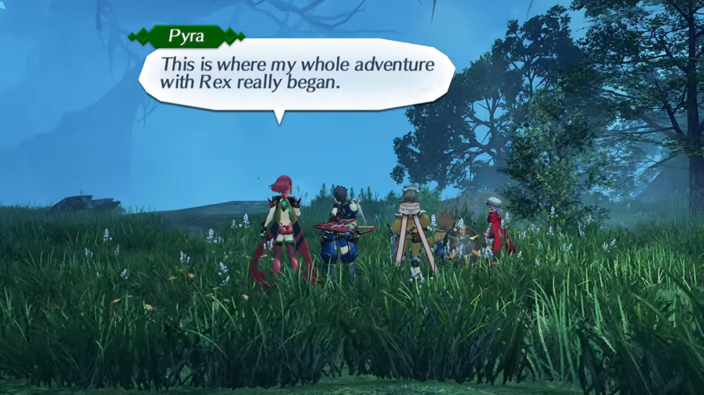

"We're back here. This is where my whole adventure with Rex really began." exclaimed Pyra. 

Nia: "Oh, right. This must be the spot here you and Rex washed up."

Rex added: "Though we only made it here thanks to Gramps's efforts."

Gramps: "And those efforts are the reason I'm like this now..." Talk about being in larvae form. 

Nia at least felt gratitude, reasoned, "Well, if you stayed that big you couldn't exactly travel with us. I'd say you're just right!"

"If I was my old self, I'd be able to carry you anywhere! Well, anywhere within reason. The World Tree would be pushing it."

"**Amazing!**" exclaimed Tora. "So how long it take you to get to Argentum from here?"

"At the current separation, let's see... About 10 days travel."

"That long?!" Nia couldn't believe what she'd just heard. 

"'You'd do it faster than that or you'd taste the whip!' is what I'm hearing."

"Of courseeee that's not what I mean. _But that_'s like 3 or 4 days by boat."

"My apologies. I'm not as young as I used to be."

Poppi don't understand, "What is point of worrying now Gramps not big any more?"

"True enough. That old body... is a thing of the past!"

Pyra walked up closer, commented, "Well I think you are _adorable like this._ I like it."

"Well, _that's very kind of you, Pyra._"

"Are you blushing, oldster?" Nia tried to look closer. 

He immediately blurt out, changed the topic as rapidly as he could, "**Tell me, Rex. Do you ever wish I was in my old form?**"

> Choose: "I liked it better when you were big."  
> or "I think you're better like this."

"I liked it better when you were big."

"Oh, is that so? I suppose you found me very useful as a Titan."

"Huh?"

"I provided a home... carried you from place to place... Not to mention the salvaging crane{{footnote: That anchor.}} stuck you-know-where."

Scratching his head, "That's not really what I meant! It's just that you were so **big and dependable**. Like a dad, or, well, a real grandpa. **Besides**, I knew you in that form for most of my life. Everyone else only really knows you like this, but I'm not used to it."

Pyra: "Rex has a point. The time when I knew you before, Azurda, is very faint in my mind. This is the _Gramps_ I'm used to."

"Tora cannot imagine big Gramps!"

"Poppi never seen big Gramps, so **also cannot** picture."

Rex: "Right? That's what I thought. It's all about what you're used to."

Gramps, thinking, "Hmm... I'll give you the benefit of the doubt. Though I know you're really just **pining** for the days when you could travel in comfort on my back."

"I think you're better like this."

"**Oho! You prefer me this way?**" The excitement in his voice don't subside. 

"It's cool to have you riding on MY back for a change! **Just hearing** you **encourage me** from behind reeeeeaaaaally sets my heart at ease. And when you were big, we couldn't just, y'know, hang out or- walk together. I like being able to _stay close._"

"I see, I see..."

Pyra noticed, "You look rather pleased, Azurda."

"If I were to be honest, Rex's helmet is a little cramped. Not to mention the jolting and bumping and bouncing around. It's enough to make me lose my lunch at times. But... hearing Rex- say that, for the first time it made me- think that perhaps this- was- actually a good thing."

"I'm sorry about the jolting. Looks like I've gotta get used to this situation too."

"That's all right, Rex. I'll keep the words of encouragement coming! I shall endeavor to become... ever more reliable."

"Ummm... Actually, if you're planning on nagging me constantly, maybe I'll **pass**..."

Nia agreed, "_Yeah_, I wouldn't want to have Dromarch's nagging voice in my ear all the time, either..."

Gramps: "**Cheeky sods!**"

---

### Ardainian Technology

On the 1st Floor (American 2nd Floor) of Mòrag's ship, Rex, Tora, Poppi, Nia, Gramps, they were looking at the technology at the control room.{{footnote: Pyra and Dromarch wasn't there, probably because they don't have speeches, so the creator don't see a need to put them in. Though one personally would disagree; as in putting them in even if they don't have something to say would fare better in one's opinion. Plus, Gramps is inside but not speaking, sitting in Rex's helmet as decorative.}}

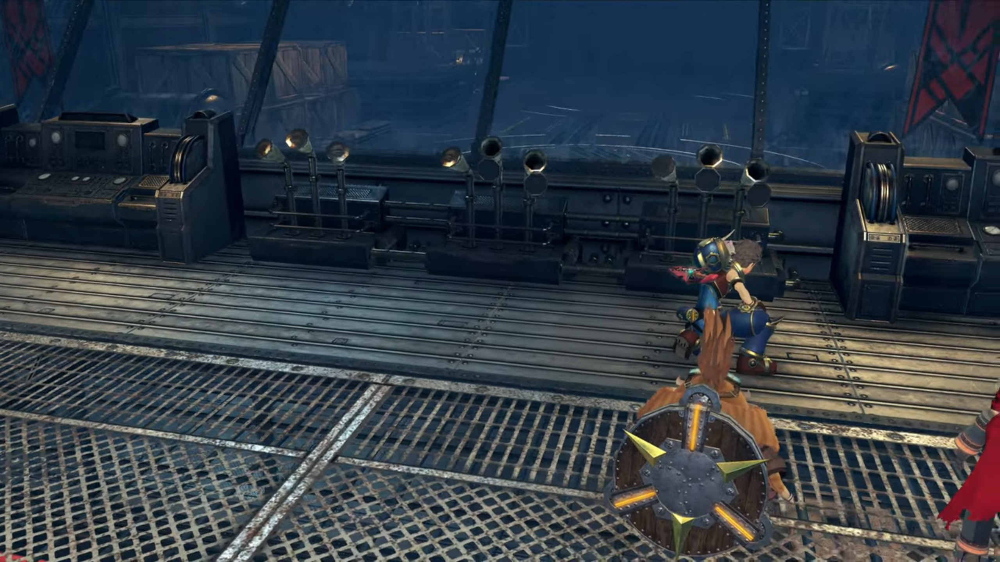

Nia noted, "The inside of a Titan battleship is way different from the Monoceros, huh..."

Poppi raised her hand and questioned, "What is Monoceros?"

"Rex, you saw it, right? Moored at a pier back in Goldmouth? Jin and co.'s black boat."{{footnote: That's the Argentum trade guild, when he first visited and noticed it in Chapter 1.}}

"**Aaaahhh**, that really impressive one! It runs without being hooked up to a Titan, right?"

"I'm no expert, but... yeah, looked like it."

Tora: "Sound **awesome! Tora want to see too!**"

Rex: "You won't get the chance, unless we see those Torna guys again."

"Meh, mehmeh, meh! Tora change mind. No need to see." The fear of getting attacked exceeded his curiosity. 

"Masterpon change mind at drop of hat..."

Rex turned their attention back to the panels before them, "Well, the Monoceros was pretty sweet, but this is nothing to scoff at either!"

Nia: "For sure. It's full of things I've never seen before."

Tora: "Ah! That's because this vessel is result of **latest** breakthroughs in **Ardainian tech!** Regular folk never so much as set foot on board!"

"You say, breakthroughs in technology, but what you mean... is salvaged stuff, right?"

Rex answered, "Ummm, not exclusively. I see lots of homegrown improvements as well. **Like this,** see? Whatever they've stuffed in here, it's been messed with so much, I can't tell what it was to start with."

Tora seemed to know, "That control panel. It transmit signal to Titan nerves. By running cables to different parts of Titan from here, can control signal flow much more better."

"**Whaaaattt??? That's amazing!**"

"And this cable itself have 2.4 time the speed and 12 time the capacity of previous iteration. In other words, it on whole other level to stuff other countries use!"

"Huuuuhh! So if they put this in a smaller Titan vessel, it would work **even better!**" The sense of excitement in his voice; but who was he thinking about? 

"**Pin-pon! Correct!**"

Nia, speaking to Poppi, "Grrrrh! They seem to be having fun, but it's all gibberish to me. Poppi, what do you think?"

> Choose: "That not even so bad..."  
> or "Why Masterpon act so proud?"

"That not even so bad..."

"Oh really?"

"Poppi have access to **much varied** information. Considering interests of Masterpon, technology info is especially rich. So for Poppi is not issue, following conversation in question. Moreover, if necessary, Poppi could out-geek Masterpon if Poppi try." Her hands and feet jumped and juggled about a lot as she excitedly answered. 

"R-right, OK..." So she was the only one... "I'm sorry I doubted you."

"No worry, Nia. Poppi can also hold conversation on favorite bug dishes of Nia."

"You're too kind... I- should point out though, it's not **bugs** I like, but **fish.**"

"Meh? Poppi apologize. Poppi update her database now. Masterpon not always fastidious in data entry, so mistakes happen."

Heh heh heh, found the culprit, she shouted out, "**Tora! I like bugs now, do I?**" The look in her eyes. 

His fur stood on ends, "Meh-meh! Tora suddenly feel very unsafe. Rex-Rex, we should move on. If we stay here, something **bad** bound to happen!"

"Like what?" asked Rex, not yet sensing the situation. 

"**No time to waste, we go!**"

"Why Masterpon act so proud?"

"**Ho-hoo! Tora very glad you ask!** That because- tech used in this Titan battleship is same as what Poppi's muscles and drivetrain use!"

"**Poppi is surprised!**"

"**But however** though! Ones that Poppi use are even more improved than these here!"

"**Yet more surprise!**"

Nia hypothesized, "Are you saying you stole the tech from Mor Ardain?"

Rex: "C'mon, Tora... Is that what you call sporting behavior?"

"**Tora take calculated risk in service to cause of scientific advancement...**" He reasoned to himself. "As result, not even Ardainian scientists capable of reverse-engineer Poppi systems! **So, no worries there!**"

Poppi's head dropped to ground, "Upon learning secret of Poppi's birth, Poppi feel sense of unease..."

"Ugh **E-everything fine!...** _Probably!_ **Now Rex-Rex! No time for chit-chat. Let's get going!**"

---

### Poppi's Unending Curiosity

At Melnath's Shoulder, overlooking the Cloud Sea on the plains outside Torigoth, Poppi asked, "Masterpon, Poppi have question."

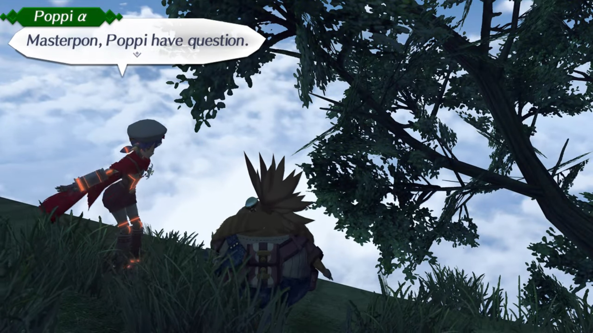

"Pursuit of learning is **good thing**. Ask **anything** and Tora will answer!"

"Cloud Sea clearly visible from here. Height of Cloud Sea is different at different times. Why height change?"

"Meh-meh?! W-well, um..." Sweat started poring down Tora's face as he struggled with getting an explanation for her. Ah, scapegoat! With a cool tone, he said, "Tora let Rex-Rex answer that one!"

Poppi went to Rex and asked, "Rex, why cloud height change?"

"Well, let's see now... Maybe it's easier if you compare it to the clouds, in the sky. They come in all different shapes, right?"

"Some clouds very flat... Other clouds big and- fluffy!" noted Poppi.

"**Yeah, that's what I mean.** And the shape doesn't stay the same forever. The Cloud Sea is the same way. It's not always a flat surface, sometimes it gets... fluffed up. The height- and shape of it isn't constant. It's alwaaays changing. Not- **suddenly**, like the weather, but- gradually."

Gramps: "It more likely than not... to change overnight."

"**Yeah! That sounds about right!**"

"Very interesting."{{footnote: Even more interesting: how do you notice the height of the sea change when you're living in a boat? On land, you can see that the water cover more beaches at certain times, while cover less beaches at recede sea level; but if you're living on a Titan which water always reached the same level (unless you put up more weight or less weight so it had different levels), a floating object is probably constant to changing sea level, theoretically. One don't know practically, though.}}

"Oh, but it's only the Titans like this one, and the Mor Ardain Titan that affect the Cloud Sea's height. Ones like the Trade Guild Titan **Goldmouth** just float on the surface, so they don't affect it."{{footnote: So does this means Gormott and Mor Ardain titan don't float on the surface, but have their feet on the seabed, 'walking in water'?}}

"Makes lots of sense!"

"I guess that's about the extent of what I know."

"Very much thanks, Rex. Poppi learn a lot! Rex must know **lots** of things. **Poppi have even more questions to ask!**"

He jumped a step back, "Oh, really? I don't know if I can answer everything..."

Tora: "Poppi..."

> Choose: "Should not bother Rex-Rex too much!"  
> or "Try ask Dromarch instead!"

"Should not bother Rex-Rex too much!"

"Hmm... OK then. Poppi leave questions there for now."

"Thanks, Tora." You saved my skin! "I know quite a lot about the Cloud Sea because of my salvaging **work**, but I'm not so hot on general knowledge. I probably wouldn't have been able to answer anything else..."

Pyra reassured him, "Don't worry, Rex. If you don't know the answer, there's always a chance that I will!"

"Thanks, Pyra!"

"And if even I don't know, we can still fall back on Azurda."

Gramps: "True enough. I've been around for quite a while{{footnote: Ahem, few hundred years of waking moments.}}, so I could most likely answer any questions Poppi might have. And there's Dromarch as well. _Between us, I'm sure we could find an answer to most questions._"

Rex: "You're not wrong there. If all of us work together, we can figure out pretty much anything!"

Pyra: "I guess it's not just battle where teamwork is important!"

"Yeah!"

"Try ask <b>Dromarch</b> instead!"

Rex: "That's a good idea. I reckon Dromarch is more knowledgeable than I am."

"Ohhhh, you flatter me. I'm- no expert compared to our resident Titan."

Gramps: "Wha- Don't drag me into this!"

"I have no memories of the time, before I bonded with my lady, after all."

"That's no reason to throw me into the cooking pot! What am I supposed to say, if Poppi asks 'Where do babies come from?' or something like that?!"

"Mmmm... Tell her they are delivered by a flying Tirkin.{{footnote: a big-beak bird that wields Iron-age weaponry like spears and wear an armor.}}"

"That kind of quick thinking is why you're a better man for the job."

"Ah, you over-**estimate** me. **Still, if the mighty** TItan is not willing, I suppose, we will have to rely on, my lady, instead."

"Hooooooold it, Dromarch. I want nooooo part in this mess!"

Poppi, in the meantime, eavesdropping their conversation and passing the bucks, exclaimed, "Masterpon, Poppi think Poppi **already** learn something."

"Huh, learn what?"

"This what people mean when they talk about 'passing the buck'!"

---

### Blushy-Crushy

At the canteen (Plaza of Reprieve) at Garfont Village, where Vandham lived, Pyra exclaimed, "I made tea for everyone. Help yourself."

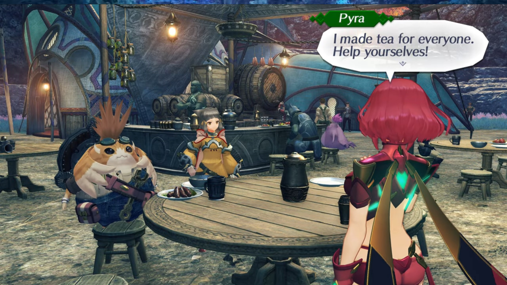

Tora: "Oh, noooo. Pyra getting it **completely** wrong."

"Oh? Would you... rather have something else, Tora?"

"Oh no no, that not it ummm. Tora just think that if- _Pyra going to_- **do** maid job, Pyra should be more... _maidy._"

"_Maidy?_"

Nia complaint, "Tora. Pyra was kind enough to make tea. Can't you just be bloody grateful?"

"**Oh, Tora knowwwww that,** but, also... Strive for perfection is important goal! Tora feel- very- strongly about this! _Most important thing for maid is... um... Nopon word is, uh... 'blushy-crushy'._ **Pyra still quite- lacking in that area!**"

"I... I-I'm lacking? _But what_ on Alrest is 'blushy-crushy'?"

"It uh... what every man, looking for. If Pyra **master art** of blushy-crushy, then all men fall at Pyra's feet!"

"A-a-all men? Really?"

"Yes! Uh It is... known fact!"

Nia: "Listen, Pyra. There's no point paying attention to this little twerp." He must be wanting to fall to her feet himself. 

"But..."

They haven't yet argued, Tora already cut in, "Is Pyra interested in essence of maidiness?"

> Choose: "Yes I am!"  
> or "If you think Rex would like that..."

"Yes, I am!"

Nia was terrified, "You cannot be serious!"

Tora was overjoyed, "**Good attitude!** Tora will teach maid art of **blushy-crushy!** Welcome Tora's maidiest assistant!"

"_How may I be of service, Masterpon? Tee-hee!_" Just the opening is already so maidy. 

Pyra was surprised, "P-Poppi?"

Nia: "What the hell happened to you? Is this some kinda malfunction?" Recall, when she wasn't there, what misprogramming Tora had gave her when she first start up. 

"_Poppi's Maidiest Mode has been activated. Tee-hee!_"

Tora: "**Hoho! Maidiest Poppi** will teach you all about essence of maid behavior."

Standing next to each other, Pyra watched Poppi, she started, "Blushy-crushy, is external magnification of love feelings inside heart. Poppi will teach magic way to magnify **love** feelings. **Chant with Poppi.**"

"O-OK!"

"**Cutey-cutey, lovely-lovely, blushy-crushy, tee-hee!**"

Nia was already not feeling right, warned, "Pyra, please do NOT tell me you're gonna..."

She wasn't listening, trying to replicate, "C-cutey-cutey? Lovely... lovely... Blushy... Crushy... Tee-hee!" Except hers was more bland than Poppi's. 

"**Whop**, there we go." Nia felt wanting to throw up at any moments. 

"**Nnnnn-Not quite! Copy Poppi... _exactly!_**" The judge determined. 

"Yes, coach!"

"Please, Pyra... Come back to us... While you still can!"

"If you think Rex <i>would like</i> that..."

"Rex-Rex is **boy**, so he definitely not immune to the... _charms of blushy-crushy._ It definitely worth Pyra's time to learn **essence** of maidiness."

"I see... **OK**, I'm ready! Tora, tell me what to do!" such straightforwardness. 

"Uh, Pyra?" Nia was sweating cold sweat. 

"Tora will now introduce assistant to help teach **essence of maidiness!**"

"**How may I be of service, Mr. Rex, sir? Tee-hee!**"

Pyra was surprised, "P-Poppi?"

Nia: "What is this, Tora, some kinda... malfunction?"

Poppi answered for her, "**Do not worry. This just 'Rex-Focused Blushy-Crushy Maximization Mode'. Have a good day _salvaging_, Mr. Rex, sir! Tee-hee-hee!**"

"**Mr.Rex... sir?**" Nia jumped on her feet. 

Pyra felt blushingly red, "S-s-so... this is... 'blushy-crushy'..."

"OK, Pyra, copy what Poppi say."

Side by side, Poppi started, "**Mr. Rex, sir, Poppi is** blushy-crushy **just for you.**"

Immediately she tried, quite blandly, her feeling of shame shot to max, "Mr. Rex... sir... Pyra- is... blushy-crushy... just for you?"

"**No no, no, no! Rex-Rex will never fall** at Pyra's feet with such **low level of blushy-crushy!** Try again, from top!"

Like the boss female manager whom shouted commands, she called out, "**Mr. Rex! Sir! Pyra** is blushy-crushy! **Just for you!**"

"_Not there yet!_"

Nia: "I... I give up. I can't watch this any more."

---

### Tora's Angst

At the stomach of Uraya, above Farlaine Central Pools, Tora exclaimed, "**Outstanding!** It thanks to Tora becoming Driver that Tora come to this place! Blades and Drivers **MOST BEST EVER!!!** Oh, that remind Tora! **Rex-Rex, Nia!** Tora need- _little_ consultation."

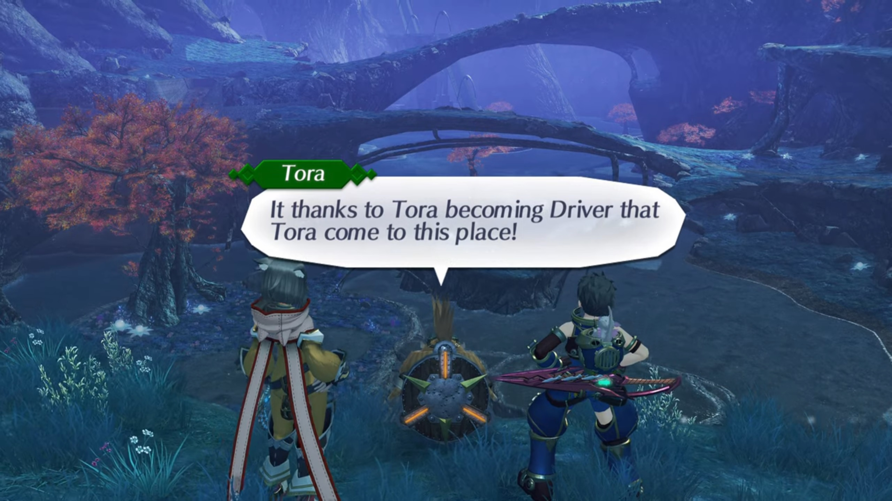

Nia: "Uh, a consultation? With us?"

"Tora have **big** problem right now. Recently... Tora finally realized. Tora is..."

"Tora- is...?" urged Rex.

"Tora is not- _very useful in battle!_"

"Ugh!" "Oh!"

"Why friends silent?"

"Oh, uhhh... We're just a bit surprised." answered Rex.

Nia added, "I mean, I just never really took you for the self-assessing type."

"Org, _too cruel._"

"Naaaahhh, I mean, you fight **just fine**, Tora."

"Poppi deserve all the credit. She pass weapon... and do all the things so Tora can fight like **real Driver.** Tora sometimes think, if he remove program of Poppi, Poppi fighting- **alone**- _would be most efficient..._"

Nia was surprised, "**Seriously? Wow, you go girl!**"

"**That why Tora just feel like- small furry ball and chain!**"

Rex: "Well, errrr... I wouldn't go **that** far..."

"Anyway, Tora wonder if there any point to Tora **still** being Driver. Maybe it better for everyone if- **Tora retire** and assume supervisor duty on sideline?"

"Ohhhh, Tora! Nia, what do you think?"

> Choose: "Why did you want to be a Driver?"  
> or "What's the most important thing, for a Driver?"

"Why did you want to be a Driver?"

He turned around and looked at the scene, reflecting his life, answered, "It not clear to Tora anymore... Starting with Grampypon, dearest wish of family was to **successfully create artificial Blade**. So, it natural that Tora start to wish it too!"

"Well, do you know **why** your grandad wanted to make an artificial Blade?"

"Surely it because..." He turned around and surprised the group with the most controversy reasoning, "**He want to be famous!**"

Rex: "That sounds like a lame reason..."

"**But** Nopon Driver is **rare** thing! Nopon who become Driver almost **sure** to become celebrity!"

"Was that your motivation as well, then?"

"Mmmmmeeeeehhhh... **Not** exactly. Tora want to be **like Rex-Rex!**"

"Like me?"

"At first, Tora simply yeaaaarn to be Driver, not- think- too much about it. But... _after me travel with Rex-Rex and friends_, he start to think different! Saving persons in need, facing all challenges... **Rex-Rex** is Tora's **idea** of **perfect Driver!**"

"It... feels kinda strange when you say that to my face..."

Nia wondered, "Rex, _a perfect Driver? I'm not convinced_. But it looks like you've got a clear goal in mind, Tora."

"**Hey, hold on!**"

Nia ignored him, continued, "Honestly, that's all you need! Tora, you should keep being a Driver. As- long- as you have goals to achieve, there's **no** reason for you to stop. And your Blade will help you in that. **Poppi shouldn't have to fight alone. You need** to be **right there** with her."

"Ohhh, it fair point... **Thank you, Rex-Rex! Thank you, Nia! Tora promise he will striiiive to be best Driver ever!**"

"What's the most important thing, for a Driver?"

"_Hoh,_ Tora been thinking about that **a lot**. Love towards Blade is important."

"L-l-love?"

Rex was surprised, "Not an answer I was **expecting**..."

"Tora observe and Tora analyze... And Tora note, **all Drivers** have **love** for their Blades! Example, Rex-Rex **love** Pyra, and Nia **love** Dromarch!"

"**I LOVE PYRA?!!!**" Caught him on his feet. 

"**R-REX LOVES PYRA?!!!**" That's Nia's focus. 

"Love that Tora feel for Poppi is- also unsurpassed thing. But just because Tora **have love**, _not mean Tora can necessarily be Driver..._"

Rex: "Yeah, but still..."

"Hang on, Rex." Nia had a suggestion. "We're getting bogged down here. Can we just- **straight up ask Poppi** and be done with this?"

"**That's a great idea!** Let's get Poppi here."

After Poppi arrived, Rex asked, "Hey, Poppi. **What would you do**- if Tora said- he wanted to quit being a Driver?"

"Poppi probably break down in tears, is what!"

"Oh, **meh-meh**-meh-meh! Tora work to be **best** Driver he can!" And he went back playing with Poppi. Tora and Poppi behind them, Rex exclaimed, "**Well**, that was pretty easy!"

"Ugh! I've just got no patience for this sorta- **non**-problem."

---

### A Tora and Poppi Production

Inside Mymona Playhouse (Cole's theater) at Fonsa Myma, Tora and Poppi arranged a show for some members of the group. Tora started, "Ladies and gentlepon, thank you for join us here today! _We hope you_ enjoy performance of **'Uraya Goes To War'.**"

Rex exclaimed, "This is gonna be **so much** fun!"

Gramps wondered, "Are we the only ones watching? **Where did Nia go off to?**"

"**I dunno!**"

Tora continued narrating, "**Queen Raqura! Me** think time has come to go to war with Mor Ardain!"

"This is **most** sudden, War Minister." Nia had participated herself in the show. 

Dromarch was surprised, "My lady...?"

Rex cheered, "Wow, **you're great, Nia!**"

She can have out-of-performance narratives, sniped at Rex, "Shut it, you! I didn't ask to take part in this farce!"

Tora continued, "**Ahem**. This not sudden, Your Majesty. We preparing for war **ever since** Mor Ardain take occupation- of Gormott."

"Then the preparations- are- complete?" she returned to her role playing. 

"Preparations _go steady for long time_, **but**- we can quickly make complete. Mor Ardain soon try to **conquer other countries aside** from Gormott. We **cannot** allow ambitions to succeed. **Must start war** at earliest possibility!"

"I see... So be it then. Let us... make war."

"**Wait- one- moment, please!**" Poppi rejected. 

"You have concerns, High Minister?"

"Titan of Mor Ardain quickly becoming so barren, crops cannot be grown. **Meanwhile, we** have rich soil, producing **much delicious** Gromrice. Why **bother with war** when Mor Ardain **collapse on its own** from famine?"

"A valid question."

Tora rebutted quick, "No no! _If we wait, Mor Ardain just conquer_ **more territories** like Gormott. _With more territories, Mor Ardain become_ still greater threat! **Eeeeeeeeven** if Mor Ardain **Titan collapse completely**, _may still be difficult_ to defeat whole Empire!"

"There no need to be hasty." argued Poppi. "Mor Ardain still not have enough territory or supplies to properly provide for own people. Gormott alone not enough to support whoooole of Ardainian population. In other words, more prudent to wait for Mor Ardain to grow weaker before attacking."

Nia thought that "Your argument- is- compelling."

Tora resolved "**That not happen today or tomorrow** though! Noooo! Might take **many** decades to happen, _or even_ centuries! We can **not allow Mor Ardain threat** to remain **longer than necessary!**"

"That- quite- true-, but now is not time- to rush into things! War preparations may be in progress, but still not in optimal condition!"

Tora looked to Nia, "Oh urgh This argument **never end**. Your Majesty **must make FINAL DECISION!!!**"

She jumped on her feet, "Huh? You want me to decide?"

Poppi agreed, "Your Majesty is Queeeeen of Uraya.{{footnote: On a note, in Xenoblade Chronicles 3, Nia did became a Queen.}}"

"O-o-ohh yeah, right..."

> Choose: "Let's go to war!"  
> or "Let's wait a little longer."

"Let's go to war!"

Tora was impressed! Poppi said nothing. 

"Let's wait a little longer."

Tora was speechless! Poppi was impressed.

Nia was confused. Why are they looking at her? "What now? Did you both forget your lines?"

Tora explained, "Argh... Script of 'Uraya Goes To War' end here. **No more lines** to say."

Poppi addressed the audiences, "Thank you for coming today, everyone!"

Gramps noted, "I see, I see! By showing this play to the children, you'll get them to think for themselves about whether Uraya should go to war."

Dromarch: "Mmm, that's quite clever, actually."

Rex agreed, "It's a difficult question. I can see the kids having split opinions, too."

Nia, meanwhile, was getting fired up, "You force me to take part in this thing, and then it just ends like that? This is SO not satisfying!"

---

### Telling Roc about Vandham

On a hill overlooking Garfont village, Rex told Roc, after reawakening him, "There's a **really great** view of the whole village from here, right?"

"Indeed! It's... quite- the vista. Such a fine village it is, too. Certainly no one is **awash** with luxury down there. But still, the people are remarkably happy. Even when life is hard, they keep- smiling, **keep looking forward.**"

"I think of it as the continuation of Vandham's spirit. He may be gone, but his good deeeeeds outlive him."

"Yes, it's a fine thought, _knowing- the man who- built and protected this village was once my Driver._"

> Choose: "Do you want to hear about Vandham?"  
> or "Do you wish you could stay here?"

"Do you want to hear about Vandham?"

"Well... _it seems a tad rude- to go on about my old Driver in front of my current one..._ But I've heard he was quite the remarkable man. Naturally, I'm curious."

"He was one of the good guys, all right. He had **big** muscles, a **big** voice, and an **even bigger** heart. It was Vandham who taught me the basics of being a Driver. More than that, in fact. He taught me all about Blades, how to fight, the way of the world... I didn't know him for long, but he taught me the most important things I know."

"Is that right? He was the kind of- solid, powerful, and dashing sort that is irresistible to the opposite sex, I'll wager."

"Ermmm, I'm not sure if he was that much of a hit with the ladies. But he was a great guy, that's for sure."

"Hmmm... I feel the loss of my memories- of him- very keenly."

"Well, don't worry, Roc. Like I said before, the people of this village are carrying on what he started. **And so are we.** I hope I can become as good as him some day. I may still have a way to go. But **just you stick with me**, Roc, and **one day, you'll see!**"

"I don't doubt it."

"Do you wish you could stay here?"

"I wouldn't say that. After all, it's not like _I have any memories of my time in this village._ But **I believe something** lives on here. Something of Vandham, and- of myself. When I think about it, I can't help but- get **a tad** sentimental."

"Yeah, I know what you mean. It's like the village is full of memories. Memories of... you, memories of Vandham."

"I wonder how he and I used to spend our days..."

"I think... you probably both lived pretty normal lives, really."

"Normal?"

"That's right. Vandham was the everyday sort, you know? I mean, he'd get up in the morning, see to the kids, then he'd just eat a big sausage sandwich. Evening, he'd drink a beer and- chat about what he was up to. Then he'd just get a bit sleepy, and go to bed. I think that's what he was trying to build here. A place where people could just... live normal lives. I think that's what both of you were always fighting for."

"Fighting for _a normal life? Then perhaps even now, that_... normal life is what the people of this village hold most dear... Tell me, Rex... Would you say Vandham... _was a 'kind'- person?_"

"Kind, errrrr... I mean, he was straight up with everyone. Maybe even blunt sometimes. But he was a real gentle giant. He'd probably get mad at me for saying it, but I think he was a lot like a father. He's someone that I looked up to. Someone I'd like to **be like** someday."

"I can see you hold him in **great regard**, Rex. I only wish I could have **met him myself.**"

"He did everything he could to protect us. I bet he's still watching over us from somewhere, even now..."

"Well, **in that case**, I'd better make sure he **always sees me** at my best!"

"**Yeah, I reckon if we don't live up to his expectations, we'll be in a RIIIGHT rollicking someday!**"

---

### How to be a Veteran Driver

One night, near the port where they disembarked in Mor Ardain, in the Cargo Transportation Zone, suddenly, Tora had a really weird statement, "Rex-Rex! Tora have to ask for friend as fellow man's man! Tora want to gain understanding of life as adventurer!"

"As an adventurer?" What do you mean? 

"Rex-Rex is role-model of Tora! That why Tora want to learn **everything** he can about being Rex-Rex!"

"This is all very sudden, Tora. What's going on?"

Gramps had a different feeling about this, "Come now, Rex. Don't feel too important, he just wants to talk."

Poppi: "In any case, it not so common for Masterpon to ask something so directly."

"Exactly! Tora being **earnest** like **never before!** Hm! Tora submit as evidence: this direct, unflinching eye contact!" And he stared at Rex with his big eyes.

Rex looked closely and noticed, "_Wow_, your pupils are really dilated..."

Gramps commented, "That's what you get, staying up all night..."

Poppi made up her mind, "All right, tonight Masterpon go to bed early." That includes some... drastic measures if he don't. 

"**Meh-meh-meh-meh! Enough!** Tora's eyes are worry of Tora! It no matter! This important! Tora want to be like Rex-Rex! Rex-Rex! Pleaaaaase, teach Tora!"

> Choose: "I'll teach you all that life's taught me!"  
> or: "Maybe it's better if Nia teaches you?"

"I'll teach you all that life's taught me!"

"Thank you! Tora cannot wait!"

"All right, Tora, listen up. To become a responsible adult, here's what you need to do. Firstly, you've got to take good care of your tools!"

"**Ah, Tora very good at that!** Runs Poppi's diagnostics every day!" He held out his wings to stop Rex from speaking more. 

"Indeed. Masterpon keep Poppi in impeccable state of maintenance."

"Secondly, you've got to take good care... of your friends! If you don't have friends to rely on, you'll be in trouble when a big job comes around!"

"_Hum hum hum hum hum, Tora see._ Tora always work alone until now, so- that point- _still a little new_ to Tora."

"And **most importantly, number three!**"

"Yes, yes?"

"Correctly triangulating wreckage coordinates!"

"**Ah, of course!** Tora can see that very important!" He answered without thinking; then it struck his conscious, "_One moment. Wreckage coordinates?_"

"That's right. If you mess up the coordinates, all the prep you've done goes down the drain. You might lose out on any loot you could've got otherwise..."

"_Ohhh..._" Tora is not salvager, meh! 

Gramps quietly reminded, "_Um, Rex. Isn't that salvaging you're talking about?_"

"**Huh? Yeah, why?**"

Tora raised up his wings, "**One moment, please!** _Why Rex-Rex talking about salvaging?_"

"You wanted to know about adventure, yeah? And what greater adventure is there than salvaging?"

His wings fluttered, "Tora want to know Driver wisdom! Have no use for salvager wisdom! Meh!"

"**WHUH?!!**"

"Masterpon, it seem that ask Rex about art of being Driver not bear fruit."

Gramps added, "After all, Rex is a rookie too..."

"_Tora is disappoint..._"

"**I really thought you were thinking of being a salvager, Tora...**"

He turned his back on Rex immediately, not giving face, "Meh, it fine. Tora ask Nia." Immediately, he walked away. 

"**H-Hang on, Tora! Let me... Let me try again!**" And he went after him. 

"Maybe it's better if Nia teaches you? OK, so you want to know about being a Driver, right?"

"Right!"

"Does it bother Masterpon when someone say he no good at weapon pass?" Poppi wondered. 

"Of course it bother Tora! I mean, _weapon pass is crucial element_ of Driver-Blade coordination. If someone say me not so great at that, Tora's self-esteem plunge is par for course!"

"I know where you're coming from, but... Uh, maybe that's all the more reason to ask Nia? **She's the experienced** one around here..."

Tora felt disappointed, "Mehhhhh... Tora get it. Will ask and come back."

After he returned, he passed on wisdom of Nia, "Nia just say, with time, body of Driver learn to do it by muscle memory..."

Poppi felt disappointed this time, "Answer seem somewhat... dismissive?"

"Ah, that's a shame... **Hey, but, maybe- I can still help? I think Pyra and I manage OK, so...**"

"Actually, Nia refer to Rex-Rex as well."

Poppi had memorized her exact phrase, proudly repeated, "Poppi believe 'the kid's green as freshly mowed grass himself'... _were her exact words._"

"**Seriously?!!! That's what she thinks of me?**"

"Oh chin up, Rex-Rex."

Poppi: "Indeed! Have much time to live and learn!"

"**Yeahhhh!!! We'll get there!**"

Gramps commented, "He says he'll help, but then he's the one who needs pepping up..."

---

### Dromarch's Wisdom

At the capital city of Mor Ardain, Alba Cavanich, Nharil Central Plaza, Dromarch called for her attention, "My Lady... Over there. The capital's standing army."

"I see 'em." There were children behind them playing, and some other adults over at the lamppost chatting. 

Rex and Pyra just went up to them, Rex suggested, "Let's keep our distance, yeah? Best let sleeping Gogols lie."

"Good call."

Dromarch had other wisdom, shared, "Be not alarmed. The troops that captured us- were Ardainian military, yes, but from the Gor-motti regiment."

"Those aren't the same?" Pyra wondered. 

"Mmm. Quite different, in fact. **One can learn many things**- while in a Titan battleship's brig, and I made- good use- of the opportunity."

Nia sighed, "_Damn. They chucked me into solitary_, so I don't know anything..."

Dromarch continued, "It does seem they have separate procedures for Blades and Drivers. In any case, once- I abandoned thoughts of staging a break-out, I did make sure to keep my ears open for intelligence."

Pyra asked, "Did you hear anything else?"

"Mmm... Let me think... The soldiers over there are, as I said previously, from the capital's garrison..." He's referring the soldiers that's guarding the buildings, probably military. "But those other ones actually belong to the First Imperial Guard, 2nd Battalion." That's the one guarding the bridge connecting Alba Cavanich to the Castle. 

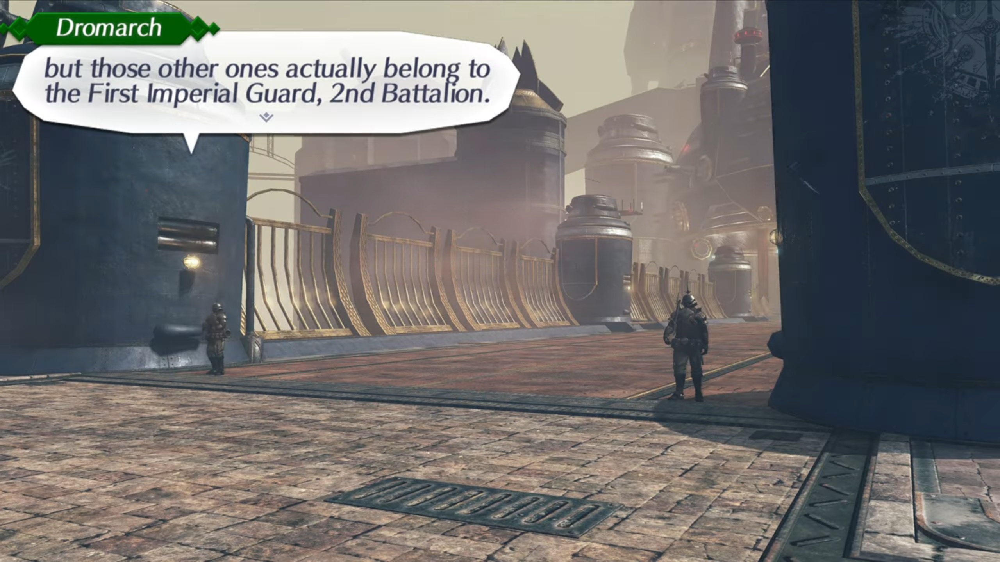

"Huh? What's the difference?" Rex don't understand. 

"Beyond the bridge is Hardhaigh Palace, the imperial residence. Therefore..."

It clicked in Pyra's mind, "**Oh, I've got it!** The palace guards belong to a different unit. **Of course!**"

"**Indeed!** Then, above the Imperial Guard rank and file, you have the **Carraig special** guard unit. And higher yet, the Special Inquisitor, The Flamebringer herself."

"Wow!" Rex was impressed. 

Nia was bored and confused, "_Armies, man._ I could never deal with all this **hierarchy** crap."

"Ever heard the expression, 'know- thy- enemy'...?" asked Dromarch.

> Choose: "Nia, how was Torna organized?"  
> or: "Got any other good ones, Dromarch?"

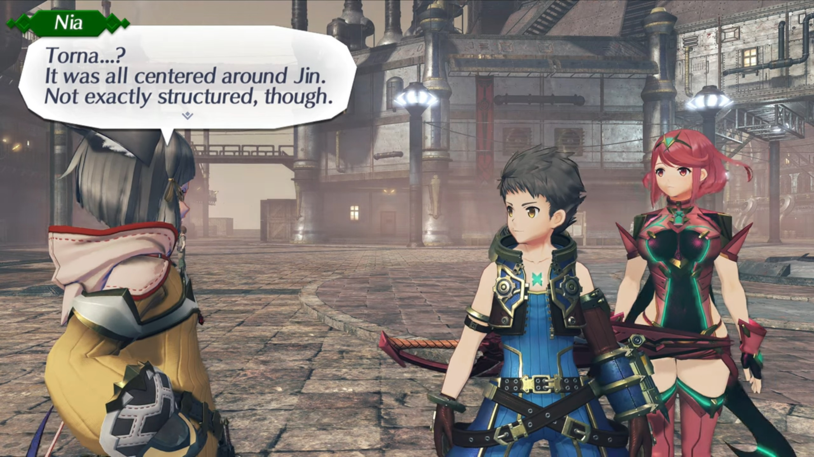

Rex wondered, "Nia, how was Torna organized?"

"Torna? It was all... centered around Jin. Not exactly structured, though. But we all had our assignments."

"What was yours, Nia?" wondered Pyra.

"I was..."

Rex interrupted her, "Naptime specialist?"

"**Shut it!** I was, uh, general- support. I hadn't been there long, so- I- mostly just helped out with whatever."

"**Hah. Not much of a change, then.**"

Dromarch agreed, "It is, as you say."

Nia lashed out at him, "Stop making it sound like I'm some useless layabout!" Then she felt the need to explain herself, "I mean, I can make _ruska dumplings and stuff_, so..."

Cooking! Pyra immediately invited, "Well then, maybe we could cook something together?"

"Mm-hmm! OK, you're on!"

Dromarch had worries, "**My Lady, are you sure that's err...**"

She decided to use action to prove it, "Both of you'll sing a different song when I stuff your faces with my food!"

Cold sweat ran down Dromarch's manes, "(sigh)... You have best **steel** yourself, Master Rex. My lady's cooking... is not what anyone would call... 'conventionally tasty'..."

Rex backed up a sec, "Ugh... Maybe I shouldn't have riled her up..."

Rex wondered: "Got any other good ones, Dromarch?"

"The smallest unit in the Ardainian army's structure... is the **ten-soldier** decade. It includes **eight** foot soldiers, alongside the squad leader and a deputy. Six to ten of these decades can then form a unit called- a century. But eight- is the usual number."

"Haaaaaahhhh, neat..."

"Mm hmm..." He rubbed his face as he showered in pride. "Master Rex, you did ask for a 'good one', correct?"

"I did."

"Would you not say that was a 'good one', then?" He wanted a specific praise, LOL...

But Rex was so confused, "Uhhhhh, which part?"

Dromarch reminded him, "(sigh)... I said that commonly, **eight** decades form a century. **Eighty men**... and yet, they are... **a century.**"

"**Ohhhh, now I get it!**"

Nia quietly suggested, "_Rex, he's done his best, so just throw him a bone, will ya?_"

"**Ahh yeah, no, that was a VERY good one! Uh-huh, VERY good.**"

"**I have- doubts- about your sincerity...**"

---

### Unforgiving Terrain

In the upper level of Mor Ardain, Jelidorend Highlands, Tora complaint, "Mor Ardain so full of **wasteland** and hard rocks... Not easy for walking!"

Rex suggested, "Shall we take a rest around here?"

"**Good idea**, yes!" Immediately he agreed. 

Gramps suggested, "You need to toughen up a bit, Tora."

Tora rebutted, "Tora live whole life cooped up in house working on building Poppi! _Not used to walking long distance! If only Tora could_ flitter-flutter like Gramps..."

"Well, you have those big ear... wing... things."

He fluttered, "Nopon wings not for flying! Could flap forever and not reach sky!"

Rex had another suggestion, "If you're really having a hard time walking, you could ask Dromarch to give you a ride..."

His eyes lit up, "**Ohhh, Rex-Rex is genius!**"

Nia looked to Dromarch for his opinion. A Nopon behind his back? "I- think- not. I have solemnly sworn to carry none other than my lady."

Nia urged, "_Go on. It can't hurt._"

Dromarch jumped on his feet with tail raised high, "**WHAAAAATTT?!!!**" Or perhaps, more surprised by her acceptance. He tried to dissuade her, "Are you sure about this, my lady?! If you Tora to ride me now, soon he will want Poppi to join him, and there will be no space left for you!"

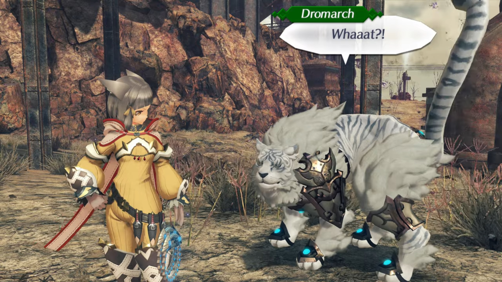

"Well, when you put it like that... Sorry, Tora, _guess that's a no._"

"Orgh, Much disappoint...."

Rex worried about "Pyra, are you OK walking?"

"**Oh**, yes, I'm fine. Though all the dust clouds do bother me a little..."

Nia agreed, "Oh, yeah, those are a pain. Gets in your eyes sometimes."

"Poppi also not like that. Small particles get in joints and cause **nasty** creaking when moving. Must ask Masterpon **to clean out** when get out of this place."

"Rex-Rex, it seem like Mor Ardain tricky place for everyone. Rex-Rex have any bright ideas for helping?"

"Well, let's see..."

> Choose: "I could lend out my salvager suits."  
> or: "Just gotta rough it out!"

An aha moment came, and he asked, "Would anyone like to borrow one of my salvager suits?"

Pyra: "I suppose that would help keep the sand out..."

"I've got a spare you could borrow. You wanna try it on? Actually, I guess Nia's the only one who it would _really_ fit."

"Go on then, I'll give it a try. If it really is useful, we can buy a whole bunch of 'em sometime!"

After wearing it, Dromarch commented, "My lady... That suits you- surprisingly well..."

"Oh shuttup." She was wearing a golden-brown version of Rex's blue ones, including the helmet. "So this is what it's like for Rex when he goes salvaging, huh?"

"Keeps the sand out pretty well, right?"

"Well, yeah, it does that... But I can't really see. Peripheral vision's awful in this thing. It's hard to move about in, too." She tried to do a battle stance. 

Pyra concluded, "It might not be **very** practical for combat..."

"Yeah, I don't think I could fight like this."

Tora concluded, "Looks like genius idea of Rex-Rex _not so genius after all._"

"Well it was worth a try..."

He hadn't spoken anything but Gramps read his mind already, "Ahhh, the old 'grin and bear it' solution."

Poppi was disappointed, "Rex not even try to solve problem?"

"Well I mean... listening to you guys talk about it does make me think that the sand and dust is a problem. **But then I realize** it never actually bothered me until you mentioned it. It's not like it's making our attacks miss or anything, **right?** I think we're fighting **as well as we ever have**. It's a bit of an irritation, **but it's not causing any actual problems.**"

Pyra agreed, "I suppose you're right..."

Nia too, "Yeah, I guess its not actually slowing me down."

"Right? So I think as long as we keep our spirits strong, we can make it through this just fine."

Pyra cheered, "**Well said, Rex!** I'll do my best to keep going then!"

Nia: "I'll try and keep my mind off it too."

Of course, everyone had forgotten who had started the conversation and quacked in the first place. Rex suggested, "All right! Let's keep moving, guys!"

Pyra, high in spirit, "**Right!**"

Poppi wondered, "Is this really solution?"

Tora: "Is **best** solution!"

---

### Mor Ardain vs Gormott

Nia, at Hardhaigh Palace Wing Area #2, commented, "When I look at it now, this capital of yours is pretty prosperous. Far cry from Gormott."

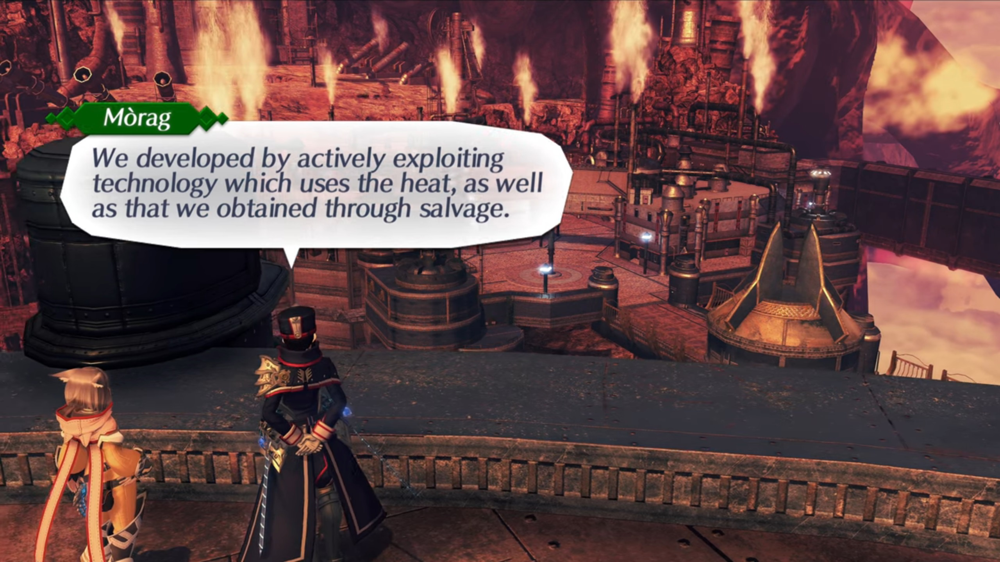

Mòrag questioned, "Is that how you see it, Nia?"

"Well, am I wrong? Your technology is so much more advanced than Gormott's, and you've got army facilities, hot springs... Looks to me like you've got all you need right here. I guess I don't get why you had to go and annex Gormott..."

"Mor Ardain generally has a rather hot climate, you see. We developed by actively exploiting technology which uses the heat, as well as that we obtained through salvage. **But**... as the Titan nears the end of its lifetime, the temperature has started rising steadily{{footnote: Talk about global warming.}}... Ironically, while this has made our heat-powered technologies even more efficient, our farmland has done very much the opposite- of flourish."

"The Titan's lifetime, huh..."

"Yes, it shouldn't be long now. The day when Mor Ardain's Titan becomes uninhabitable. Sensing that, the Senate started a war to conquer a new home for our people."

"That'd be Gormott, then."

"Indeed."

> Choose: "You realize there was a better way?"  
> or: "All this because of dumb pride..."

"You realize there was a better way?"

"Was there, now?"

"Our two governments could've just talked, got to know each other, become friends... **We could've worked together on this! Just- like- you and me**. We were enemies at first, **sure, but now we're allies**, fighting on the same side. If our nations could've done the same, **it wouldn't have had to come to war!**"

"Perhaps so. If everyone in this world thought like you do, terror and strife wouldn't be so commonplace."

"Well, come on... You're not just gonna give up, are you?"

"What do you mean?"

"If there's no need for strife, then we should just get rid of it. **Rex told us,** right? **If we reach the World Tree, there'll be no need for fighting any more.**"

"You think Elysium is the answer to all our troubles, do you?"

"I don't care if people laugh, call it a pipe dream, or whatever. **I'd rather be an optimist** than just despair at the state of the world."

"Hahah! You have a point."

"I hope you'll lend us your strength to reach that goal, Mòrag. It'd be grand if we could count on your support."

"I will! They call me the Empire's finest, and I- intend- to prove it."

"All this because of dumb pride..."

"What do you mean?"

She started ranting, "You didn't have to act _so high and mighty. You coulda been humble._ But no. **I dunno if you were refusing to show weakness, or if you just felt you were better than us, but you put your damn pride above all other things and chose to invade.** Am I wrong? You started a war. Wanting to save lives, you ended up losing lives. **How backwards is that?** If you can't make enough food, **why not just... bow your head and ask if you could share?** I mean, we were enemies once, **but now** we understand each other. **How could a sodding government not even think of it?**"

She wasn't angered by it, kept her calm, "A point well made... But the world is not as straightforward a place as that. Sometimes the most- obvious- way is the most difficult to take."

"_Cor..._ People are such a pain..."

"No question..." She didn't realize{{footnote: on the word 'people'}}. That's exactly why I want to support the boy, and other upright people like him.

"You mean Rex?"

"A world with no strife... _Can you imagine something so wonderful, if it were true?_ And if there's anyone who could ever _make it true, it's him._ **_Every age needs its own dreamers to forge new paths,_** after all."

"**Ahah! You're full of surprises, Mòrag.** You always struck me as straight-laced. **But here you are, believing in the Elysium story.**"

"It's not just little boys and girls that follow their dreams, is it? I too want to see the fruits of this dream you all share. _That's why I'm with you._"

"Well, whatever your motive, it's nice to have you with us, Mòrag. Yeah, I think we can make good use of the Empire's finest!"

"Please do! No matter what path we tread, I'll be there to help you on the way..."

---

### Mòrag the Chef

At the kitchen/restaurant (Rumbletum Canteen) in Argentum, Pyra said to "Hey, Brighid! I found something interesting in that shop over there."

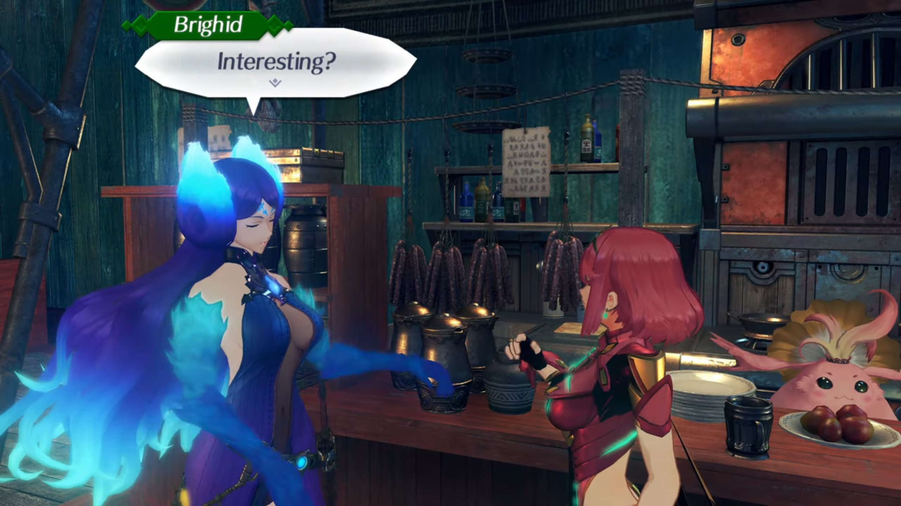

"Interesting?"

"Yep. Here it is." She handed her something. 

"What... is that thing? It looks... quite grotesque."

"Why, that's an Argentum Monkfish." Mòrag recognized immediately, coming into the kitchen. 

"You are familiar with this creature, Lady Mòrag?"

"It's a rare delicacy that is only found in the waters around here. Rather tasty."

"People... eat this monstrous fish thing?" Brighid can't believe what she'd just heard. 

Pyra commented, "It might not look appetizing, but I've heard the taste is divine. Since it's so rare, I thought I'd cook something up with it, but I'm not sure how... Mòrag, do you know? Do tell, please!"

> Choose: "I'm not that great a cook..."  
> or: "...Very well, I'll do it."

"I'm not that great a cook..."

Perhaps sensing what's she gonna say, Pyra immediately suggested, "**Oh, no,** that's fine! I'm happy to do the messy part. I just need you to tell me the steps, and then if you could add the spices..."

"Well, if that is all, I suppose it should be... fine..."

Brighid heard the wobbery in her voice, asked, "Are you certain, Lady Mòrag? About the spices and everything?"

"D-d-don't you worry... Have- some- faith in my taste buds."

In front of the stove, they were looking at it. Pyra asked, "Right then. So, first, how should we cook it?"

"_A fine question._ Many would eat it grilled, or sliced raw, **but I hear it tastes best** in a stew."

"**Sounds great!** Well then, Mòrag, can I ask you to get the stock ready?"

"Of course! If I recall, that's- made- by- boiling the guts..."

"I think I can leave you to it then! I'll go buy the other ingredients."

"Roger."

Looking at the fish, Mòrag was self-questioning, "Hmph... **Brighid?**"

"Yes, Lady Mòrag?"

"Do we have to begin by **gutting** this ugly little creature?"

"Well, I should think so. Can you do it?"

She backed a step, "Erm... I'm not even really sure which part the guts are..."

"That would be the parts on the in-side. Consider using a knife..."

"Right... **Brighid?**" After she cut it open, she called out once more. 

"Yes, what is it now?"

She jumped back, exclaimed, "**The heart! The heart- is still- beating!** What should I do? Should I deliver the coup de grâce?"

Can't back away now, she gave the confidence, "I-i-indeed! That- seems wise. We don't want it fighting back."

"**Brighid! It's... looking at me with THOSE EYES, and moving those lips, like it's accusing me of something. IT'S CURSING ME FOR TAKING IT'S heart! It's NO USE... I CAN'T TORMENT the dead any further. BRIGHID, I'll leave the rest to you.**"

"**Wait** just a minute! You can't force me to do your dirty work!"

"**I'M SORRY, but... I must!**"

"Lady Mòrag! Are you deserting in the face of the enemy?!"

"...Very well, I'll do it."

Brighid warned for the final time, "Lady Mòrag, if I may. _Is this really- wise?_"

"**Oh!** Don't you worry yourself." She had said it, she must made it come true. 

Pyra was excited, asked, "Shall we start by gutting the fish, then?"

"Ex-cuse me?"

"What's the matter?"

"Gut it? Gut. This. Creature?"

"_Well, yes._ We can't exactly cook it like that."

"**MM HMM!** Understood. Life is a battlefield. Let us commence."

"**Show it who's boss, Lady Mòrag!**" Brighid cheered for her. 

"Mhmph! **Brighid!**"

"Yes?"

"Please hold down its head."

"Wh-wha...?! No, I, er, that is... I'd rather not... touch it."

"**It's just**... a little tricky to make the incision when it keeps... **staring** at me..."

"Qu-quite true, b-b-but..."

"**FOR THE LOVE of the Architect, DO IT! Please, at least cover its eyes for me!**"

"Y-y-yes, Ma'am. We cannot let a mere fish get the best of us! **ERRRRRKKKKK!!!**" She screamed thereafter. 

"**What's wrong?!**"

"**It...It looked me in the eye!** Is this thing still alive?!"

"Can it be? Then I must end it before it strikes!" She pulled out her truncheon, as if the battlefield was even harder than a real one. 

Brighid warned, "**It's opening its foul maw?!** Lady Mòrag, the enemy means to **eat us! Quickly, the finishing blow!**"

"**VERY WELL! HELLFIRE!!!**"

Pyra exclaimed, "**NO, WAIT! I-If you do that, the food will be...**"

But it was too late. They'd destroyed the enemy of their heart that looms larger than it really. Tucked her truncheon back to her sides, she asked, "Well, Brighid?"

She agreed thick-faced, "**As befits the** Flamebringer. _The foe is extinguished... without a trace._"

"Phew. _Our mission here is done._"

Pyra was jumping up and down, "What do you think you're doing?! There's nothing left for us to eat!"

---

### Hot Springs

"Ahh, how Tora missed hot springs. This bring back memories of first time we stay in Mor Ardain." They were at Jakolo's Inn at Mor Ardain. 

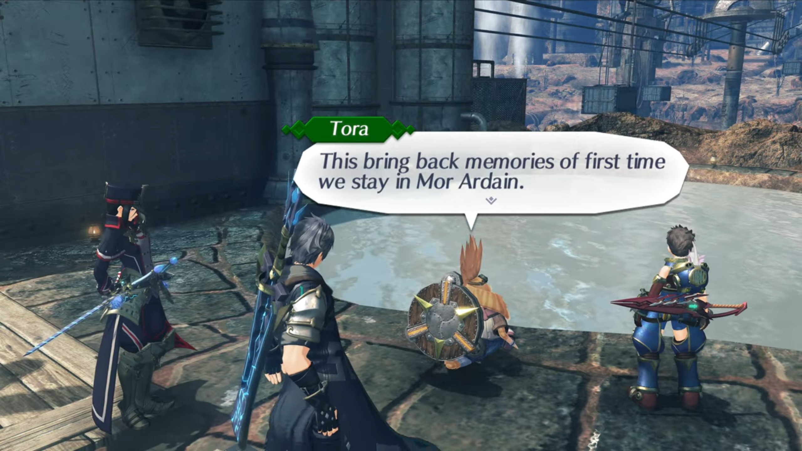

Rex exclaimed, "The water here is great, right? It just melted the weariness away."

Mòrag noted, "Ahh, I see. So this is where you stayed."

Zeke: "First time I've been here, though. But hang on... **Is this place unisex?**"

Tora: "Sadly, it is not... Are set times for men and women."

"Ahhh, right... That sorta system..." Discouraged. 

Mòrag: "Hmph... To bad for you."

Tora invited, "Seems now is right time for men to go bathe. **What lads say? We all go, yes?**"

Mòrag jumped on her feet, "What?" I'm not a man?!!!

> Choose: "All men here! No need to fear nudity!"  
> or: "Tora happy to wash everyone's backs!"

"All men here! No need to fear nudity!"

Mòrag tried to understand his request, "You want- all four of us- to bathe- together?"

"**Of course yes!** Or, is there some... problem?"

Zeke answered, "No, ummm, me and Rex are game, but urrr Mòrag, uh..." How do one explain? He didn't even notice? 

Mòrag relieved his explanation, "You three go on ahead. I- shall- abstain- for now."

Tora still didn't get it, encouraged strongly, "Mòrag so reserved... **Come on, all go together!**"

Rex asked Zeke, scratching his head, "**Is it possible** that Tora doesn't know Mòrag is a woman?"

Zeke shared his experience the other way, considering the options, "Well, it's not like I could tell a Nopon woman apart, except from the clothing... And with Mòrag wearing **men's** clothes, maybe it's no wonder the little guy got confused. Orrrrr... Maybe he just doesn't really care one way or the other?"

At the center scene, Tora was still trying to convince her, "Mòrag, _it OK! Take moment to breathe, then come with!_"

Straight in his face, "I refuse."

Without listening further, he continued to urge, "Look, _Tora understand. Lots of Nopon not like baths, too._ Maybe- Mòrag afraid Mòrag drown? But- hygiene veeeeeery important! Have to soak, to get nice and clean."

"I **do** like water, and **I am not- filthy**... But on this matter, I will not bulge."

"Ohhh how friend Mòrag be so stubborn, with hot spring right before eyes! **Come on, Mòrag! Drop clothes like man, and jump in hot spring! Tora not have all day!**"

She now ask straight in his face, "You know I'm a woman, _don't you?_"

His fluttering wings froze in mid-air, "Meh... meh... **mehmehmehmehmehmehmehmehmeh?!!!** Wo-wo-wo-**woman?!!!**"

"**Yes. I'm a woman,** Tora."

"**Mehmeh-mehmeh?!!**" He turned around and asked, "**Rex-Rex! Zeke! You know this?!**"

Rex: "I mean, at a glance..."

"Well, for Tora, this discovery of century! **Have to tell Poppi and others!**" After he went away to share the news, the rest gathered in a circle. 

Rex: "well, that's that then, I guess?"

Mòrag: "_My..._ I did not expect **this** when I woke up today."

Zeke suggested, "Hey Mòrag, how about next time you put on a skirt and some heels?"

She replied calmly, "How about you die in a fire, Zeke."

"Tora happy to wash everyone's backs! In return, Tora ask for help in washing his! <b>Tora strong believer in importance of physical contact, for build team bonds!</b>"

Mòrag: "_I think I'll excuse myself this time._"

"Mòrag not want to bathe with Tora?" He felt disappointed. 

"Please don't take this the wrong way. It is just... **this is a very delicate matter, I'm sure you understand.**"

"Is because Tora is Nopon?"

"**Nooo! Of course not! That's not it at all! I-I just, I have other... Ugh!**"

Zeke now get into the play, "Oh, Mòrag... Why've you gotta be so stubborn? Why not just play along and make Tora's little dream come true?" Or maybe, _your_ dream come true? 

"Bolt it! How dare you make light of me!"

Tora still don't understand, "Mòrag... _maybe worried about feathers in bath?_ Then no need! Tora is younggggg, not drop feathers so easy!"

"Uhm, no, th-that's not the problem..."

"Then there only **one** explanation... _Mòrag really do hate Tora?_"

"Ngh... N-no, that's not true..."

Zeke urged her to reveal herself, "C'mon Mòrag. Tora's almost crying here."

"Urkkk..."

"If Mòrag not hate Tora, then, why not want to wash each other's backs...?"

"**Oh**, for the... **Fine! Let us bathe together!**"

"Huh?" Rex and Zeke jumped on their feet. What the heck is she even speaking? 

Zeke: "Seriously?" 

Only Tora's fluttered wings exclaimed how happy he got. "**Tora score!**"

"But I will bathe in my clothes! And **that**- is non-negotiable!"

Zeke: "Uhhh, good luck trying to explain this to the bath attendants..."

---

### Rex's Secret Base

He brought Pyra and Nia to his little cove in Fonsett Village. It only have a chest placed on a table, other than the rocks and stones carved by nature. Pyra asked, "So, Rex, you lived here?"

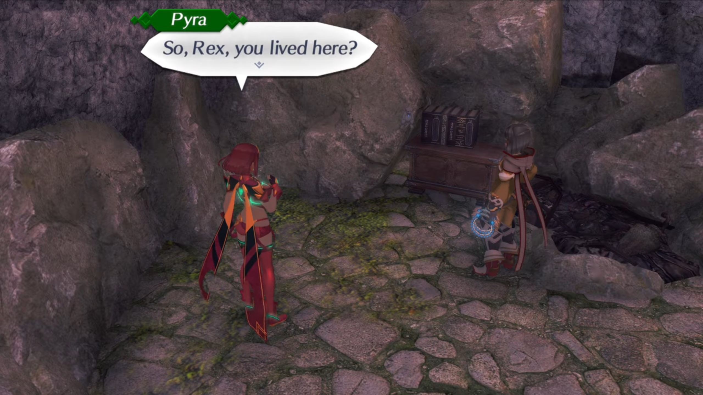

"Huh? **Noooo**, this is my getaway. You know, like a _secret_ hideout. I lived on Gramps. I'd moor him next to that cliff over the way."

"What kind of kid were you, Rex?"

"I dunno. I've not really thought about it."

"I bet you're curious too, right Nia?" says she who was showered with excitement. 

She played along a bit, but facing the other direction, "Oh, errr... well, maybe a bit."

Gramps offered, "I could tell you a few stories about when Rex was younger. Ahhhh, yes... He was a wild child, that's for sure. A bit of a tearaway. He was never the biggest child, but he had a strong sense of justice. **Always** picking fights with the local bullies!"

Rex: "I think I still have the bumps to prove it."

Pyra: "So he's been this full of energy his whole life?"

Nia: "Sounds like you were a right handful!"

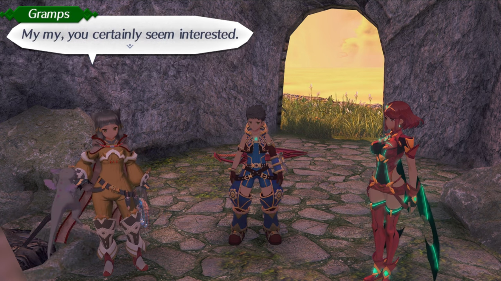

Gramps noted, and his storytelling instinct came online, "My my, you certainly _seem interested._ **Well then**, perhaps I'll tell you my **best**- Rex- story."

> Choose: "Whoa, just a sec!"  
> or: "Go on then, I've got nothing to hide!"

"<b>Whoa, wait, just a sec! What do you mean, 'best'?</b>"

Gramps go forward anyways, and he'll know what it meant by 'best'. "One day, one of the local kids- was attacked- by a monster. _Without thinking, Rex jumped in_ to help him."

Nia noted, "That's our reckless Rex!"

Rex: "**That's your story?** Of course I'm gonna help someone in danger!"

Pyra was eager for more, "**What happened after that?**"

"Both Rex- and the kid- had to be rescued by the villagers."

She was surprised, "Huh? Wasn't- Rex meant to be the one doing the rescuing?"

"That was his plan. Unfortunately, he just ended up in the same hot water."

Nia laughed out loud, "**Hah! Rex, you genius!**"

"That night, I heard Rex- _bawling his eyes out._ Was he in pain from his wounds, I asked. But he replied, 'No, I just wish I'd been able to save my friend.' Injury held no fear for him, but the anguish of not being able to save his friend... was unbearable."

Nia can't understand, "And he cried about that?" 

Looking at him, Rex: "What's the big deal? **Kids cry. It's normal!**"

Pyra: "No, Rex. Nia is impressed! Aren't you?"

"Sure. I was surprised at your bravery. **Even- at- that age...**"

"_We admire you, Rex._" Pyra repeated. 

"**Aw, stoppit! You'll make me blush!**"

Gramps: "_Ho ho ho. I told you it was a good story!_"

"Go on then. I've got nothing to hide!" he urged. "Gramps'll just exaggerate it anyway."

Gramps therefore teased, "So you won't mind me telling them- about the time you **wet** yourself- when there was a monster attack?"

Everyone jumped on their feet, Rex exclaiming, "**HUH? NO, THAT'S NOT-**"

Pyra already heard it, "W-wet yourself?"

Nia labeled, "Rex, you baby!"

"**That was just when I was a kid! I don't do it anymore! Don't even think about carrying on with the story, Gramps!**"

Nia got excited, "**Awww, c'mon! We wanna hear!**"

He looked for support, "**No! Pyra, pleaseeeee... You don't want to hear it, do you?**"

"_Ummmm... Actually, I kind of do..._"

"**HUH?!**"

Gramps started something unexpected, "This is a story about the time one of the local bullies- fell foul of a monster. _Rex didn't hesitate_. He packed up and..."

"**Gramps, pleaseeeee stop!**"

Nia was still lingering on the thought, "**Is wetting yourself reaaaally that embarrassing?**"

"**SUPER EMBARRASSING!!! Nia, don't tell me it's never happened to you!**"

"Urgh..."

Pyra don't want the fire to burn on her, suggested, "Maybe we should hear a different story."

Gramps got the idea wrong, "Oho, _you'd like to hear an **even** more embarrassing story?_"

Rex: "**No! Stop! Don't encourage him, Pyra!**"

She was confused being misunderstood, "**Huh?** I just want to know as much about you as possible, Rex."

Nia: "Well said! Drivers and Blades should know **everything** about each other."

Rex: "**Yeah, well, there's everything and there's- EVERYTHING. Can we please just drop it?**"

---

### Tough Life

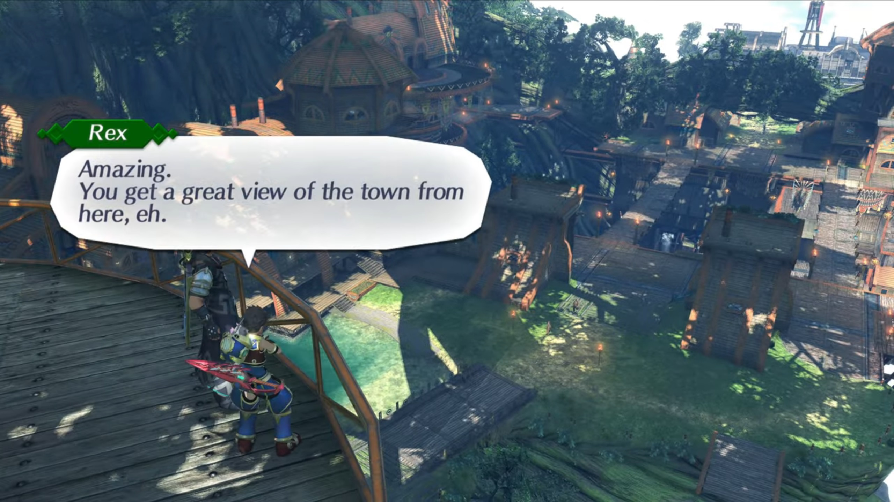

They were by a balcony at the top of a windmill overviewing Torigoth, Rex was impressed, "Amazing! You get a great view of the town from here, eh!"

Zeke: "Told ya so. When the Zekenator says there's a good view, he doesn't lie. Matter of fact, _it's the best view_ in allllll of Torigoth."

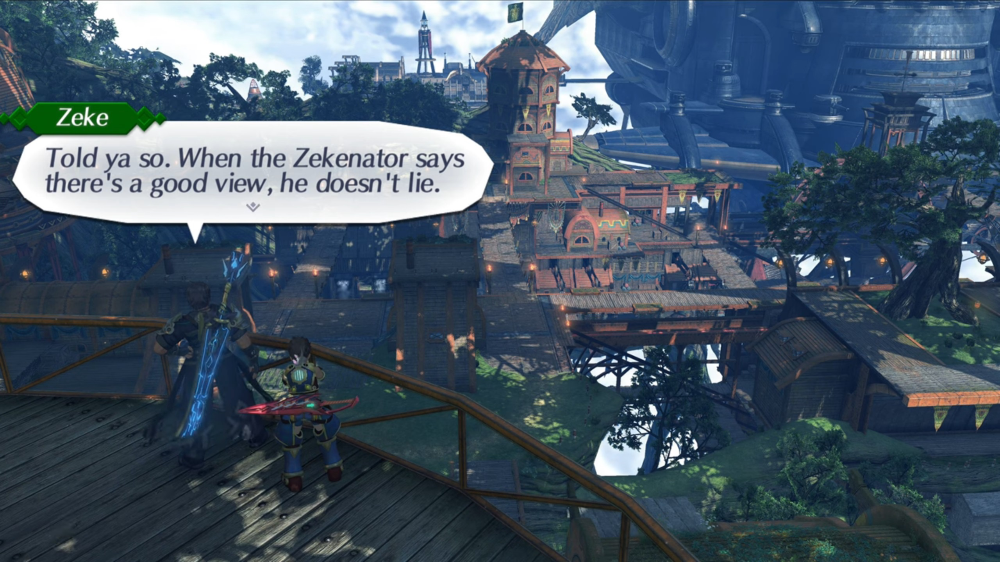

"You're not from here, are you, Zeke? **You seem to know** quite a lot about the place."

"Well, you see... Last time I was here, the old **geez** at the **inn** gave me the lowdown."

"**Ohhhhh, right, you used to travel all over the place, didn't you?** DO you know a lot about other places apart from Gormott, then?"

His pride shot up, "**Oh, yes!** You wouldn't **believe** some of the things I've seen. _But listen_, I want you to tell me something. What does this scenery right here make you think of?"

> Choose: "It's such a big, lively town."  
> or: "Honestly, I think I prefer Fonsett."

Rex exclaimed, "It's such a big, <b>lively</b> town." 

"Yeah. Hmmmm. Sure." Is that it? "But y'know... That's just a façade. _It's what they **want** you to see._"

"A façade?"

"Yeah, exactly. Like, you know Gormott's a colony of Mor Ardain right now. Well, the only reason the town looks so **lively** is 'cos Mor Ardain has a military base here. **Most other** settlements in Gormott, everyone's doing **hard work** like farming and lumberjacking. And most of what they produce, they export to Mor Ardain. It's quite a tough life here. A lot of folks are struggling."

"Mmm..." That kept him thinking deep. 

"And it's not just Gormott, either. I've seen a good few dark underbellies on my travels, no doubt about it."

"Did you ever try to help those people out?"

"_Ahhh_, so many times. **I had it in my head** that the **Zekenator** had the power to fix **anything**. But, fancy sword skills and titles... _They aren't much use to most folks._ I was **trying** to save the world alone. But what happened is that **reality bit me on the arse**."

"**Hey, don't look at it like that!**"

"_Huh?_"

He encouraged, "**Sure**, maybe you don't have the power to save the whole world right now. But there are definitely people out there you have helped. Me- and Pyra, for a start. **So Zeke,** don't _ever_ give up. Don't **forget**, you've got some people you can count on now."

"_Yeah,_ you're right. You **really** are. I dunno what I was thinking. It's not **just** the Zekenator now. I've got **you guys** watching my back. **Some** of the things I couldn't do back then might even be **possible** now."

"**Right? So let's keep doing what we can. All of us, together.**"

"_Yeah_! **I just gotta put my back** into it." Then his shout shocked Pyra and Pandoria, whom also climbed up with them, watching the other side (the fields) from the top. "**LOOK OUT, WORLD! THE ZEKENATOR'S COMING TO ROCK YOUR SOCKS OFF!!!! Hoooh!** That sure felt good. **Your turn, Rex! Let your manifesto out!**"

"**Ermmm...**" Like that? Don't you feel embarrassing? But he went forward, "**I'm gonna get Pyra and Mythra to Elysium, or die trying!**"

"**YEEEEEEEE HAAAAAAHHHHH!!**"

Pandoria was so confused, asked softly, "_What are you two doing?_"

Pyra added, "_You're embarrassing me..._" But they weren't listening, feeling excited at their manifesto, became close brother for a moment. 

"Honestly, I think I prefer Fonsett."

"Fonsett's a peaceful village, right? War hasn't really reached it?"

"Yeah, that's right."

"Problem **is**, most villages in Alrest can't say the same."

"**What do you mean** exactly?"

"Listen up, chum. What you see on the surface? _That's not the whole story._ A lot of places that look like they're doing well, have a lot of people suffering in the shadows."

"Even here in Gormott?"

"**Sure as.** You can see Torigoth doing great, same as the other towns where there's an Ardainian army base. **But most other settlements in Gormott?** They scrape by on hard **labor** like farming and lumberjacking. And most of what they produce, they export to Mor Ardain. It's quite a tough life here. _A lot of folks are struggling._ And it's not just Gormott, either. **I've seen a whole bunch** of places _like this, and they make me realize how powerless I am._"

"_Huuuuh_" Felt heavy in his heart, the way he spoke it. He encouraged, "Zeke, you aren't powerless. **You never** stop wanting to help people. **Even though**, you're thinking about the people who **reaaaaally** need your help. **Exactly** how a future king should think."

"Heyyyy, don't take the piss." He waved it off. 

"I mean it. I'm all spent just worrying about the people **right in front of me. Pyra, Mythra, Nia, Gramps... But it seems like you're** always worrying about the **wider world. Like, people whose names you don't even know!** It's something I **reaaaaally admire about you**, Zeke. I hope I can learn to care as much as you do."

"Man, you **always** know what to say. You're **such a**... focused guy."

"Haha. Gramps said I should pay more attention to the world around me, though."

Unbeknownst to them, Pandoria and Pyra had climbed up and were overhearing their conversations now, "**Tell you what then**, chum. While you focused on your main goals, I'll keep an eye on the big picture on you."

"Yeah, I know I can count on you."

"Damn right you can!"

Pandoria was impressed, "Ohhh, what a pair."

Pyra: "I find it really inspiring."

"**Yeah!** I'd be lying if I said I wasn't a little inspired."

---

### What Should One Be Called?

At the port of Genbu, overlooking the reddening sky and the cliff edge in the far distance, Zeke and Pandoria supported themselves on the stony fence. 

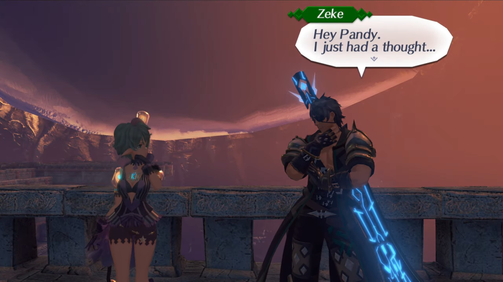

"Hey Pandy. I just had a thought..."

"Oh no..." Every time you said this, something bad would happen. This time would be no different. 

"Don't be **so quick to judge!** You don't even know what I'm going to **say!**"

"Wellllll, you're not the most sophisticated of thinkers. _I can read you like a book._"

He tried authority, "Hey, you can't talk to your Driver like that! **Go on, then!** If I'm so easy to read, what am I thinking?"

Pandoria dismissed his authority call, gotten used to it, "You ARE that easy to read, annnnnnd you just came up with a new title for yourself."

"_Uhhhhhh..._"

"Hahah, bingo! **You** are soooooo predictable. **Go on then,** what is it **this time?** I promise **not to laugh.** You can tell your big sis."

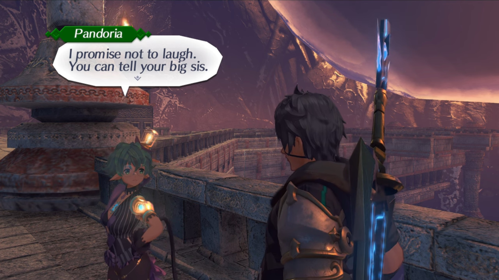

"**Big sis?**... **Wait** a sec! What makes you think it'll be something to **laugh** at?! Listen, when I tell you my new title, you're gonna be _proper impressed._ **Zeke von Genbu, CHAOOOOOTIC- Bringer of Chaos!**"

She snorted at that. "Prrrrrtttt..."

"**OI! I HEARD THAT!!! You can't deny the coolness of the name, surely!**"

She tried suppressing her laughters, "O-of course not. It's _very cool_. **Suits you** down to a tee. Super cool."

"_You're not even_ **pretending** to be serious! **Why don't you try again?**"

"Ahahahah, it's so funny watching you guys." Pyra giggled as she approached those two. 

"Oh, hello Pyra! You arrived at just the right time. We're getting nowhere with Pandoria. **Pyra, lend us** your judgment."

"Who, me?"

"**Yes, you! What do you** think? **Zeke von Genbu, Chaotic Bringer of Chaos!**"

> Choose: "That's a fantastic name!"  
> or: "Honestly, it's kind of goofy."

"That's a fantastic name!" she exclaimed.

"**Right? Obviously! I knew** you'd know what's what."

Pandoria urged, "No need to worry about **hurting his feelings**, Pyra. You **can be honest.**"

"**I am** being honest! I think it's a very creative name."

"_Uh?_ **No way... You're kidding, right?**"

Zeke was extremely proud and satisfied, "**Finally, somebody who ACTUALLY understands! At least SOMEONE does. Go on,** Pyra. **You** need a title as well."

"_Huh, me?_"

"**Yes!** Something that **really captures** the spirit of who you are."

"Steady on, my Prince. Pyra doesn't want a stupid name."

But Pyra urged on, played with the game, "**OK!** Lay it on me, Zeke! Gimme that title!"

Pandoria sighed, "_Someone's gotten carried away..._"

"Right then. **From now on, Pyra, you shall be... Pyra von Aegis, OMEN OF RETRIBUTION!!!**" He thought for a short moment before giving her the nickname. 

She thought of it carefully, "Pyra von Aegis, Omen of... Retribution?"

Pandoria: "Uhh... really, Pyra... If you don't like it, you shoulda just said so."

"**I love it! To be honest**, I don't really know what it's supposed to mean? **But it's so cool!**" she exclaimed. 

Pandoria can't believed what she just heard, "**What on Alrest is going onnnnn?** These two are incorrigible!"

"Right? **Just like** I thought. Pyra GETS me. **In fact, maybe YOU should just be my Blade!**"

"A-ahh hahahah... I think I'm good, thanks." Not on that, sorry...

"Huh?"

"You're very amusing, Zeke, but Drivers need to be a lot more than amusing."

"What?"

Pandoria finally found her laughing point, "**AHAHAHAHAHAH!!!** You're going to need an Ice Art for **that** burn. That was worth the wait. It's gonna take him some time to recover."

"Honestly, it's kind of goofy. And it's redundant as well."

"**URK!!!**" He went down to the floor in extreme heart pain. 

"**My Prince?!**" Pandoria acted as if she's gonna lose him. 

With intense heartache, he exclaimed, with barely enough oxygen to survive, "_Too... too blunt. It struck me... **right** to my very heart..._"

Pandoria couldn't help joking, "Hang in there! _It's just a flesh wound! You're going to be just fine!_"

Pyra don't understand the joke, worried, "Huh? Is Zeke OK?"

As if he's gonna immediately pass away, he answered, "_No... Remember me well, friends..._"

Pyra started panicking, "**What?! I-I'm so sorry! I-I didn't mean... I just let my thoughts SPILL out of my mouth without THINKING!!!**"

"(cough cough cough)"

"**My Prince?!**"

Pyra: "**Um, what's happening? I, er, should I get help?**"

Pandoria was so deep in the joke, exclaimed, "**Pyra, you monster! You're KILLING him here!**"

Zeke agreed, "_Who would have known that- Pyra could be so **deeply** cruel..."

"**That wasn't my intention at all! I-I'm sorry! I just thought-** that the joke wasn't up to your usual standard..."

"**ARRRRRHHHHHCCCKKKKKK!!!**" Pinch straight to his heart twice! 

"**MY PRINCE?!!! A mortal blow!** _It's going to take him some time to recover from that..._"

---

### Curse of the Zekenator

Near Three-Vein Crossroads, a location very near the outskirts of Tantal's main city. Brighid had a question for "Hey, Pandoria. Zeke's a rather unlucky guy, is he not? Isn't it difficult, being his partner?"

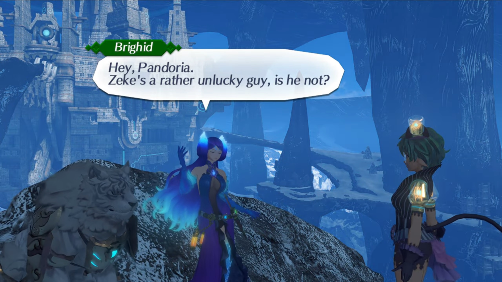

"Oh, yes. The Prince of mine, he's unlucky like you wouldn't believe. If there was an All-Alrest Unluckiness Championship, he'd win every time." Yet her tone was full of hope than despair. 

Dromarch: "From the incidents I've witnessed alone, he's already been chased by- rolling rocks, fallen off cliffs... He even fell into the Cloud Sea once, as I recall."

Her excitement came up, "Hnhnhnhhh, you ain't see the half of it! When he's walking in the harbor, he's always getting bitten- or smacked round the face by the Titan ships. Oh, this one time, he got caught in a blizzard, took shelter in a cave, and wound up surrounded by 100 Ignas! Hahahaha, I could keep going for hours."

"Weeeell, I don't quite know how to react... Frankly, I'm impressed you both still alive."

Brighid agreed, "Yes, congratulations on surviving. Or should I say, my _condolences?_"

"Too far, Brighid. Too far." She got a little serious with that. Then turned her mood back to up-lived, "**Still**, I gotta admit keeping an eye on my Prince is a full-time job. You should try it yourself some time. _He drives me crazy._"

> Choose: "But you love him all the same, yes?"  
> or: "You sound almost like his mother."

"But you love him all the same, yes?"

She jumped back at such inferences, "**LOVE?! Where the hell'd you pull THAT one out of?** Ehehehe...."

Dromarch interpreted her reactions as, "_Ah, yes, I see._ You **pretend** to dislike him while secretly harboring **feelings.**"

Brighid added to the fire, "Maybe it's time you should be more honest with yourself?"

She couldn't even reject their notion, "_Oh, for the..._ you've got to be kidding me! Y-You couldn't be more wrong!"

The more she tried to reject, the more sure they were of her feelings, "There's no need to be shy, my dear. As a fellow Blade, I'll be happy to keep this **just** between us."

Dromarch agreed with that, "Quite so. We will keep your little secret from your _beloved Prince_- until such time as you see fit."

Her voice is all weak and not getting through, "_I'm trying to tell_ you, **it's not like that!**"

Brighid already convinced herself, and no other 'facts' would unconvince her, "Ohhhh, you're so cute when you get embarrassed."

Dromarch too, "Hmhm! I quite agree..."

"**Hey! Stop that! Don't you give me that knowing smile!** Ungghhhh, **curse you,** my Prince, and your unlucky nature!"

"You sound almost like his mother."

"Oh yes, he's such a frightful little sonny Jim..." She replied unconsciously, then suddenly picked it up consciously, "**WAIT, who're you calling his mom?!** At least go for big sister or something!"

Dromarch: "Ahhh, what a comeback! What im-peccable comedic delivery!"

"Hahah, _you like it?_ You've gotta have a sharp wit when you're dealing with that guy. But comedy aside, it all _comes back to his blasted bad luck._ If you have to deal with some of the stuff I've been through, you'd be worrying like an old maid, too. When it really counts, he can be a proper hero, _but the rest of the time... I just don't know what to do with him._"

Brighid: "It wouldn't be Zeke without a little bad luck, though, would it?"

Dromarch: "I quite agree. It's an integral part of his identity!"

"Yep.. _and ain't that just the worst thing?_" asked Pandoria. "(sigh) **The things I put up with** for my Prince..."

---

## Open Your Eyes To The Outside World

In Theoscaldia Palace, Silvergleam Terrace{{footnote: One didn't remember where this was.}}. Two soldiers guarded each side of the door, with more soldiers within the chamber. Zeke and Mòrag were outside the chamber, where behind them were the balcony overlooking the mountains, along the corridor, he asked, "So, how d'you like this palace, eh? Just as good as your Ardainian one."

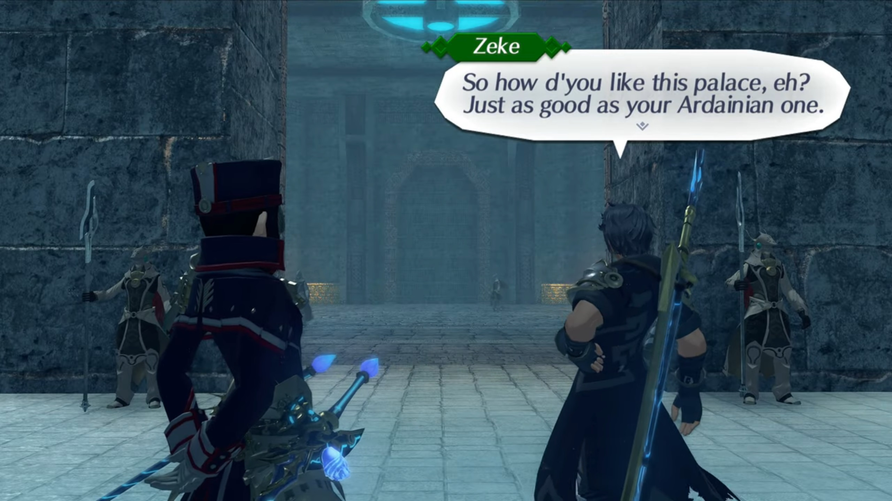

"For a man who abandoned his country, you're certainly proud of it." she mocked him. 

"Hey. That's a low blow."

"Do you think you'll _return for good_ someday?"

"That's a toughie." Will he, he wondered? 

"What is it that's stopping you?" She spoke straight to the core. 

He didn't answer, but had a question for her, "Hey, Mòrag. **Is your country** important to you?"

"That was kind of out of the blue..."

"**Come on, just tell me. Would you** protect your country over **anything else** in the world?"

> Choose: "Without a doubt."  
> or: "Would you not?"

"Without a doubt." she answered without thinking twice. "Why do you ask?"

"Well, I mean... As a prince, **of cours**e you're gonna want to **protect your country and your people. But**... _is that really enough?_"

"What do you mean?"

"**This world**, it's **stretched** to its **limit**. We've both seen that on our travels."

"Mmmm?"

"Now, my old man, **he closed** off our country from the outside **world. Why?** To protect his people. **But that's** not a **real solution**. That's just **running away** from reality. **Maybe you can** protect your own **people** like that, for a **while**. But when the world ends, you're just as dead. I just couldn't bring myself to agree with the way **he does things.**"

She listened for him to finish without interruption, asked thereafter, "And... that's- why you left?"

"**Yeah!** If I can use my power to help save the world, even a little. I figured, that's what I have to do. **Help** the people who **need** it. **Of course**, I was **younger** then, with naïve ambitions. **In the end**, I just wound up learning how powerless I really am."

"But you haven't given up yet, have you? You're still trying to save the world."

"**Course** I am. If you don't have the power, you gotta try even harder. If you **can't** do it alone, then you **gotta find some friends** to back you up. **Mòrag! You're one** of those people, right? **Someone I can** count on."

"Hahah, I'm with you, Zeke." she supported him. 

Mòrag don't understand, "Would you not? Wishing to protect your country is both a natural impulse- and a duty, is it not?"

That makes him quite angry, "**THAT'S THE ONE!!!** That's exactly what my old man used to say. But, is that really enough?"

"What do you mean?"

"**This crazy world's** _right at its limit._ **If it carries on** like this, it's done for. My old man... He chose to **close** his eyes to the outside **world** and _only_ think of the **safety** of our country."

Mòrag don't see how that's wrong, "A king's first duty is to protect his nation. _I don't think I can blame him for the choice he made._"

"Well, **yeah**... **But** is it really OK to just think of yourself? **Can you** really be happy when you're **shut up** in your **own world** like that? **If we carry on** like this, our **whole world has had it.** And you **can't have a country without a world. That's why** his attitude drove me **crazy! Sitting doing nothing** as the whole shebang falls down... **That's** no way for **anyone** to live. I can't just give up on the **future** like that. **That's why** I left Tantal. And that's why I can't go back, not until the world is safe."

"Ahah... You're a **remarkably straightforward** man. Honestly, I'm a little **jealous** of the way you can _follow your heart_ so freely."

"Hey, what are you saying? It's **not like** it's hard. You should try it yourself -- **just say what you think!**"

"Hah!" Her pride couldn't let her do that, her worries for what others might think of her couldn't do that, her position as Special Inquisitor couldn't do that. Can she? "**Straightforward guys** like you and Rex are all very well, but I think **someone** needs to attend to the **finer** details."

"Jeez, you let me have it with **both barrels there**... But thanks."

"You can count on me **for that**, Zeke!"

---

### Pandoria Wondering How To Be More Feminine

In the Commercial District of Fonsa Myma, the capital of Uraya, overlooking the various buildings below the balcony, and the cherry blossoms in its full strength, illuminating the night even brighter than the streetlight does, its leaves raining on the city. Pandoria wasn't looking, but she invited Mòrag to come here with her{{footnote: This one says so; actually, one don't know who invited who.}}, "This looks like as good a place as any to have a proper chat."

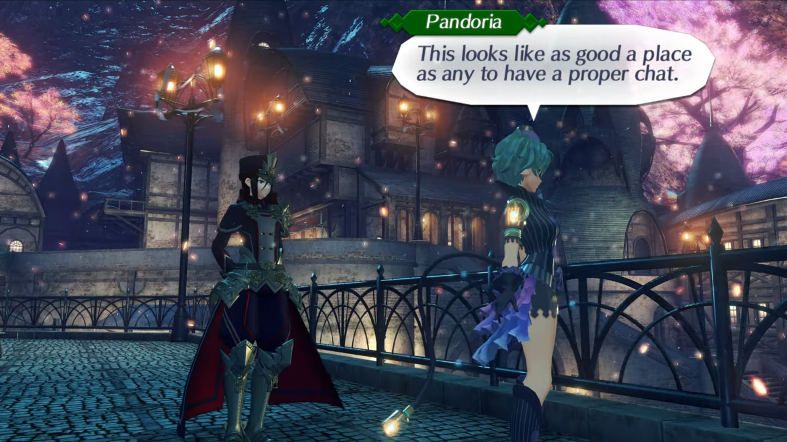

"**So**, what did you want to discuss?"

She got a little [blushy-crushy](/96_heart_to_heart.html#blushy-crushy) , asked, "Well, listen, Mòrag... What do you think of me? **Well, um**, I was wondering... _Do you think_ I'm- feminine enough?"

> Choose: "I think you're perfectly fine."  
> or: "Are you coming on to me?"

"<i>Relax.</i> You're a <b>very lovely</b> young woman."

"Well, _I mean_, I'm sure **most** women look feminine and cute next to you, Mòrag, but..."

Hah, she already got the comparison, "Are you _trying_ to insult me?"

She jumped back, "**N-n-no, not at all!** Sorry, I'm not good with words..."

"Umph!" Let you go this time. 

"But, **don't you think** I'm kind of- _plain_- next to Pyra and Brighid?"

"It's true that the two of them- do have a certain healthy **vigor** about them."

As if she got her conformation, "**Right?** Sometimes I- feel like I- need to up my game a bit when it- comes to looks."

"**I see! And you thought I** must know all the tips and tricks to keep one's appearance in tip-top shape."

"**N-no, no,** I wouldn't come to you for that kind of advice." When you're not one yourself, hah! "**It's just...** you dress like a guy, right?"

"Oh!"

"So I figured you _probably_ have a good idea of how men think."

"_Ahahah_. I see."

"Yeah, I **knew** you'd understand! So tell me, from your point of view, what have Brighid and Pyra got- that I haven't?"

She strictly rejected, "Forget it. We're done here." Too much insult for the day, repeated again and again and again. 

She was surprised, "Huh? Wait a sec, Mòrag! Weren't you gonna help me? Oh, **c'mon**, you're such a tease!"

She looked down on the floor and started barraging words to not hear back from her, "If this is a come-on, I'm <b>very</b> flattered. But... you know I'm a <b>woman</b>, right, Pandoria? <i>I must admit</i>, I didn't take <b>you</b> for, uh, <i>well...</i>"

She giggled at the misunderstanding, "**Uhuhuh!!!** Oh, Mòrag, you're so funny."

"_Huh?_"

"That's not it at all! _I wasn't confessing my love or anything. I just wanted to ask you about my femininity._"

"Really? You came to ask **me**... about femininity?"

She exclaimed, "You dress like a dude but you're so pretty. You must know a thing or two. Your hair, _your skin, your nails... Always so on point._"

She was impressed, "You have better eyes than I **gave you credit for.**"

"I just notice that stuff. _I'm a girl Blade, after all._"

"I see... _Sounds like there's **some man** that you want to notice you, Pandoria._"

She strictly denied, "**NO NO NO! Nothing like that!** I was just watching youuuu and Brighid, and- wondered what kind of stuff you do to- look so sophisticated."

"Is that so?"

"No word of a lie!"

"Huh! **Both Brighid** and myself import Elastifying Tonic and Freshening Gel specially from- Argentum."

"**Mm hmm!**"

"Titan-Oil Hand Cream **also** comes in very useful."

"_I see, I see_..." When was the last time Zeke ran out of gold and couldn't make himself a contact lens for his other eyes ahem ahem?

"**I'll ask Zeke**- _if_ he can buy some for you too, in future."

She jumped on her feet, "_What?_ **No,** don't do that!"

"_Ohhhh???_"

"**Let's- keep this**- on the down-low, OK? Nobody needs to know!"

---

### Who's Taking Care of Turters?

Near the Sekis Pillar at the Upper Level of Tanta. The ruins of some uninhabited buildings can be seen behind the scene. Nia had a question, "Hey Zeke, Pandoria, You got a moment?"

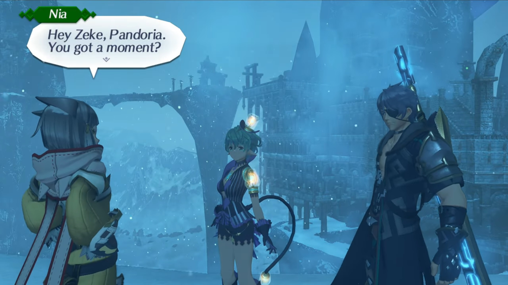

"**Sure, what's up?** You're not usually the **type** to start a serious discussion."{{footnote: And you're not usually the type to call 'Zeke' instead of 'Shellhead'.}}

"Well, y'see, _it's- about Turters..._"

"**Turters?!!**" Pandoria backed away. What does she want with our Turters! 

Zeke immediately rebut without hearing what she gotta say, "Sorry, but Turters is our mascot. I know he's the **cutest** little chap in the world, but you can't have him."

"You heard the Prince. *If you* ask nicely, we might allow you to pat him on the head..."

"Uh-huh. Thanks- for confirming what I already guessed. You haven't even noticed, have you? He's been crawling into my bed every night."

Zeke eyes widened to its max and his pupils dilated to its min, "**H-he's been... what?!**"

She continued to deliver the bad news, "If I'm not super careful, I worry I'm going to **crush** the little guy in my sleep. But like you say, he's **your** precious little mascot, yeah? I figured you'd be mad if I hurt him. So it's been keeping me awake the whole damn night."

"Well, I guess I should apologize on Turters' behalf."

Pandoria wondered, "Honestly, weren't you meant to be keeping an eye on him?"

"**Ahahahah! Well,** you know me! Once my head hits the sheets, I'm out for the count!"

"Hmmm..." Not good at all... "We'd better find a way to stop him wandering off."

> Choose: "He could sleep in my bed?"  
> or: "Let's flip this whole issue on its head."

"He could... sleep in my bed?" offered Pandoria.

Zeke agreed, "Yeah, that might be the best solution."

She recalled, "He used to sleep in my bed back in the day, anyway. It'll be fine."

Nia was relieved, "I guess that settles it. Thanks, Pandoria!"

"You can count on me!"

"Hang on, though. You- said- he used to sleep in your bed 'back in the day'... Just how long have you had this turtle?"

She looked to Zeke for affirmation, "Ohhh... It hasn't been as long as me and old Princey here, but... it's been- quite a while, I think?"

"Huh. It's just that he's so small. I always assumed he was pretty young. So what would you do if he grew up to be Dromarch-sized?"

Zeke couldn't believe "The things that go through that head of yours..." Dromarch-size, do you really mean it? 

"Watch it, you." she snarled at him. 

Pandoria agreed that "He wouldn't be quite so portable if that were to happen."

"_Right?_ It got me wondering, **would you guys**- stick together even then?"

Zeke don't see anything different, "Why? I could **ride around on top of Turters instead!**"

Pandoria: "You mean like Nia and Dromarch?"

"Yeah! That sounds pretty **sweet**, right?"

"You'd probably get left behind. _A lot._" blurted Nia sincerely and bluntly. 

Pandoria: "And how?"

Zeke: "Yeah, you know what? **I'm just gonna** be glad that Turters stayed _this_ size."

"Let's flip this whoooooole issue on its head," suggested Pandoria.

"Flip it?" Nia wondered, how do they do that? 

"On its head?" Zeke wasn't sure what she meant. On Turters head? 

"Yuh-huh." The message didn't get through, but she took it for granted that it did. "I mean, Turters is **one of the gang too, right?** So I figure, me and Zeke can't keep hogging him forever. He doesn't belong to any one person. _He's a precious mascot, to each and every one of us._ So what **I** say is, why don't we all pitch in on looking after him?"

Zeke: "**Oh, right! Great idea!**"

"Riiiight? If Nia's helping us out too, there's no problem with Turters sleeping in her bed."

She was mad, "**Hold it, hold it!** This isn't solving the issue of how I get some sleep. **You can't just** lump it all on me. Get someone else to help."

Zeke thought for a while, suggested, "Hmmm... Maybe Dromarch could look after him?"

Pandoria agreed, "Could work. He's basically a big fuzzy pillow."

Now that they thought of it, Zeke had another idea, "Actually, the same goes for Tora!"

"More like a little fluffy pillow, **but yes!**"

Nia was impressed, "_Hey... Are you two_ actually just fed up- of taking care of Turters?"

Zeke was surprised, struggled to find reinforcements, "**HMMM?!!! P-Perish the thought! Right, Pandy?**"

"Yeah, we love Turters. **Sometimes I forget to feed him,** but he's great."

"I'm starting to understand why he comes running to me every night..."

---

### Aegaeon missing His Majesty

"Oh, His Majesty is absent." Aegaeon, was staring at the seat in the Throne Room where Emperor Niall usually did the paperwork. 

Brighid entered the empty room and commented, "A shame. You were hoping to meet him again, weren't you?" He had returned to his core during the last Uraya-Mor Ardain summit, and now, someone else resonated with his core once again, bringing him back to life. 

"It feels a little _strange_ for me to think of it as _'again'_, but I did wish to meet with him, yes."

"I remember the old you, standing _tranquilly_ beside the throne. Quiet, and resolved."

"I can sense it is a... good memory for you."

"I had hoped some memory might linger within you too, _but alas_, it seems not."

"So it would appear... Unlike you, Brighid, I did not have past records to fall back on. Without any data, it is... _difficult_- to feel any emotional connection either." Brighid kept a diary she can read whenever she get resonated; and the diary she passed on to the Imperial throne to pass it down for whoever resonated with her again. 

"And now you're prohibited from reading those records that do exist, as well..."

"So I am, so I am. Therefore, I know not what I had been doing, nor what my role is in the Ardainian Empire. I can- _comprehend_- some of it by talking with you or Mòrag, but I feel sure there is much of importance I do not grasp. Hence my plan: to ask Emperor Niall- why it was that he *forbade* me from reading the past records."

"Do you have any idea what the reason might be?"

"I wonder..."

> Choose: "As a sign of demotion."  
> or: "So I'd save the world, not the Empire."

"From what I hear, it... seems I failed to keep the Emperor safe, yes? In which case, might it not mean I have been... <i>relieved</i> of the duty to protect His Majesty?"

"That's very pessimistic. You always are too hard on yourself, Aegaeon. I- think- Emperor Niall was hoping you would protect Alrest, and not- just- him. Rather than keep someone as *excellent* as you cooped up in Mor Ardain, he preferred to have you contribute to the well-being of the world at large."

"Hmmm. I see. He thought my knowing of my past role in Mor Ardain would... **hinder** that."

"That's what I think."

"I see... I may not have been able to meet the Emperor, but... just talking to you, Brighid, has given me strength."

"This may be presumptuous to suggest, but... He may have thought that I should work for the good of Alrest, rather than just for the Empire?"

"You mean, that an adept Blade should serve the world, not a single country?"

"Yes, precisely."

Brighid was impressed, "You can be quite **brazen** sometimes."

"I was hesitant to say it myself..."

"But I do think you're probably right. That's why the Emperor didn't want you to know too much about your role here. He feared if you **did**, it may- _hinder_ you from achieving that purpose. "

"I see... I may not have been able to meet the Emperor, but... just talking to you, Brighid, has given me strength."

"Always glad to help. For what it's worth, _I can't wait_ for the day when you're back by the side of the throne."

"Are you worried for him?"

"Maybe somewhat. Anyone can aid the Emperor in his duties, _but to keep him safe... takes someone **truly**- special._ Up until now, I felt _secure_ knowing that His Majesty was protected by myself, Lady Mòrag, and you."

He thought for a while, agreed, "Certainly... The sooner things fall back into place, the better. When all is said and done, I **will** return to the throne room. You and me both, Brighid. We **will** help see this through."

"Right. I'll be counting on you."

---

### Addam's Favorite Food?

Nia looked at the black market's bazaar at Tantal. There were spices, foods, alcohol. What impressed her was what's written on the sign. "Ooh, _'A treat- fit for a hero'!_"

"Snack time already, Nia? _Spot anything interesting?_" Mythra came up to her asking. Perhaps she wanted something herself. 

Zeke praised, "Nice one, Nia! You **sniffed out a pretty cushty place.** Y'know, this was the great hero Addam's favorite food! They **say** it uses an authentic mix of spices passed down for 500 years. Tantal is pretty damn cold. Stands to reason that Addam would like food with a bit of **kick** to it, eh?"

"A 'kick'?" What does that even mean, wondered Mythra. 

Nia wondered, "Addam was into spicy stuff? Huh. Heroes have strange tastes."

"**Rather rude,** don't you think? Spicy food is **delicious! Don't tell me** you're some kind of **namby-pamby** when it comes to **heat.**"

"And what would be the problem with that?" She eyed him. 

"**HAHAHAHAHAH**, for all your tough façade, you're really just a little kid, ain'tcha?"

"**Oi, you watch it,** Shellhead. You're askin' for a fight!"

"**Hey**, no need to get your ears ruffled. I'm gonna **get** some for you and you'll see how wrong you are. Mythra, you want some too?"

"Errr..."

"Huh? What's up?"

"Um, well, you see... Addam didn't like spicy food either." she revealed. 

"**Whaaaaat?**"

"_Huh?_" Nia was surprised, 

> Choose: "Addam didn't actually like Addam's Embercakes?"  
> or: "So the advertising slogan is just lying?"

"Addam didn't actually like Addam's Embercakes?"

"You got it! I never saw him eat anything that spicy. Even a **hint** of spice would have him **running for the latrine!**"

"**Bwhmhmhmhmhm! So Addam had a little kid's tastes too.**"

Zeke shot back in disbelief, "**You're kidding me!** You can't tell me stories like that! I grew up **idolizing** Addam, **and now I can't get that image out of my head!**"

But not Nia, she asked in full curiosity, "Hey, Mythra. Do you have any other funny stories?"

"Funny stories? I wonder if I can remember anything."

"So, like, what was Addam's **real** favorite food?"

"Well, that would be... Pan-Fried Tartari."

"**Just like Rex!**" Nia exclaimed. 

"Yeah! Addam would just **light up** at the sight of it."

"I really sounds like the **Great Hero** was just a **big kid** when it came to food. Anything else?"

Zeke went into depression, "**STOP! STOP! I CAN'T TAKE ANYMORE!!!** Can you **please** leave at least **some** of my admiration for him **untainted?**"

Nia don't understand, "What do you care? Addam was just a guy like anyone else." Then she teased, "Look who's the big kid now, Shellhead!"

"You arse, Nia. _You're loving this, aren't you?_ Dammit! I'm going to have to reread 'Addam, the Great Hero' to scrub my mind."

"So the advertising slogan is just lying?"

Mythra agreed, "Yep! It's a total marketing gimmick. A load of **bull**, in other words."

Nia felt cheated, "**Bloody liars!** The cheek of it!"

Zeke had faith, "Steady on just a second, chaps. It's not definite that they're lying."

"Huh?"

"**Even** if this wasn't Addam's favorite food, you've still gotta hand it to them. Keeping 500-year-old traditions alive is a pretty noble thing. **So what** if they did exaggerate? Maybe... Addam had a bite when Mythra wasn't looking and thought... **'this is jolly tasty'.**"

Nia urged, "No need to get so worked up, Shellhead."

"**Who's worked up? It's nothing to me. I'm just saying,** don't go around calling ancient recipes a lie **for no reason!**"

Mythra seemed to read the situation, "Ahhh, OK, I see what's going on here. **I've a sneaking suspicion that** this might be Zeke's favorite food..."

"**Wha-**" and he looked away, not willing to face the clever girl. 

And she revealed more, "Oh, is it your favorite because **you** believed their shtick about Addam?"

"Arrrrgh..." Two arrows in his heart. 

Nia finally got it, laughed till her belly hurt, "**BWHMHMHMHMHMHM!!! Busted!** Is that why you took it to heart? You're like a little kid!"

He started panicking, trying to protect his final image, "Wh-wh-**what's wrong with that?!** I grew up believing this was Addam's favorite **food! It's been enchanting kids for 500 years now!** I'm not gonna let the words of one Blade **take that away!**"

Mythra: "**Sure!** But that still doesn't change the fact that Addam didn't like spicy food. **He'd never eat this** stuff of his own volition."

"**ARRRRRRGGGGHHHH!!**" Millions of arrows in the heart, he collapsed on the ground. "You're **shattering my image of him!** My precious childhood innocence... I don't believe **anyone or anything anymore...**"

Nia urged and offered, "Don't be like that, Shellhead. Cheer up, I'll buy you an embercake! Hah!"

---

### What Happened to the Judicium Weapon?

Gathered at the Judicium Titan Weapon dig site in Temperantia, Tora asked, "Mòrag, is Ardainian army still digging up Aeshma?"

"No. I believe the excavation has been put on hold ever since the incident."

Poppi QT noted and curiously asked, "Still many Ardainians here though. **Why not** go home to Empire?"

She explained, "If we were to leave the site unguarded, Torna could misuse the artifacts **again. Even if** we were to re-bury what has been excavated so far, there's _no guarantee_ the same won't happen. So we're maintaining jurisdiction over the site... for the time being."

Brighid added, "To ensure they don't fall into the wrong hands, we've bolstered the garrison and brought in a Titan battleship too."

"Makes much sense."

"Tora want to check out Aeshma! Never seen weapons from Judicium before. **Very** interesting technology."

"My apologies, Tora. Our treaty with the Kingdom of Uraya will not allow it."

Brighid added, "We have agreed not to investigate, research, or use Aeshma in **any** form."

"**Meh-meh!**" He was disappointed. "**But when you** making such promise?!"

"At the Mor Ardain-Uraya summit."

Poppi QT questioned, "Mor Ardain take big penalty for almost starting war?"

Mòrag nodded, "That's about right, yes."

> Choose: "You pay Uraya big fine too?"  
> or: "You give Uraya Tasty Sausages?"

"You pay Uraya big fine too?" Tora wondered.

"We didn't end up paying monetary compensation, but- it- was a possibility."

Brighid estimated, "**If we had**, it would likely have come to around- 40 billion G."

"Oh! Much expensive!"

"Could make 1,000 Poppis with that money."

Brighid was surprised, "Wow! You're surprisingly expensive too!" 40 million G for a single Poppi? Can you imagine? 

"Ehehehe!"

"If not money, what did Mòrag country pay?" asked Tora. 

"You give Uraya Tasty Sausages?" Tora asked, depressingly.

"That **just** what Masterpon would want."

"If you pay in sausages, how many years supply it take?"

"_Hmmm..._" How much does a Tasty Sausages cost again? Mòrag estimated, "About a billion years' worth, I suppose."

Brighid read her Driver, accused, "**You just** made up a large number because you couldn't be bothered to **calculate**, didn't you?"

Hoof, not tasty sausages. That felt like a relief! "What did Mòrag country pay then?"

"They asked for the rights to survey Temperantia."

Poppi QT wondered, "Why they want that?"

"Well, as a buffer zone. But we managed to dig up _that_ Judician Titan weapon, didn't we? Perhaps- they thought Temperantia would still have- other such weapons buried within it. Uraya would love to get hold of some of this ordnance."

Brighid agreed, "Surely, it would be an awesome deterrent."

"Yes... And, a protection for the nation."

"**Ahhhh**, such boring **geo**politics. Tora not **care** about any of that. Just want to **tinker** with Titan weapon freely on his own." complaint Tora. 

"Hahah... I'm sure you do. If only **we and Uraya**- were as simple to deal with as you, Tora."

"Indeed. I envy you that- simplicity of mind." agreed Brighid. 

Poppi QT explained what they meant in straightforward terms, "Masterpon. They calling you simple idiot."

"Tora never hear word **idiot!** _Hmph_. Now Tora go steal advanced Judicium tech and use to upgrade Poppi's **respect** for Masterpon."

Mòrag warned strictly, "**Don't. Do. That. Please.**"

---

### Where's your grave gonna be at?

Looking at the giant crest on the wall in Spirit Crucible Elpys, Mòrag exclaimed, "These ruins are **quite** remarkable."

Brighid agreed, "Indeed. This style of architecture **cannot** be found in Mor Ardain."

Zeke: "There's **plenty** of ruins in Tantal too, but nothing quite like this."

Pandoria hypothesized, "Must be something to do with the Titans here."

"How would you even build a place like this **anyway**?" Zeke wondered. 

"I explained before, did I not?" Gramps scratched his head. 

"_Probably_ wasn't listening."

Rex hypothesized, "Maybe it was before he joined up with us?"{{footnote: Ahem, recall, some broken fence...}}

"Hmm? Was it? I can't recall. _In any case_, no harm in repeating myself. The Leftherian Archipelago- consists of a mountainous Cloud Sea formation- and numerous Titans gathered like islands. All of those smaller Titans- are circling around a much larger one. But that larger Titan is hidden- deep within the cloud mountains."

Zeke guessed, "So... looking at the size of these ruins, we must be inside that big Titan right now?"

"**Yes, precisely.**"

Pandoria exclaimed, "Wow, what a crazy sort of place!"

Rex complaint, "That doesn't answer the question of how anyone **made all this, though.** I mean, I doubt they carried all this rock through the Village Guardian..."

Mòrag hypothesized, "Perhaps it was built before this- large Titan submerged itself in the Cloud Sea?"

Zeke convinced himself with such 'common sense': "Ahhhh, that'd make sense. So back on the surface, it was just like any other Titan. **Then** at some point, those cloud mountains formed around it, creating the Archipelago we know today."

"Yes, that would explain- how this place came to be. But even so, it would be very difficult to build structures of this size today."

"Indeed..." Brighid agreed. "We have neither the labor forces required, nor sufficient land available. I doubt Mor Ardain, Uraya, or Tantal could construct something like this in today's climate."

Zeke instructed, "Pandy... When I die, you don't have to build a monument this grand for me, OK?"

"I'm gonna be gone as soon as you are, you know! Besides, I don't think you need a gravestone. A snowman'll do for you, heheh!"

"When am I being buried, Theosoir Rear Gate? _Though a snowman does sound pretty nice._"

"You're fine with that?" Rex was surprised. 

"Anyway, while we're talking about graves..."

> Choose: "Where's your grave gonna be, Rex?"  
> or: "Where's your grave gonna be, Mòrag?"

"Where's your grave gonna be, Rex?"

"**My grave?!**" He jumped on his feet. So sudden... "I-I... guess I've never thought about it."

"You're still pretty young, after all." Pandoria explained him away. 

"You're calling me old?!" Zeke complaint. 

Rex had thought while they fought, continued, "I guess I'd probably like to be buried alongside my parents in Fonsett."

Zeke asked, "How would you fancy here- in Elpys?"

Scratching his head, "Uhhhhhhh... I don't know about that..."

Pandoria don't like it either, clutched herself as if she felt very cold, "Yeah, this place is so big and empty, you'd die of loneliness."

Zeke: "After he's already dead?" Can he even feel loneliness then? 

Rex agreed, "I think I'd rather stay close to the people I love. Though it's still pretty weird to think about."

"Wellll, that's a nice way of looking at it."

"Where's your grave gonna be, Mòrag?"

She calmly and immediately answered, "My manner of burial is already decided. There is a proud Ardainian tradition to-"

He immediately cut her story short, "**Yeah, OK,** I'm gonna stop you there. Thanks for the predictable answer."

"_Wha-?!_ Then ask me again. **I will endeavor** to make my response more entertaining."

"_Lady Mòrag, I don't think there is any need to..._"

"_You **are** aware of how I dislike to be outdone, are you not?_"

Zeke agreed to her proposal, "All right, let's do this. Where's your grave going to be?"

Without a moment hesitation, she answered, her hands flung around that almost hit Brighid, and she looked up in the sky full of pride, answered, "A snowman at Theosoir Rear Gate!"

"**WHA?!!!**"

Pandoria: "Waaaaaaiiiitttt, _are you gonna marry into Tantal royalty or something?_"

"**Wha?! Of course I will not! I-I was just imitating Zeke's amusing remark!!!** Perhaps I should have chosen a graveeee (then an idea came to her mind) **in Fonsett instead!**"

"**Whaaaaa?!**" Now Rex jumped on his feet. 

Brighid face-palmed herself, "That's also not exactly, er..."

"Ugh!" Mòrag gave up. 

Zeke laughed, "**HAHAHAHAH!!!** Looks like Mòrag's got a thing or two to learn when it comes to the _funnies!_"

Gramps exclaimed, "Ah, _to be young and carefree gain_. To think they can joke around in a place like this..."

---

### Rex confessing to Pyra?

Pyra wished for some time with Rex's parents at the cemetery. Rex waited for her for a while before asking, "Well, Pyra? Did you manage to talk to them?"

"**I did!** We had a pleasant chat."

He was eager to know, "**What did you talk about?**"

"Everything that's happened since I met you. And I told them **not** to worry- _because I'm going to do_ everything in _my power to look after you._"

Rex was surprised, "**I'm sorry, what? I can look after myself,** thank you very much."

"I think not. **If you** go off on your own, you'll **just** get yourself into trouble."

Gramps was excited listening to them, "**Hohohoh!** Already bickering like you're a married couple, eh?"

"**Heeeeyyyy! Gramps!**"

Pyra was taken aback, "C-couple?! But really, I-I didn't mean to..."

"Ahahahah! It was just a joke. Besides, (he whispered) _you have to have that sort of mettle- to deal with Rex._"

She felt a little shy, "Hm, come on, Azurda, cut it out!"

Rex changed the topic, "Anyhow, we've done what we have to here, right? Time we should be getting back."

"Oh, we're leaving already? _Can't we talk for a little more?_"

"_We can do that when we get_ back, can't we?"

"That's true, but the two of us rarely get the opportunity _to talk alone like this._"

"I'm not sure you can say 'alone' when we've got Gramps tagging along..."

Gramps, with tearful tone, "_Eh? This old fogey getting in the way?_ You want me to shove off?"

Pyra cheered him, "No one's telling you to shove off, Azurda. Stop being such a child!"

"Hohoho! Youth is a beautiful thing."

Rex don't have anything in his mind right now, so he asked, "All right, what was it you wanted to talk about?"

> Choose: "Do you miss your mom and dad?"  
> or: "Have you always sent money home?"

"Do you miss your mom and dad?"

"Ermmmmmm... I don't really know. What makes you ask?"

"Well, I'm a Blade, so I don't really know much _about parents_. I was wondering what it's like to have them."

He scratched his head, "Mmmm... I'm not sure- how to explain it. All I know about my parents, is what Gramps and Auntie Corinne have told me. Honestly, I have hardly **any** memory of them myself. It doesn't **really** feel real."

"Isn't that sort of sad?"

"Not _'sad'_ exactly... I've just never really thought much about them."

"Oh, I see..."

"I mean, it's Gramps and the villagers who've looked after me this whole time. They're my family. **Everyone** in the village is. And when you've got all these mums, dads, brothers, and sisters, it's kind of hard to feel sad, you know?"

Gramps teased, "The downside to a big family is that you can't go a day without getting an earful from someone, eh!"

"Hey, give it a rest!"

"Hahahah!" Pyra love to see how they tease each other. 

"Have you always sent money home?"

"Yeah, I've been sending money back pretty much ever since I left the village to set off to become a salvager. I mean, take a look around. There's nothing here. Trade with other countries doesn't really cut it, and being self-sufficient only goes so far. What I earn is a pittance, but it's better than nothing, I think."

Pyra was heartfelt, "But it can't be easy for you, either, living the way you do. You shouldn't push yourself _so hard._"

"Mmmm, I guess. But I can't really leave my family out in the lurch either."

"Your family? you mean the villagers?"

"That's right. **Everyone** in the village is like family to me. I'll do everything in my power to help them!"

Gramps added, "They're all very grateful to Rex for his work. Never thought a mischievous brat like you'd grow some backbone!"

"**Who are you calling a brat?!**"

"Hahahah!" Pyra love to see how they tease each other. 

"**What? What's so funny?**"

"Sorry, I didn't mean to be rude. I just couldn't help but _admire your way of thinking._ I'd love to have _a family as big as yours, Rex._"

"**What are you talking about**, Pyra? **You're already part** of the family."

Gramps finally found the best moment, took his chance, "So can we take this as **confession of love?!!!** (He literally jumped on his feet.) Very bold of you to do so in front of your parents, my boy!"

Blood rushed up Pyra's cheeks, "_Wha-?!_ Rex, h-hold on a second!"

He tried to deny, busy explaining to Pyra that he don't have the attention to teach Gramps a lesson, "N-no, that's not what I was trying to say! You, Nia, Mòrag, Zeke, and Tora too. You're all... family to me. So there's no reason to feel sad orrrrr lonely, that's what I'm trying to say!"

Gramps cut in _again_, disappointed at the failed confession, "Uh, so much for the boy having backbone. (Whispering to her). _Sorry, Pyra, this one's going to be hard work._"

"Heheheheh! That's all right. I've got a surprising amount of _patience._"

He who cannot hear what they were talking wasn't happy of being left out, "**Oi! What are you two** going on about? _Jeez..._"

---

### Reconnecting Familial Ties

On the grassy thin path along the edge of the cliff, Mòrag stood alone, watching the Cloud Sea plunging into the Great Void far below. Wind reached the speed of hurricanes, and lightning struck when clouds rubbed against one another. 

"So there you are, Mòrag." Pyra approached her, asked, "Is- something wrong?"

"No, not at all. I've just been thinking."

"Any particular worries?"

"_Ah, it's just_... my brother."

"Emperor Niall? Is he OK?"

"I'm... concerned- he'll wear himself out."

"The Emperor is quite young, isn't he..."

"_Yes._ The weight of responsibility is a heavy burden for someone his age."

"Have you two spoke recently?"

"**Well**, as Special Inquisitor, I send him reports almost daily..."

"No, I mean, just... talk, like siblings do. Chat about family stuff, things like that."

"Talk like siblings do? It may shock you, **but** neither me nor the Emperor are great at small talk."

"Don't overthink it. You can talk about anything, so long as it's not work. You should just go drop in."

"_Ah_, the Emperor- is a very busy person..." she didn't realized she's raising excuses. "Engaging in idle chit-chat with me... That would be a waste of his time."

> Choose: "Surely he'd be happy to see his big sis."  
> or: "Sounds like you don't want to see him."

"Surely even the great Emperor Niall would be happy to see his big sis!" Pyra was insistent.

"Thank you, Pyra. Alas, my brother and I are hardly your average family." She turned around to look at the Great Void, or perhaps, she just don't want to face her, "His Imperial Majesty andddd his retainer, the Special Inquisitor; our stations differ greatly, as- do our ways of life. We couldn't possibly expect to talk like normal siblings..." At least that's what she believed. Though, she'd never asked the emperor herself, and make assumptions based on her own extrapolations instead. 

Mythra had instead replaced Pyra, feeling irritated, "**Ugggh, give me a break!** You think your 'stations' trump your relationship as brother and sister?"

Mòrag jumped on her feet as she turned around, "**Mythra?! When did you...**"

"I couldn't listen to you anymore. You're family, aren't you? You and Emperor Niall. Emperor or not, _he's your brother_, first and foremost. What more is there to think about?"

"_Urgh_. **Even so**, it has been a long time since we've acted as siblings..." and it felt weird if she were to go back to the past times, she thought. It felt awkward trying to reconcile 'childish' relationship with him. 

"**Look at me and Pyra!** We haven't exactly been in touch all that much. **And now?** We're rock-solid."

She rebutted, "That's not exactly-"

"**Shut it!**" She poached at her, stopped her from generating more excuses, "You've been worried about your brother- makes you family enough. Your stations don't come into it! Just **woman up**, and be a good sister already!"

"**Hmm!!!** Maybe you're right."

"_Of course I'm right. Obviously._ Just enjoy some time with your little bro and spoil him rotten. That's it."

"Very well. Then I will strive to be the sister Niall deserves."

"You **better be ready** the next time you two meet."

"I will. I promise."

"_Finally, we've made some progress._ You and Rex both get **so stuck** in your heads, it's infuriating."

"Hahah! Thanks for the pep talk, Mythra."

"You're very welcome!"

"Hang on, Mòrag. Could it be that you don't want to see him?" Pyra sensed something else.

"**No!** That's not it. I would like to spend time with him, no question. **But** I'm afraid our respective stations- would get in the way..."

"Stations? You mean- because he's Emperor?"

"Indeed. When my little brother took the throne, I volunteered to **become** his shield. It was then that we **cut** the familial bonds- between us."

"_You poor thing..._" How awful is that, she thought. 

"Please don't misunderstand. I-I-I do not regret choosing this life. To protect my brother and all of Mor Ardain? There is no higher joy for me."

"_Huh..._ As a Blade, I **have** _no family_. But I do looooong for the kind of relations that a family brings. You and Emperor Niall are _already connected_, and more closely than you might think. **But still**, y-you don't goooo to see him...? _Why?_ Surely there wouldn't be any harm in just- talking and enjoying each other's company? In all honesty... there's nothing I'd want _more._"

"_Hmm..._" That put Mòrag in deep thoughts. 

"I think Emperor Niall would enjoy a chance to talk with you, too. I mean, isn't that what family's about? I don't think bonds can be **cut** as easily as that, you know?"

"I... that is..." She don't know how to rebut. 

Pyra urged, "**Just try! Go see him!** Emperor, retainer... That isn't what counts. You don't need some special reason to go talk to your brother, Mòrag! And I bet he'd appreciate it, too."

She brightened up, "**Hah!** Indeed. It may well be as you say. **It's possible** that **I** was the one who **built**- a wall between us."

Pyra was excited to help, "You know where to start, right? Tear down that wall!"

"_Yes._ I'll do my best. Thank you, Pyra."

---

### What's with Zeke?

At the Cliff of Morytha, Runo Cave-in, which is some place that looked like surrounded by a V-shaped cliff walls, Rex asked, "Say, Mòrag, have you known Zeke for a long time?"

"Indeed. We'd never spoken directly, but I knew of him."

Brighid added, recalling, "The Prince paid a visit to Mor Ardain, did he not? _It must- have- been- not- long-_ after his departure from Tantal."

"Yes, now that you mention it..."

> Choose: "How was he, back then?"  
> or: "You weren't really interested, Mòrag?"

Rex was curious, "How was he, back then?"

Brighid: "Well, let's see... As I recall, the guards reported capturing a suspicious man, dressed all in black, and with a- funny accent."

Mòrag agreed, "That's right! They'd stopped him at the palace gates and were about to throw him in jail."

"He was already a shady customer back then, huh?"

Brighid: "It's a good thing the Prince was feeling generous, **otherwise** it could have been a major diplomatic incident."

Mòrag agreed, "Most certainly. Thanks be to his forbearance."

"That's just _like Zeke, though._ I can almost picture it now..."

"**Heheheheh**. That isn't even the worst of my Prince's heroic tales!" The eavesdropping Pandoria came out of nowhere because she could no longer keep quiet. Yet the group weren't surprised. 

Brighid wanted to know, "There are worse ones yet?"

She excitedly shared, "Oh yeah, loads! He's pretty much misfortune on legs. Like, when he visited Uraya, they mistook him for a rookie guard, and made us drill for 72 hours straight. My Prince was happy as a clam, said it was a **rarrrrre chance** to see other countries' training regimens. **If you ask me**, though, it was beyond awful." She shivered even thinking about it, carted complaining about it, **"The grub was worse** than Armu kibble, and they **didn't even have baths!**"

"Calamity indeed."

Mòrag: "Yet, despite that treatment, he let it pass without creating an uproar! Quite the gracious personage, our Zeke."

Pandoria don't see it that way, "**Gracious?** I think he was just doing whatever he felt like..."

"You weren't really interested, Mòrag?"

"No, I was curious! I had heard him praised as the _greatest Driver in Tantal, after all._ I would have liked to spar with him, **but** at the end of the day I had my duties..."

Brighid: "I was curious about him myself. _Truly, a shame._"

"And now? You don't wanna spar anymore?"

"No. There is no need. Now I can see him in action at my side. And he is as reliable as they come."

Brighid agreed, "Quite... His personality may be _somewhat- unique_, but his prowess cannot be questioned."

"Still, that's a shame! I would like to see the two of you go at it!"

"**Hmmm...**" Mòrag agreed, "**Well**, if the opportunity arises, I would not **mind** facing him. Rivalry can benefit both parties. And it can only be **helpful** to grasp one's allies' **strengths**, and weaknesses."

Brighid got nearer and whispered while Mòrag was busy considering the options, "Rex, a word of advice... _Try not to egg Lady Mòrag on. She tends to take people very- seriously._"

"My bad..."

---

### Mythra vs Brighid

In the Land of Morytha, amidst the top of a fallen skyscraper's balcony, Mythra commented, "Seems like a good place to rest."

Brighid walked up to her, asked, "Hey, Mythra... May I ask you something?"

"Huh? Something up?"

"I read over my journal again. We used to fight each other quite a lot during training, didn't we? Andddd it looks like- I usually came off worse..."

"Don't take it too hard. **You really** gave it all you had; but I guess I've just got certain attributes. Sorry, what did you want to ask?"

"Well, according to my journal... it looks like there was one time where I got the better of you."

"Huh?"

"I doesn't go into much detail. But still, besting the Aegis is- quite the achievement, don't you think? I really need to know how it happened, how I- managed to beat you."

"That's bull."

"_Huh?_"

She panicked, stomping her feet on the (still rigid) ground, "Your journal is lying to you, Brighid! I never lost to you, not once!"

"I don't think so! W-Why else would I have written it down?"

"When exactly? What kind of match was it?"

Without hesitation, she answered, hoping it would incite her memories, "It was in a camp in the Tornan borderlands, on the last day of training."

"**That doesn't sound right at all! It's nonsense!**"

> Choose: "You're saying my journal is mistaken?"  
> or: "Are you calling me a liar?"

"You're saying my journal is mistaken?"

"Ngh, **I meant... _that_ fight didn't count!**"

"Didn't- count? Explain."

"**That fight was right after I'd gone up** against Haze. **You begged** me to take you on! **So that's why it doesn't count!**"

She came to a different conclusion, "I see. You- just don't want to acknowledge your defeat."

"**I- told- you, you didn't beat me!**"

"This is really childish, Mythra. It seems that you only won narrowly, in most of our other bouts. I don't know how you can be so stubborn!"

"Hmmm... **Are you sure** your journal isn't just a load of fantasy trash-talk written down?"

That incited her, "Mythra! You want a piece of me? **Come** get it!"

Dromarch immediately rushed between them, acted as the middle men vowing for peace, "**Ladies, please!** Making a mountain out of a molehill here, aren't we? **There's no need** to brawl!"

"We're not brawling." disagreed Mythra. 

Brighid agreed, "That's right! We're just training. **OK!** Ready yourself! After so many years, let me set you straight!"

"I'll make it **clear** this time. **You'll know I'm the better fighter once and for all!**" She's determined. 

Dromarch saw his attempt failed, tried to convince yet again, seeking help, "Now, hold on! Not so fast! Will someone please intervene?"

"Are you calling me a liar?"

"The truth hurts, Brighid. **You purposefully** waited for a time when I was tired out for that fight! _That's a cowardly tactic._"

"**Shut it!** We were pretty evenly matched, **my journal said!** We're almost level in terms of ability! There's nothing strange about me winning once in a while!"

"Hang on. Why were you recording stuff like that in so much detail anyway? **Let me get a look** at that journal! I bet it needs a few corrections!"

She felt incensed, "**Cut that out! Don't you dare try to taint the truth!**"

"Ah... Erm..." Dromarch became the third party trying to calm their quarrels. 

"**What?**" Mythra was shock. 

"**Speak up!**" Brighid ordered. 

"Do you really think it's wiseeeee to quarrel like this?"

"This is not- a- quarrel, Dromarch. **Withdraw, if you want to retain your _whiskers._**"

Mythra agreed, "That's right. This is just a friendly bit of rivalry. So keep your **nose** out of it! **Brighid! You will know my power today. For real.**"

"**Mythra! You're going to EAT those words!**"

"**Well now...** You two certainly have strangeeee concept of friendship."

---

### Morytha the Unknown

The storms continued to rage while the group observed the abandoned city. Nia sighed, "Who would've thought a place like this existed under the Cloud Sea?"

"Yeaaaaaaah... Us salvagers die deep, but I've never dreamed there'd be this enormous space down here."

"You'd be hard-pressed finding another place as vast as this, that's for sure." 

Nia wondered, "Did people live here once, d'you think? If the whole space is filled with buildings like the ones around here, there must've been a **heck** of a lot of people living in them."

"True, that. And the number of people aside, **can you imagine** the work it would take to cover this whole place in buildings?" His own country, Tantal didn't built much, reused from the ancient civilizations that left it. 

"I can hardly imagine! I've salvaged a **whole bunch** of treasures over the years with functions we could **never** figure out! If this world is where they came from, I've gotta say it makes sense."

"In any age, the ambitions of men build civilization _up_, and those same ambitions bring it _crumbling_ down."

"That's so tragic..."

"Why is this place in ruins anyways?" Nia wondered. 

> Choose: "Because of the Cloud Sea?"  
> or: "There must have been a war."

"Because of the Cloud Sea?" Rex hypothesized.

"You think the Cloud Sea appeared one day and **covered** the whole thing up?" Zeke wasn't very convinced. 

"Yeaaaaah. The crops wouldn't have grown any more, so people would have had to leave. And everyone would've wound up living above the Cloud Sea **instead**! Does that make sense?"

"**I've** got the feeling it's the other way round. **You're saying** the Cloud Sea caused problems **here**, so people wound up living on the Titans. **But I think** the problems **here** came **first**, and that's how the **Cloud Sea** and the Titans were made. And **once** it became uninhabitable, they went and made a **new** place to live."

"Hmmm..." Rex considered the possibility of that theory, couldn't come up with a conclusion. So, he turned his attention, "What do you think, Nia?"

"Well, let's see... _Who freaking knows?!_ I mean, *this stuff* must've happened more than just centuries ago. How're we meant to have any idea?"

"Well, that's why we're speculating, right?" Zeke nudged. 

"Yeah, but I reckon _it's a waste of time!_ We still know barely anything about this place. **If we want to work** stuff out, we should search for more clues."

"Well, that's a fair point. This place is beyond **anything** we've imagined, after all."

"There must have been a war." said Rex confidently.

"I think you hit the nail on the head. Some **terrible** war sounds pretty likely." Zeke agreed. 

"But would a war cause THIS much devastation?" Nia wondered. "Maybe it was- some natural disaster or other?"

"**Not out of the question**, but a **natural** disaster's not gonna level everything. It **wouldn't** be this widespread. Take a look outside. **Ruin** as far as the eye can see."

"_Hmm..._ You could say the same about war, though. _What kind_ of a war could destroy _a city this big?_"

Rex hypothesized, "Maybe... they had some kind of incredible weapon we've never seen."

Zeke added, "Or just one hell of a lot of 'em. I hear a **crazy** number of **Blades** fought in the war 500 years ago."

"You think something like that happened before?" Nia asked. 

"Hard to say for sure. **I think maybe we need** to explore a bit further. This place is beyond **anything** we've imagined, after all."

Rex: "To be honest, I think it's actually kind of exciting." To salvage not just parts but history, eh!

---

### Growing Up

There was a giant jellyfish island that Poppi QT looked at, accompanied by Tora, and they remained silence, enjoying their time. 

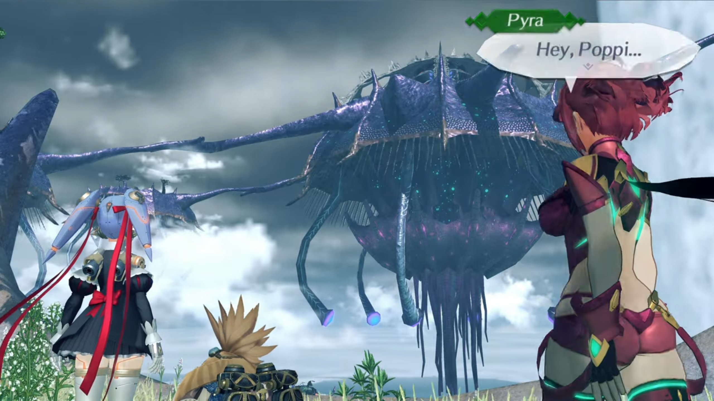

That's until Pyra approached and called for her attention, "Hey, Poppi..."

"Yes?"

"I was just thinking how... **curious** it is. Even though you look completely different, y-you're still the same Poppi."

"Poppi very strange! _Even Tora think so sometimes!_"

"Even though you made her?"

"That right! She grew so much, **BAM!** All at once!"

"Perhaps friends could call Poppi by her model name?" she suggested. 

"Very good idea." Tora thought so. 

"What do you mean by model name?"

He explained, "Well, Poppi's smallest mode actually has name: 'Poppi \\\(\alpha\\)'."

Pyra was surprised, "**Oh really?** I didn't know that."

"And this form called 'Poppi Quixotic Tutelar'."

"**Wowwwwww**, that is a **very** impressive name!"

Then she suggested strongly, "If friends refer to Poppi as- 'Poppi Quixotic Tutelar' when in this form, Poppi- **very**- happy."

"T-that's a little bit of a mouthful!" Can't it be simplified? 

"Quixotic Tutelar..." Tora tried it out for a while, then snapped, "**True true**, it difficult to say! Distinction of Poppis _may-be_ too hard now."

"Really?" She doesn't find it so. 

"Yes. In fact, Tora work _secretly on even more improved_ mode for Poppi. **When that finished**, must differentiate between whole three different modes. But that far too much bother! **'Poppi'!** That nice and simple, best way to call."

> Choose: "I agree."  
> or: "What's Poppi's third mode like?"

"I agree. Yeah, I think Poppi suits her just fine. It's short, and easy to understand. And <b>besides</b>, no matter how she looks, she's still the same Poppi."

"That is what you said before." noted Poppi QT. "Poppi has no problem with being called Poppi."

"Good good!"

"We came full circle..."

"Masterpon, **Poppi is curious**. What is new mode of Poppi like?"

"What's Poppi's third mode like?"

(Nothing here)

"That **excellent** question! It called... 'Quantum- Technochampion \\(\pi\\)."

"That is another very impressive name!" Pyra was impressed. 

"It sound powerful." Poppi QT was eager. 

Tora confessed, "Name came to Tora **suddenly** when he decide whether to enter swimming pool with **left.. or right foot.**"

"Name origin story sound **completely** irrelevant."

"So... how exactly are you going to remodel Poppi?"

"Mmm... _Tora not decided yet._"

"Oh really?"

"Name only **first step** in process."

"Sound like it **not** happen any time **soon**." Poppi QT was disappointed. 

He reassured, "It not take that long. **Tora brainstorm day and night.** Suddenly one day new design will appear like **ether bulb** over head. That- just how inventors do."

"If Masterpon say so..."

"When inspiration strike, Masterpon power up Poppi **ASAP**. Please, **trust** in Masterpon!"

"Understood. _But if Poppi_ had breath, Poppi would not hold it."

Tora was disappointed, "_You not trust Masterpon at all!_"

"Hahaha! Appearances may change, but Poppi will always be Poppi, huh?"

[Read more of Quantum Technochampion \\(\pi\\) mode here](./95_QT_pi.md)

---

### Creation of Tora: Poppi's armor

"So, this is the abode of the mighty Tora?" Brighid who'd never visited his house observed, standing before the cabinet where Poppi was before she's awaken. 

"**HEEEEEEYYYY!!! Careful with hands!** Lots of breakable and valuable things!"

As if she never heard, she took something on her hand and felt it, "Huh? W-What's this?"

"**AHHHHH!!! That more than enough fiddling! Don't handle Tora's stuff!**"

Pyra was curious too: "What's this? It's all fluffy... Is this a... Bunnit costume? Doesn't look very scientific..."

"That armor for Poppi!" She immediately recognized. 

Brighid doubt, "Armor? It's got _eaaaaars_ and everything."

Pyra too: "**This won't** provide protection. It's more like something from a beauty pageant."

"This Cutie Bun-Bun Armor!" Poppi introduced. 

"Cutie Bun-Bun Armor?"

"Correct! This state-of-the-art armor. Everyone wish they had such good defense!" Oh my God, what had you done to her, Tora? "Additional function is to cheer up Masterpon with extreme cuteness."

Brighid was convinced that "It looks like _that's_ its primary function..."

"Cheer-up effect can be boosted by initiating tail-wiggle dance protocol."

Turning to him, she strictly spoke, "Tora, I think you have a little explaining to do here."

"_Mehmeh..._" Sweat started flowing down his furs like rain rolling down the windshield during a heavy downpour. 

> Choose: "Try to explain"  
> or: "Be defiant."

With panicking voice, "Erm... if you listen to Tora's explanation, it make <b>perfect</b> sense!"

"I'm all ears, Tora."

His confidence came back as he speak without blushing, "This not thing that Tora make! Nothing to do with Tora really! This creation of Dadapon and Grampypon. Tora never used!" Ahem, what about the cabinet to your right that's now closed, Tora? 

"Is this true, Poppi?"

"Correct. This armor was designed by Masterpon's Grampypon. Masterpon's Dadapon improve design further and perfect its defensive capabilities."

"Huh? Is that right?" Pyra wasn't very convinced. 

"That **entirely right! Tora not fib-teller!**"

But he said too early. With wings widespread, the most shocking revelation came. With arms on both side of her waist, Poppi proudly revealed, "Masterpon put finishing touches in form of **tail-wiggle dance** protocol."

Brighid and Pyra took a step back from this jerk... "Meeeeehhhhh..."

"Masterpon work **feverishly** on this feature. **Tail-wiggle protocol** consume Masterpon's waking hours until he perfect wiggle angle and ear flap rate."

Brighid looked at him, "**Oh**, is that so? That's... **very interesting**... Tora!"

Panicked, he reminded, "Poppi! Poppi! Don't reveal _Masterpon's secrets!_"

She don't understand. "Why not? This excellent opportunity to share Masterpon's research with group."

Brighid agreed, "Poppi's right! Really, this- is- fascinating. Do continue, Tora! I'd especially like to hear about your views on **women**."

"Mehmeh?!!!"

"Ahem! This armor that Tora build based on <b>Dadapon and Grampypon's</b> design! This fruit of three generations of <b>research!</b>

"Tora, this is indefensible!"

Poppi shared, "Also, tail-wiggle dance protocol created entirely by Masterpon."

"**ARRRRRGGGG-Indeed! Tora's scientific passion!**"

"I don't think this has much to do with **scientific** endeavor, Tora! You can't dress Poppi up like this!"

Pyra also don't agree, commented, "Tora, that's not cool."

"Masterpon. Poppi not understand." She dropped her head  in confusion. 

Panickingly, he warned, "**Don't listen, Poppi!** Poppi should be proud of very special, one-of-kind armor!"

Brighid can't take it anymore, "Tora, you should get rid of this horrible thing. Pyra, maybe you could just... reduce it to ashes for us?"

Not sure why she don't do it herself, but "OK! I'd be happy to!"

"**NOOOOO!!! Do not destroy Tora's wonderful creation!**"

Brighid was searching the room when she found the wardrobe. "Come here, Tora! **Come here and explain yourself** properly!"

"**No, no! Stop! Hot! Hot! Meh!** Urgh! **AHAH It Burns!!!**" What happened to his creation or his fur after that we do not know. 

---

### Quantum Technochampion \\(\pi\\)

On the lower levels while climbing the World Tree, Zeke and Tora was at a balcony overlooking giant support beam in the distance; nothing else interesting could be seen in the foggy mist. Zeke commented, "I don't know what I was expecting in here but this jolly well- isn't it."

"Tora surprised too! Insides of World Tree make Tora's head go all swirly-whirly!"

"When it's even getting to Tora, you **know** it's serious business!"

"No need for surprise. Masterpon lacking in **many** regards." out came Poppi QT\\(\pi\\) from nowhere and commented. "In particular, **common sense** level close to **0**%."

Masterpon trembled, and answered with a trembling voice, "_Errr_, Poppi! It- it go without saying, but Blade should not diss Masterpon! _Poppi get very impudent since activating **QT\\(\pi\\) mode**._ **She is difficult girl!**"

"Difficult?" Zeke don't understand, "Didn't you- **make her**, though?"

"**Yes**, in manner of speaking, but- Poppi is result of work of threeeee generations. Actually, there plenty in Poppi that Tora not know or understand."

She added herself, "Poppi's components contain elements from Professor Soosoo and Professor Tatazo in addition to Masterpon. Poppi comprise hopes and dreams of alllll three. Any one might be stronger at **any** given time!"

"You're obviously a lot more _complex_ than I gave you credit for, Popster. **So**, hey, Tora. **Does that mean** even you don't know everything she's capable of?"

"That right. Basis of mode change function was laid down by Grampypon Soosoo. So, part of **system core** is sealed mystery, or 'black box'."

> Choose: "Can't you, like, investigate?"  
> or: "Are you also in the dark here, Poppi?"

"Can't you, like, investigate?"

"Unfortunately no. _Even Dadapon not able to fathom what going on in there. That because the box have note on it saying_ **'Do not open!'**"

Zeke was awestruck, "The... box? **I thought 'black box'** was some kind of fancy **engineer** term or something!" Now you're telling me it's a physical black box? 

"You want to see?" Poppi QT\\(\pi\\) asked. 

"So, the box is in Poppi's stomach or something? Why don't we open it and see?" Zeke encouraged. 

Tora fluttered his wings, "Nooooooo **way!** That might activate **self-destruct mode of Poppi.**"

Zeke jumped back, "Se-sel-**self-destruct?!** You can actually do that?"

"Of course." Tora answered for her. "Grampypon thought self-destruct was hero's most _daring_ and noble act. So... **best not tamper.**"

Zeke gloomily commented, "Your Grampypon had some **very** strange ideas, Tora. **Are you OK with that, Poppi? Having a bloody great bomb** in your stomach, I mean!"

"**Oh, yes.** No problem. Bomb is **comparatively safe** next to Poppi's other functions."

"**MEH!!!**" Zeke jumped even further, Tora voice trembled at how she spoke so calmly at such. 

"Hmm..."

"Meh? What happen?" Poppi QT\\(\pi\\) was surprised at their reactions. "Zeke? Masterpon? Why you suddenly make selves far from Poppi?"

"Are you <b>also</b> in the dark here, Poppi?

"In the dark about functions?" she clarified. 

"Right. **Sure you've not got any** hidden abilities kicking about in there?"

"Uh let me see..." She scanned her panels for any more information about it. After a while, she confidently commented, "Function identified!"

Zeke was impressed, "**Oh, excellent! Let's see it, then!**"

Suddenly, Poppi QT\\(\pi\\) started barking like a dog, "Woof, woof, woof, woof! Orgh orrrrrrgh, Grrrr, orgh orgh orh..."

"What's going on?"

"Woof woof, orghhh orrrrgh. Dog Mode orrrgh."

Tora fluttered his wings, tried to remind her, "**Poppi!** _That mode is only for park!_ Tora sealed Dog Mode so people not think Tora some kind of... weirdo!"

Zeke agreed, "Yyyyyyeah. That is more than a little bit weird! I mean, come on, Tora, _why don't you just get a real dog?_"

"**Tora not have time for real dogs.**"

"**Aaaaaaaanyhow, Poppi, surely** that's not the only ability you've got? **You don't have any** hidden function we could use for battle or exploring? Something like that? Even without Tora, you must be able to do **a bit** of digging around in that black box of yours, no?"

She answered without hesitation, "Negative."

"**Negative?**"

---

### Tora's Families

In the Old Factory of Mor Ardain, Tora stood on top of the control panels, looking outside the window panes at the three giant ether cylinders. Rex approached and asked, "**Hey, Tora! What's up?** You look a little bit spaced out, looking at the view like that."

He turned around and answered effetely, as if all energy had been drained from him, "_Ohhhh, Rex-Rex!_ Tora was just thinking about when they captured Dadapon."

"_Right..._ Come to think of it, this was the place where he had to create all those artificial Blades."

"**Dadapon always** was bit of a scaredy-pon. Shy. Couldn't do bad thing, even when needed to do bad thing. _What happened to Dadapon was..._"

"Tora?"

"How could they make him make so many rubbish Blades... Tora **can-not i-ma-gine how bitter it was** for Dadapon!"

"Huh? **Hang on a moment**, Tora."

"What is it, Rex-Rex?"

"**I thought you were sad because your dadapo- I mean, your dad, he got captured?**"

"**Nooo!** Not that!{{footnote: So you love your dad being captured?}} Dadapon **happy whenever working**. Dadapon **love his work very much!**"

"Really?!"

"Really! Just look at **Lila and Rosa**. Dadapon's noponality is written all over them."

He scratched his head, "**Ahhhhh, yeah, it really comes through.**" Coming to think of it. 

"But... These new generic ones... No spirit. No- verve. Maybe most important things for artificial Blade!"

"_Hmm..._"

"Something wrong, Rex-Rex?"

"Ahhh, no, just... (How to put it) Passions sure run high in your family."

"Why, of course! Spirit of adventure like **air** we breathe!"

> Choose: "What kind of person was Soosoo?"  
> or "What kind of person was Tatazo?"

"What kind of person was Soosoo?"

"Soosoo? My Grampypon?"

"Poppi interested too! Tell us, Masterpon!" They weren't too surprised at the newly arrived guest, and Tora continued the conversation without much hassle, 

"Hmm... Honestly, Tora not remember much about Grampypon."

"Oh?" But why?

"Grampypon always locked away in lab, **all by self.**"

"Soosoo make lots of experiment and research?"

"No, usually look at photo books of Blades." Rex don't know what to say about that weird hobby. "Grampypon real stickler for appearance and mannerisms of creations. Grampypon really hung up on details."

"What kind of details, Tora?"

"This not sound very _scientific_, Masterpon."

"Ah on contrary. **Because** of Grampypon's book-looking, Poppi is Blade she is today. Grampypon **work very hard** to get style and poise _just right._ He had to **perfect ether furnace** to make his _dreams_ real. Other detail Grampypon **liked** is self-destruct feature, and hidden devices. Grampypon **always** **hunched** over plans, _snickering_ to self. (He proudly said) **To little Tora, looked very much like CRAZY mad scientist.**"

"**Butttt**, I guess when he invented the ether furnace, his drive and passion paid off." Rex supposed. "There's a **lot of talent** in your family, Tora. No doubt about it! Poppi's a walking testament to his genius."

"Poppi experiencing very complex emotion right now." Spokes she in very emotionless way. 

"What kind of person was Tatazo?"

"Dadapon?"

She approached beside them and added, "Poppi- also want to hear about Masterpon's Dadapon."

"Huh! Dadapon **quite an introvert** Nopon. Not expert in communication."

"Tatazo always busy with research?"

"**Yes! Every day full of research.** From morning to night. At graduation party{{footnote: They had a graduation party? They had college?!!!}}, _was very lonely. Not many friends to talk to._ **But brave enough to ask my Mamapon to dance!** Very lucky for Tora. This how Tora get born. Mamapon said- _Dadapon was so true_ to self, couldn't say no to him."

"That... (He had to think how to voice his opinions) That's **really** heartwarming."

"Masterpon, where is your mamapon now?"

"In end, said Dadapon was **too** true to self, _so-_ Mamapon went away."

"So, it's like they got together and broke up for the same reason." Rex concluded.

"Grampypon and Dadapon **always** together, **working on artificial Blades.** Never spend **any** time with Mamapon. _Make her unhappy._"

Poppi QT\\(\pi\\) can relate, "This makes sense to Poppi. Poppi have same problem with Masterpon sometimes."

"**Sorry, but** there _no other way_. Very busy making dreams real, **living life to max.** That what Dadapon always say. But always get _very sad when Tora ask him about it._ (He dropped his head) _When Mamapon left, Dadapon eat and drink like_ **wild beast for 3 days,** to... To try to fix sadness."

"That not sound too healthy. Poppi must make sure Masterpon _never get that sad, ever..._"

"Seems that your dad made a lot of sacrifices for his work. But it was _those sacrifices_ that made Poppi a reality. I guess we have to be **grateful** for that."

"This give Poppi a _funny feeling in ether furnace_. Thanks for sharing, Masterpon."

"**Ohhh! Poppi!** That nice of you to say!"

"Funny not always mean _good_, Masterpon."

"**EXCUSE TORA?!!!!**"

---

### Trying So Hard To Preserve One's Self

"Masterpon was in good mood today. Talked with Poppi 16 times. Poppi also talked with Pyra 31 times today!" She was keeping the good feelings to herself when Brighid approached her, asked, 

"What are you doing, Poppi?" They were inside their room at the inn in Argentum Trade Guild. 

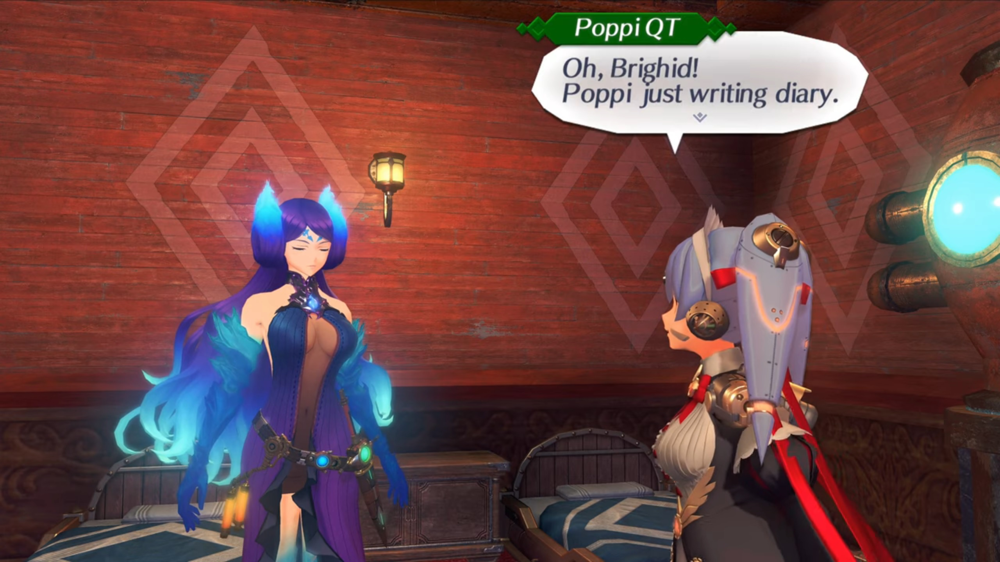

"Oh, Brighid! Poppi just writing diary. Poppi decided to leave records of **life,** just like Brighid!"

"But you can't be returned to a Core Crystal like us, so you're not in danger of losing your memories, are you?"

She don't agree, "Poppi's body is **very** complex device. If important part damaged by attack, memory could be corrupted."

"Ah, I see! At a glance, your body seems practically flawless, but I suppose it comes with its own troubles."

"Brighid right. It like Masterpon often say -- Poppi's _delicate_ body _always in need of TLC._{{footnote: Stands for 'tender loving care'. [TLC](https://dictionary.cambridge.org/dictionary/english/tlc)}}"

"Tora- says that to you, _does he?_ **Remind me** to have a word with him later."

"Um, Brighid... Can Poppi ask why Brighid care **so much** about preserving past memories? Poppi started diary, but **never know what to write. Maybe Brighid** can help."

> Choose: "I don't want to lose myself forever."  
> or: "I want to keep being the same person."

"I don't want to lose myself forever."

Poppi QT jumped backwards, shockingly asked, "If Brighid not have diary, no more Brighid? Poppi thought, even if Brighid go back to Core Crystal, just need to find new Driver, and then Brighid come back!"

"But- is that really true? If I were to return to my Crystal and remain that way for a long time, by the time I was reawakened, all who knew me could be long gone. If the Brighid who lived through that time no longer exists in my memories, or the memories of others, who's to say that I existed in that time at all?"

"Hmmmmm... Might be difficult to **prove**, that true."

"if nobody knows of my existence, I may as well **not** have existed. That thought, it- troubles me. After all, it's the time I spend with those **dear** to me that makes me who I am. The happy memories, the sad ones; **all of them together**. Without them, I don't think I would be myself. To lose all of that forever, it would be like denying not only myself, but the people I spent those times with."

"Masterpon teach _Poppi many things_. Poppi not want to forget all that. Masterpon pour **everything** into making Poppi!"

"Precisely. So, if you hold him dear, a diary filled with **memories** of him- should be **just** as precious, because memories are what connect us to others, and to the world we live in."

"Poppi think Poppi understand. Will try **best** to write good diary! Will fill diary with memories of **everyone! Even Brighid!**"

"That's very kind of you, Poppi. _I'm sure_ your diary will be _wonderful._"

"I want to keep being the same person."

Poppi QT don't understand, "Meh-meh? Brighid is Brighid. Why would Brighid be somebody else?"

"Well, _imagine_ if one day you were to forget **all** of your memories of Tora, and start working for a new master. Would that Poppi still be the same Poppi I am talking to right now?"

"Hmmmmm... Poppi- is Poppi, _but_ **that** Poppi would be **new Masterpon's** Poppi. **Not the same as Tora's Poppi.** Probably would not even _wear frilly maid outfits._"

"I- see. _Well,_ maid outfits aside, d-do you see what I'm getting at? While my _past selves_ are all Brighid, they are all **different** Brighids, living different lives, with different people. They're not directly connected to the person I am today."

"_Yes._ Poppi think- Poppi understand. Brighid want to keep being this Brighid. **That why** leave diary full of memories."

"Precisely. Even if I return to my Core Crystal and lose my memories, by reading my diary, my new self can hold on to **some part** of the person I am today. Though of course, this relies on the assumption that Mor Ardain will pass my diary on to my new self."

"Brighid... How can Poppi make sure Poppi's diary gets passed down?"

"A- good question... Tora _isn't_ the most _reliable_ fellow, is he?"

"Masterpon would use diary as pillow for naps and for prop up wobbly table.{{footnote: Better than toilet paper.}}"

"Perhaps you should take the time to think of the best solution to that problem yourself."

"_Not only_ writing memories every day, but _also_ finding _best way_ to preserve... Diary is quite difficult task!"

---

### Zeke's Past, and the Peaceful Village

Within the gates outside Corinne's house one evening, Zeke announced, "Coming to this place alllllways calms me _right_ down."

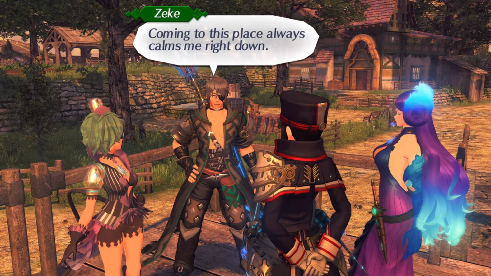

Pandoria felt so too, "I know what you mean. _It's so empty_... in a good way."

Zeke shared, "They've got a good salvaging business going, **but the place** isn't _bustling_ like Argentum. And they don't have a super-developed primary sector like Gormott. If you just want to live out your days in peace, there's really no better place."

"**You talk** like an old man sometimes. What d'you think, Mòrag?"

"I would like to live here awhile."

"**Ohhh?** Wasn't expecting that from you."

"Seeing such hospitality has been a refreshing experience for me. It's lovely to learn how the common folk live."

"I quite agree." said Brighid. 

"It's very different from staying at a city inn."

"I guess you two are used to the high life, huh..." said the poorest Prince on Alrest.

"Are you so different yourself?" Mòrag don't understand. 

Pandoria discussed with her partner, "Since we left Tantal, we've been spending a lot of our nights roughing it up outdoors, huh?"

"Sure have." He agreed. "It was **pretty tough** when we were camping out waiting for you lot in Uraya and Mor Ardain. Always on our toes, thinking you might show up any moment."

"Yyyyeah, I don't miss those hungry camping days. We came pretty close to eating Turters..."

"Let's not talk _about that_. It's painful to remember. **Waiting in the port** here was pretty all right, though."

"**Yeahhhhhh!** We could rest up in the ship, at least."

Mòrag: "It sounds like you've been through a lot."

Brighid was compassionate, but "Stakeouts are one experience I would **rather** avoid."

Zeke: "Anyway, **that's enough** about the past! There was something I wanted to ask you, Mòrag. You've seen how **smashing** this place is, right? _I'm just worried_ that Mor Ardain and Uraya- might wind up fighting over it or something."

"Not any time **soon**, I should hope. If either nation were to make a move on these islands, it would be _tantamount_ to a _declaration of war._ Mor Ardain, at least, has **no desire** for such conflict."

"Ahhh, right. **Well**, that's pretty reassuring at least."

"Why are you so invested in the fate of these islands, anyway?" wondered Brighid. 

> Choose: "'Cos it's where Rex grew up."  
> or: "'Cos there's no place like it in Alrest."

"'Cos it's where Rex grew up. Ain't it natural to worry about your friend's hometown?"

Mòrag can't deny, "I suppose so."

"As long as this place is safe, our chum can focus on the task he's gotta do. **Don't want** to let other worries start **creeping** in to distract him, do I?" He convinced himself.

"**Real** thoughtful, that is." Pandoria accepted his explanation. 

"**You said it! I'm the best! Hahahah!**"

Brighid: "..._and_ he just had to go and ruin it."

"'Cos there's no place like it in Alrest."

"That's _quite_ the grand statement." Brighid was impressed. 

"**I reckon** an environment like this is the only place a chap like Rex could grow up."

"Oh?" That piqued Mòrag's curiosity. 

"**Like, if a kid** grows up in Alba Cavanich, he's gonna want to join the *army*, right? **Not saying that's bad** _or anything_, but I don't think a kid like that would wind up as the Aegis's Driver. **Can't be easy** raising the kind of _boy_ who could change the future of Alrest. All the world's nations and establishments aren't gonna foster _that kind of_ potential. But **this village?** It's cut off from all that. A place of _freedom_ and possibilities."

"Ahhh, I see..."

Pandoria was impressed too, "**Once in a while**, you _actually_ say some **princely stuff!**"

"**Shut it, you!**"

Mòrag: "I have to say, I agree with Zeke. Villages like this have an important **place**- in Alrest. We must do our utmost to _keep them all from harm._"

---

### Five Centuries of Memory

At the depth of Spirit Crucible Elpys, standing in front of the bridge, Rex asked, "Hey, Gramps! You were protecting this place for years and years, right?"

He was flying himself than reside inside his helmet, answered, "That I was. Five hundred of them, in fact."

"But all that time I was a kid in Fonsett, I never noticed you doing anything **like** that."

"Well, things have been quiet for the past few centuries. Given two hundred years or so, rumors pass into legend, and people stop taking them so seriously. Looooong ago, Drivers used to enter this place **quite often**, but their numbers have long since fallen off. **Besides**, the entrance itself will not open for any but a Leftherian. And sad though it may be, the population of Fonsett is on the decline. Fewer and fewer people _are even aware of this place._"

"**I see!**"

"So you actually had work to do back in the day, huh?" Nia was surprised. She thought he'd been just bathing in the sun all days long for the past half a millennium. 

"I'm no layabout now, either! I was the one who told you of this place, if you recall!"

"Sure, whatevs."

"Honestly, Nia, _you're just like Corinne- when she was younger._"

Rex jumped on his feet, "**Huh?! Really?!!!**"

"I'm not sure if that's a compliment..."

"She was quite the little firecracker. _Even came in here once_, as a child."

"Wow, pretty gutsy." Nia was impressed.

"Though, she turned back upon reaching the bridge. _She must have sensed that this was a place to be feared._"

Rex reasoned it, "It's protected by the village's guardian spirit after all. Anyone in Fonsett would know it's not a place to enter lightly."

"**_To fear and to respect- are two sides of the same coin, you know._** The people of Fonsett understand the importance of this place- _on an instinctive level._"

> Choose: "Only thanks to you, Gramps."  
> or: "How would outsiders feel about it?"

"Only thanks to you, Gramps. You've been protecting this place for <b>centuries</b>, right? I think it's probably thanks to <b>you</b> that the villagers have such a powerful <b>respect</b> for the Village Guardian."

Zeke agreed, "Yeah, you can't have respect without someone to keep it alive."

Mòrag too, "If it were not for the Titan Azurda, this place may truly have been forgotten by the world completely."

Gramps felt his face red, "Weeeellll, _I don't think anyone's put it to me **quite** like that before._"

Even Nia praised, "You've done good, these past 500 years."

"Yeah! **Good job**, Gramps!"

"_Ohhh!_" Such heartfelt words! "More than anything, at times like this, I just feel thankful that I'm able to travel- with you all- in this form. If I'd remained in my old body, I might never have come here and heard those words!"

Zeke: "I thought you were gonna say something **profound**, not just **baskkkk** in the praise!"

"Hohohohohohoh!"

"How would outsiders feel about it?"

"People from outside of Fonsett village?" Gramps clarified. "None have entered in recent years, but 400 years ago, visitors did sometimes venture in here- with Fonsett youths. **It seems** people from **outside** see this place as little more than another ruin to be explored. _I tried_ to talk them out of entering, but they _never appreciated_ my words. Still, I didn't feel it was right to stop them by force. They stood precious little **chance** of reaching the end, at any rate. Thus it was- that many adventurers entered, never to return."

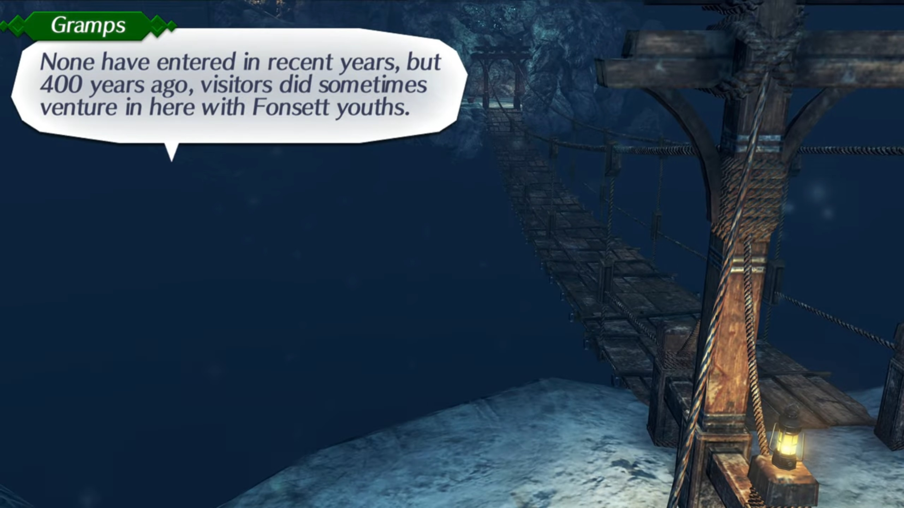

Mòrag hypothesized, "I daresay their sacrifice **also** contributed- to the healthy respect the villagers now hold for this place."

Zeke agreed, "Yeaaaah, you don't treat a ruin lightly when folks go in and never come out."

"I don't doubt that that is indeed _a part of it._"

Nia asked and commented, "You've been watching for _500 years as all this stuff happened, right?_ I guess that must've been tough going. Sorry for being all... _disrespectful and stuff before._" 

"No need to apologize, Nia. We are all quite used to your foul mouth at this point. **And we know** you have a _kind heart- underneath._"

Why do you have to say it so straightforwardly? Nia jumped on her feet, her claws first aim at Gramps but she pulled back at the last moment, said to herself, "_I wanna make a snappy comeback, but that would ruin my apology!_"

---

### Elysium in One's Heart

At the Central Deck of lower level World Tree, Mòrag asked, "Say, Rex. Do you really think that place is Elysium?"

They had just passed through it, and they couldn't believe their eyes, "It's a tough sell, for sure. That barren wasteland is **nothing** like the paradise in the fairy tales." said Zeke.

"To be honest, I'm not even sure myself. The Elysium I saw first was a warm place, full of sunlight and... greenery." He recalled the Elysium in her dream. 

"Do you think that Elysium still exists somewhere else?" Mòrag probed. 

"**No!** uh... **We definitely made it to the right place!**"

"Then what, you think the paradise Elysium was never anything more than a dream?" Zeke asked. 

Mòrag hypothesized, "I don't think we can say that _for sure._ **Perhaps** what Rex **saw** was how Elysium truly was, long ago."

"Long ago?"

"Yes. A vision of an older Elysium, taken from within someone's memories."

"So our chum here was dreaming about... **someone else's** memories? That's pretty freaky stuff." Getting more and more confused here. Meanwhile, Rex was kept thinking while they were debating. 

"Yes, it's- certainly far from an ordinary phenomenon."

"_Hmm..._ If the passage of time could turn the Elysium I saw into... **that... Maybe Alrest** could end up like that too someday."

Mòrag agreed, "Indeed. It is the same as the Tornan Titan we saw in Morytha. All things deteriorate, over time."

"**But time isn't the threat right now.** Malos could turn Alrest into **a wasteland like that any time!!!**"

"True enough. And i daresay neither we humans nor even the Titans themselves could survive in such a world."

"That's why we **have to stop him, no matter what!**"

"**That's the spirit I like to see, CHUM! I thought you might** be depressed that Elysium wasn't all you'd hoped, but **I guess I needn't have worried.**"

Mòrag had her faith in him, "**Rex** is **not so weak** as to let something _like this_ set him back. His **strength of will** is what has carried us all this far."

"**What?! What's up with you two all of a sudden?!** There's no point in flattering me, you know!"

"**Don't fret, chum!** You just keep doing what you always do."

"Yes. Keep forging our path ahead. We're _counting_ on you."

---

### Finding Needles in Haystack From the Top of the World

"How remarkable..." Standing at the glass floor at the edge of Rhadamanthus Portal, looking down at the Cloud Sea from the First Low Orbit Station, Brighid exclaimed. "**That view down below is the world where we live, isn't it?**"

"So it would appear." her Driver answered. "I had no idea it was possible for humans to reach these kind of heights." As she was speaking, more and more of Malos's artifices were descending towards the bottom. 

Zeke reminded them, "And this World Tree's been around since forever, too. I'm not sure I can keep up with what we're finding out here."

Turning to her right, Pandoria called out, "Hey, Prince! **LOOOKKK!!! OVER DOWN THERE!!!**"{{footnote: The lift door was behind them; but that wasn't of interest to us except to know their current position.}}

"What is it? You see something?" His eyes scanned for it, but he couldn't make out anything with his shortsighted only eye. 

She excitedly exclaimed, "**Look! Right over there! It's Genbu! That's gotta be Genbu!**"

"**Seriously?!!!**" But however he scanned, he couldn't make it out. But he, as he, always need to be confident, so he seconded her, "**WOW, you're RIGHT! That DOES look like Tantal!!**"

Brighid felt like a fool, "What are you talking about? **Of course** we can't see Tantal from all the way up here."

Pandoria disagreed, she invited, "**We totally can, though! Come over and take a look!**"

> Choose: "I'm sure it's just a cloud or something."  
> or: "Frankly, I'm not interested."

"I'm sure it's just a cloud or something. I don't see ANY sign of Tantal ANYWHERE." But she moved not a step to where Pandoria stood.

Zeke urged, "Not over **there**, over **here!**"

Pandoria: "Look, **right there!**"

"It's so small, it's **difficult to judge**. _Are you sure_ you're not imagining it?"

"No imagining **going on here!** That's Genbu, no doubt about it."

"Hmmmmmm... Is it, though?"

"Brighid?"

"What is it, Lady Mòrag?"

"_Well... it's just... I think I may have spotted Mor Ardain down there. Do you think that's really it?_"

"What?" Now her driver got infected by their disease of illusion too?

Zeke welcomed, "**Oh hey, you found your place too?!**"

"Where do you mean?" Brighid was eager. Was she the only one that can't see it? Though, if we consider her eyes were always closed, perhaps we can't complain, though. 

Mòrag pointed to a direction, nudged, "Over there -- _next to that strangely-shaped cloud.._."

"Ah, I see the one you mean."

"Doesn't that distinctive shape look just like Mor Ardain?"

"I- do believe you're right... Those wide plains look **just** the right shape. **And those shapes flying around it- MUST be Titan battleships!**" She played along. 

"I thought as much... Incredible how one can feel the majesty of Mor Ardain from- **all** the way up here..."

"Quite right, Lady Mòrag!" she cheered her. 

Zeke broke their excitement, "Hold on, you two. Take a closer look. I'm **pretty sure** that's the **Leftherian** islands. **Mor Ardain** doesn't have all that **greenery**, does it?"

"_Ahhh..._" Now that it reminded her. 

"Urk..." Brighid felt hearthurt. 

"Frankly, I'm not interested."

"**Awwwwww, c'mon!!! You're no fun!!!**"

Zeke added, "**We've come ALLLLL the way to a crazy place like this, the LEAST you can do is ENJOY yourself a bit!**"

"I'm in the wrong here? _Might I remind you_, we did not come here to have fun."

Even Mòrag was persuading her, "Everyone needs to let their hair down _once_ in a while, Brighid."

She turned to her, even her??? "Lady Mòrag?"

"**Myself**, I have already spotted the Leftherian Archipelago."

"Huh **What?!!** Those- tiny little islands?!"

Pandoria was excited, "**Welllll, WHADDYA KNOW!!! Mòrag's really getting into this! C'MON, PRINCE, we can't let her beat us!**"

"No chance of that. Take a look over there."

She turned to where he pointed, puzzled, "Huh? I can't see anything..."

"Look _reaaaaalll close_. There's a tiny **dot** right there, see? I'm pretty sure that's Goldmouth, the Argentum HQ!"

Mòrag can't believe what she'd heard, "**GOLDMOUTH?!!! Are you certain?!!!**" You have such telescopic eyes? 

Brighid urged, "**Where is this dot? I'm not seeing anything.**"

But Mòrag answered, "**Yes, that must be Goldmouth! I'm sure of it!!!**"

Her confidence confused her Blade even more, "You can see it, Lady Mòrag?!"

"_Brighid! We must find something new ourselves, else I fear we have lost!_"

"_When did this become a competition?_"

She immediately turned back to the dot, persuadingly spoke, "**If that is Goldmouth... Would that be the Maelstrom next to it?!!!**"

Brighid had to play by her note, "**Um... Well... (I can't see it but) I suppose it COULD be?**"

As if she's getting excited, she pointed to somewhere else, urged, "**Oh! Look down there, Brighid! The Nopon sailors on board the Maelstrom are waving to us!**"

"_Whaa...?!!!_"

Even Zeke felt a little too... "Urgghhhh, Mòrag, I think you might be pushing it a bit with that one."

Full of confidence, she answered without a blink, "I tell you no lie, I saw it with my **own** eyes!"

"_Seriously?_" Her Blade no longer understand whether she's speaking the truth or not. Con artist, bro, con artists! "_Ah, Lady Morag..._ I think- you may just- be seeing Tora's reflection in the window..."

"**No, you're wrong! I'm certain it was the crew of the Maelstrom!**"

"Hmmm..."

Zeke concluded the competition, "**Well, that was a bunch of fun!**"

Pandoria added, "**Yeeaaaaaahhhh. If I learned one thing today, it's that Mòrag- HATES- to lose.**"

---

### Before the Storm

Outside the door leading to Aion, Rex commented, "Malos is a powerful foe..."

Nia: "But we can't afford to give up now."

Mòrag agreed, "Indeed. If we give up hope here, there will be nothing left of Alrest."

Zeke added, "That'd leave all the people we **care about dead**, and a whole bunch of innocent folk besides."

Tora thought "That worst possible outcome..."

Nia reassured,  "But we're not in this alone. **Jin,** the Tora guys, and everyone back on Alrest are counting on us."

Zeke reminded them, "We've run into **all kinds of trouble on the way, but we made it this far.**"

Mòrag: "This may be the most formidable obstacle yet, _but we can surpass it like **any** other._"

"When friends all together, **nothing** impossible!" Tora cheered. 

Rex concluded, "This is it. This is our _final_ battle! Let's show him what **Drivers and Blades** can do **together!**"

And everyone else chant, "**YEAH!!!**" Together they marched unwaveringly through the door. 

### Footnotes: